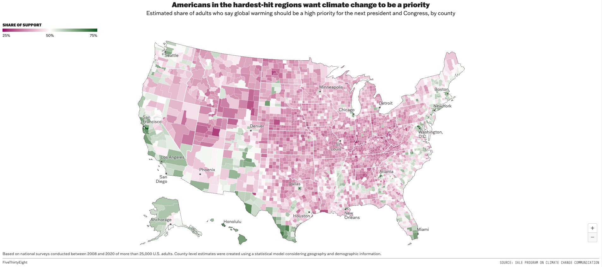
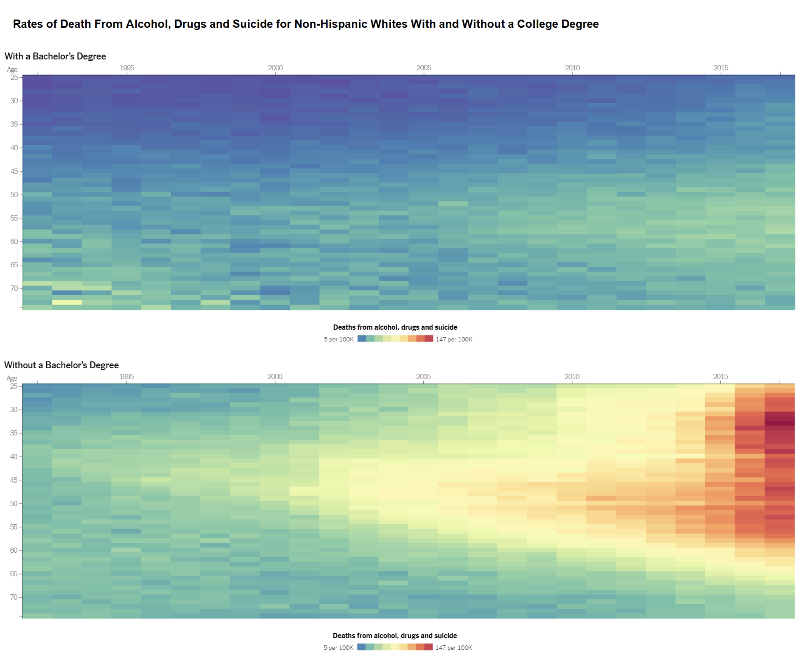
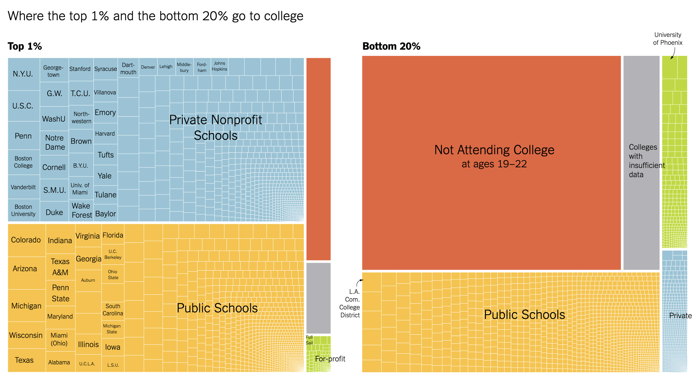

## Due: Friday, February 6th at 11:59pm on Gradescope as a **PDF**

In this homework, you will practice:

1.  Describing and evaluating elements of data visualization
2.  Interpreting and comparing examples of the five named graphs
3.  Assessing elements of graphs that aid data communication and identifying elements that can be improved


### Add any collaborators here!

I collaborated with...

**Remember that you are not allowed to use any generative AI models (like ChatGPT) on your homework assignment.**


# Exercises

### Exercise 1: Syllabus Check-in

We are going to be covering a lot of ground this semester! One of my goals is for the course policies and logistical aspects to be clear and organized, so that we can focus as much of our time and attention on the material as possible. 

With this in mind, please read the course syllabus in detail, if you haven't already. Write down three things that stand out to you (they can be positive or negative). They can be related to learning outcomes, policies, content, etc. If you have questions, write them down, and I (Megan) will respond to them. 


### Exercise 2: Slack Introduction

Slack will be a great place for you to ask and answer questions about course content and (non-urgent) logistics. Asking questions and answering questions from your peers will contribute positively towards your participation grade for the course. I also encourage you to use Slack to connect with your peers from the class to collaborate on assignments together. 

For this problem, if you haven't already, please join the course Slack channel (the link can be found on Moodle), and do **one** (or more, if you want) of the following:

-    Ask a question about anything from lecture, the lab, or the homework in the corresponding channel
-    Give an answer to someone else's question
-    Introduce yourself in #social, and post a picture of your favorite animal in #animals


### Exercise 3: Describing and evaluating elements of graphics (Library of Congress)

Check out the graphic entitled ["A Brief Visual History of MARC Cataloging at the Library of Congress"](http://sappingattention.blogspot.com/2017/05/a-brief-visual-history-of-marc.html) using the link. This unique visual was created by Benjamin M. Schmidt so that he could better understand the history of how the Library created their digital card catalogs. The many interesting visual artifacts of the graph also help highlight the significant physical work that was involved in the conversion to digital catalogs.


a. What are the variables in the **data** displayed in this graphic?  For each variable, specify if it is categorical or quantitative.


b. How would you describe the **geom**etry being used to display the data? 


c. How are each of the variables represented via **aes**thetic elements in the graphic (e.g., x- and y-axis position, color, shape, etc.)?


d. Is other context provided?  If so, how does it help the viewer better understand the graphic's story?


e. What does this graph do well?  


f. How could this graph be improved?


## Exercise 4: Describing and evaluating elements of graphics (Climate Change Opinion)

This graphic entitled "Americans in the hardest-hit regions want climate change to be a priority" was published in a 2021 [blog post](https://fivethirtyeight.com/features/how-you-view-climate-change-might-depend-on-where-you-live/) on FiveThirtyEight. The graphic is a map of the United States, and explores geographic differences in opinion with respect to climate action.




a. What are the variables in the **data** displayed in this graphic?  For each variable, specify if it is categorical or quantitative.


b. How would you describe the **geom**etry being used to display the data?


c. How are each of the variables represented via **aes**thetic elements in the graphic (e.g., x- and y-axis position, color, shape, etc.)?  


d. Is other context provided?  If so, how does it help the viewer better understand the graphic's story?


e. What does this graph do well?  


f. How could this graph be improved?


## Exercise 5: Describing and evaluating elements of graphics (NYT Graphs)

Let's look at two NYTimes graphs that use the `geom` of boxes/rectangles and see what stories these graphs are telling.  The first of these figures (Figure 2) comes from the article ["How Working-Class Life Is Killing Americans, in Charts"](https://www.nytimes.com/interactive/2020/03/06/opinion/working-class-death-rate.html) and the second figure (Figure 3) comes from the article ["Some Colleges Have More Students From the Top 1 Percent Than the Bottom 60. Find Yours."](https://www.nytimes.com/interactive/2017/01/18/upshot/some-colleges-have-more-students-from-the-top-1-percent-than-the-bottom-60.html).






a.  For each graph (Figure 2 and Figure 3), what does a single box represent?


b. What are the variables in the **data** displayed in each graphic?  For each variable, specify if it is categorical or quantitative.


c. What are the **aesthetic**s of the **geom**? For each **aesthetic**, give the variable that sets the values of that **aesthetic**. Also, if there is any faceting, identify the variable that controls the faceting.  Do this for both graphs.


d. For each graph, what story is the graph telling? Limit your answer to at most six sentences total.


e. The size aesthetic is only used in one of the graphs; explain how size aids in interpreting that graph, referencing specific details from the graph to support your reasoning. Also, comment on why you think size isn't used in the other graph.


f.  The color aesthetic is used in both graphs.  For each, identify the type of color palette and discuss whether or not you believe it in the appropriate color palette for the variable it represents.


## Exercise 6: Interpreting and comparing the five named graphs

*This question is adapted from IMS Chapter 5.*

In this problem, we will explore the distribution of finishing times for male and female winners of the New York Marathon between 1970 and 2020. For this problem, you **do not need to edit any code!** Instead, you should click the green, right facing arrow in the code chunks below to get started.

```{r message = F, warning = F}
library(openintro)
library(gridExtra)
library(ggplot2)
data(nyc_marathon)
nyc_marathon$division <- factor(nyc_marathon$division,
                                levels = rev(c("Women", "Men")),
                                labels = rev(c("Women's Division",
                                               "Men's Division")))
nyc_marathon <- nyc_marathon[!is.na(nyc_marathon$name), ]

g1 <- ggplot(nyc_marathon, aes(x = time_hrs)) +
  geom_histogram(binwidth = 0.05, color = "white") +
  labs(x = "Marathon time (hours)", y = "Count") +
  scale_x_continuous(limits = c(2, 3.2), breaks = seq(2, 3.2, 0.4)) +
  theme_bw()
g2 <- ggplot(nyc_marathon, aes(x = time_hrs)) +
  geom_boxplot(outlier.alpha = 0.8) +
  labs(x = "Marathon time (hours)", y = "") +
  theme(panel.grid.major.y = element_blank(),
        panel.grid.minor.y = element_blank(),
        axis.text.y = element_blank()) +
  scale_y_continuous(breaks = c(0),labels = "00")+
  scale_x_continuous(limits = c(2, 3.2), breaks = seq(2, 3.2, 0.4)) +
  theme_bw()
grid.arrange(g1, g2)

```

a. What features of the distribution are apparent in the histogram and not the box plot? What features are apparent in the box plot but not in the histogram?


b. What may be the reason for the bimodal distribution? Explain.


c. How does the box plot shown below help you compare the distribution of marathon times for men and women?

```{r}
ggplot(nyc_marathon, aes(x = time_hrs, y = division, color = division)) +
      geom_boxplot(outlier.alpha = 0.8, show.legend = FALSE) +
      labs(x = "Marathon time (hours)", y = NULL) +
      scale_x_continuous(limits = c(2, 3.2), breaks = seq(2, 3.2, 0.4)) +
  theme_bw()
```


d. The time series plot shown below is another way to look at these data. Describe what is visible in this plot but not in the others.

```{r}
    ggplot(nyc_marathon, aes(x = year, y = time_hrs, 
                             color = division, shape = division)) +
      geom_point(size = 2) + geom_line() +
      labs(y = "Marathon time (hours)", x = "Year",color = "",shape = "") +
  theme_bw() + theme(legend.position = c(.85,.85))
```


e. The barplot below shows the count of marathon wins per unique name in the data. What insights might this type of plot offer? What issues prevent you from making insights or gaining context? 

```{r}

ggplot(nyc_marathon, aes(x = name)) +
  geom_bar() +
  xlab("Name of winner") +
  ylab("Count") +
  theme_classic()

```


f. The barplot shows the count of marathon wins by winner nationality. At least one of the graphical issues from the previous plot is fixed here, but in what other ways could the plot could be improved to better communicate insights? Additionally, give one idea for adding context by incorporating another variable from the data set that was shown in previous parts of the problem (e.g. division/gender, time). 

```{r}

ggplot(nyc_marathon, aes(y = country)) +
  geom_bar() +
  xlab("Count") +
  ylab("Country") +
  theme_classic()


```


