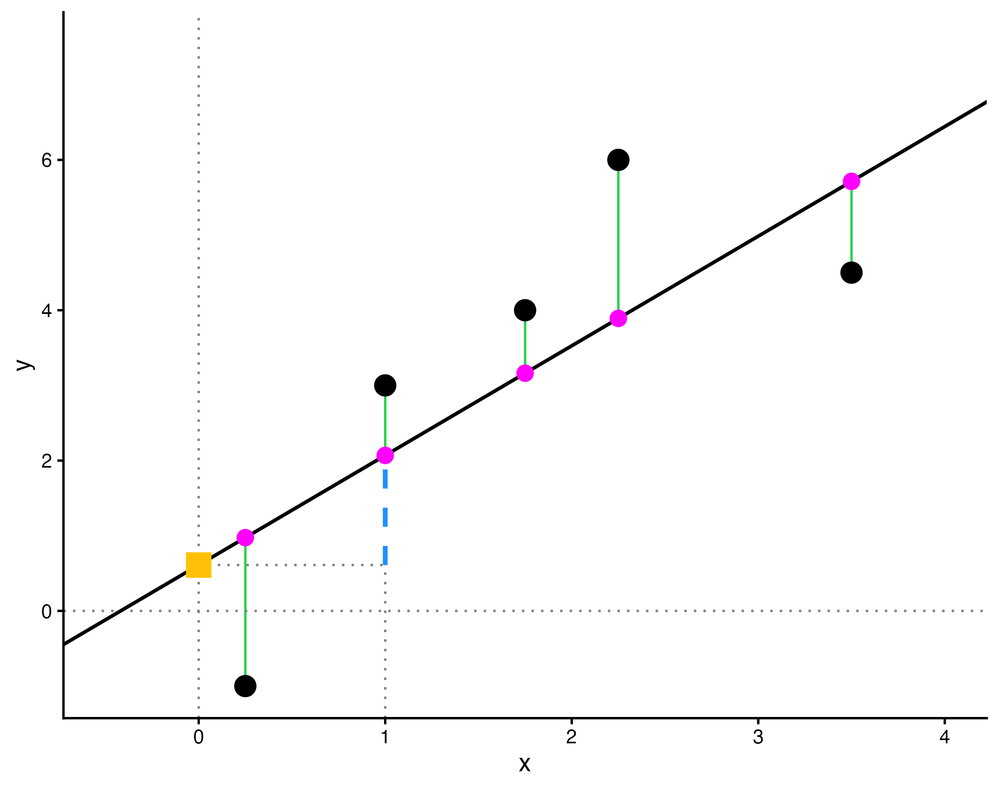

## Due: Friday, February 27th at 11:59pm on Gradescope


In this homework assignment you will:

- Review study design and sampling concepts
- Demonstrate understanding of concepts like observed vs fitted values, residuals, and coefficients
- Practice using visualizations to perform exploratory data analysis and assess linear regression assumptions
- Practice interpreting regressions with categorical variables and multiple predictors


### Add any collaborators here!

I collaborated with...

**Remember that you are not allowed to use any generative AI models (like ChatGPT) on your assignment**


```{r}
#load the necessary packages
library(tidyverse)
library(gglm)
library(moderndive)
library(pdxTrees)
```


# Exercises

### Exercise 3: Sampling Bias

**a.** During World War II, the statistician Abraham Wald was asked to help the US military determine where to place more armor on bomber planes. Adding armor protects planes, but weighs a lot, so it must be used sparingly. Statistical data on aircraft damage showed that for the planes observed, the highest density of bullet holes and damage was near the fuselage, while the lowest density was near the motors. It's said that the military concluded that bullets tended to hit the fuselage most often, and planned to add more armor to the fuselage before consulting Wald. **Why would this have been a mistake? What would you recommend instead if you were in Wald's place?** 

-------------------------------------------------------------------------------


-------------------------------------------------------------------------------


**b.** A survey is conducted on a simple random sample of 1,000 women who recently gave birth, asking them about whether or not they had health insurance. A follow-up survey about medical debt is conducted 2 years later, however, only 567 of these women are reached at the same address. The researcher reports that these 567 women are representative of all mothers. **What is the flaw in the researcher's reasoning? What should they have done different in conducting the study if they wanted to draw such strong conclusions?**

-------------------------------------------------------------------------------


-------------------------------------------------------------------------------


**c.** A conservation non-profit enrolls volunteer landowners in a program where landowners will receive financial compensation if they do not cut down any trees on their property over 5 years. The program participants comply and receive payment, and the program administrators conclude that the program prevented carbon emissions by preventing deforestation. **Why might these causal claims be misleading? What should they have done different in conducting the study if they wanted to draw such strong conclusions?**

-------------------------------------------------------------------------------


-------------------------------------------------------------------------------


**d.** *(From IMS Ch. 2)*  Suppose we want to estimate average household size, where a “household” is defined as people living together in the same dwelling, and sharing living accommodations. **If we select students at random at an elementary school and ask them what their family size is, will this be a good measure of household size? Or will our average be biased? If so, will it overestimate or underestimate the true value?**

-------------------------------------------------------------------------------


-------------------------------------------------------------------------------


### Exercise 4: Observational study vs experiment

Recall the conservation non-profit program described in Exercise 3 (c). Consider the following approaches that researchers may take to evaluate the effectiveness of this type of avoided deforestation program:

1. Researchers compare outcomes from a large sample of those who already enrolled in the program to a large sample of those who did not. Both samples are representative with respect to geographic region, forest biomes, relative income of the landowner, and ownership type (public vs private land). 
    
2. Researchers apply for a grant to implement their own similar program with a smaller sample, in a specific region of Brazil. They invite applicants to the program, and enroll a random sample of the applicants in the program. Researchers then compare outcomes between those enrolled in the program, and the applicants who were not randomly selected to enroll.

Compare these approaches by answering the following questions.


**a.** Indicate whether each approach is a randomized experiment or an observational study.

-------------------------------------------------------------------------------


-------------------------------------------------------------------------------


**b.** Suppose our overarching research question is: do payment-based conservation programs prevent deforestation? **To what extent does each approach help us answer this question?**

-------------------------------------------------------------------------------


-------------------------------------------------------------------------------


**c.** As approaches to generating knowledge, what are the benefits of each, and what are the potential drawbacks? Take statistical considerations into account, but also think about the other demands and ethics of this type of research.

-------------------------------------------------------------------------------


-------------------------------------------------------------------------------


**d.** If you had the results of each study in front of you, which would you trust more? **Explain why.**

-------------------------------------------------------------------------------


-------------------------------------------------------------------------------


### Exercise 5: UC Berkeley Study Assessment

In a study of the relationship between socio-economic class and unethical behavior, 129 University of California undergraduates at Berkeley were asked to identify themselves as having low or high social-class by comparing themselves to others with the most (least) money, most (least) education, and most (least) respected jobs. They were also presented  with a jar of individually-wrapped candies and informed that they were for children in a nearby laboratory, but that they could take some if they wanted. Participants completed unrelated tasks and then reported the number of candies they had taken. It was found that those in the upper-class level took more candy than did those in the lower-class level.


**a.** Identify the population of interest.
  
-------------------------------------------------------------------------------


-------------------------------------------------------------------------------


**b.** Identify the variables measured in the study and specify their types.

-------------------------------------------------------------------------------


-------------------------------------------------------------------------------


**c.** Identify the sample in the study.

-------------------------------------------------------------------------------


-------------------------------------------------------------------------------


**d.** Identify the research question.

-------------------------------------------------------------------------------


-------------------------------------------------------------------------------


**e.** Comment on whether the results of the study can be generalized to the population and if the findings of the study can be used to establish causal relationships.

-------------------------------------------------------------------------------


-------------------------------------------------------------------------------


### Exercise 6: SAT Coaching Study Assessment

Researchers are interested in determining whether coaching for college admissions exams has an effect on exam scores. The researches contact 100 high school junior students who have registered for the SAT exam, offering to provide 20 hours of free SAT coaching by knowledgeable tutors. Students are required to take one SAT practice exam before receiving coaching, and one practice exam after coaching concludes. 60 of the 100 students agree to be coached and complete the 20 hours of coaching. The remaining 40 students did not complete coaching, but still reported scores for a first and second practice test. Data on the scores for these students is stored in the `SAT` dataframe and can be loaded by running the following code chunk. (For this problem, it's **not** necessary to understand what each line of code below is doing)

```{r echo = F}
library(ggplot2)

set.seed(11)
n_coach <- 60
n_noncoach <- 40
n <- n_coach + n_noncoach

student_id <- 1:n

first_score_coach <- round( rnorm(n_coach, 1200, sd = 50), -1)
second_score_coach <- first_score_coach + round(rnorm(n_coach, 25, sd = 20), -1)

first_score_noncoach <- round( rnorm(n_noncoach, 1200, sd = 50), -1)
second_score_noncoach <- first_score_noncoach + round(rnorm(n_noncoach, 10, sd = 20), -1)

first_score <- c(first_score_coach, first_score_noncoach)
second_score <- c(second_score_coach, second_score_noncoach)

coached <- rep(c("yes","no"),  c(n_coach, n_noncoach))

SAT <- data.frame(student_id, first_score, second_score, coached)
```

**a.** Does this investigation represent a random experiment or an observational study? Explain.

-------------------------------------------------------------------------------


-------------------------------------------------------------------------------


**b.** Explain why the researchers are interested in measuring the difference in first and second exam scores for both coached and non-coached students.
  
-------------------------------------------------------------------------------


-------------------------------------------------------------------------------
  
  
**c.** The scatterplot below compares each student's first and second scores (color distinguishes coached and non-coached students). **Describe any trends you observed in the plot.**
  
```{r}
ggplot(SAT, aes(x = first_score, y= second_score, color = coached)) +
  geom_jitter(height = 2, width = 2) +
  geom_smooth(method = "lm", se = F) + 
  labs(title = "Comparison of First and Second Scores (with Trendline)")
```
  
-------------------------------------------------------------------------------


-------------------------------------------------------------------------------


**d.** Explain why we would expect to see a relationship between pre- and post-coaching scores, regardless of the effect of coaching.
  
-------------------------------------------------------------------------------


-------------------------------------------------------------------------------


**e.** If coaching had no effect **on average** for SAT scores, what trends would we expect to observe in the scatterplot? Explain. 
  
-------------------------------------------------------------------------------


-------------------------------------------------------------------------------


**f.** Based on the information given in the statement of this exercise, do you think it would be reasonable to generalize any conclusions for this investigation to the population of all high school juniors who plan to take the SAT? **Why or why not?**
  
-------------------------------------------------------------------------------


-------------------------------------------------------------------------------

### Exercise 3: Bias in Course Evaluations

In Exercises 3 and 4, you will explore studies that ask the question "Is there gender bias in course evaluations?"

Let's start with the interactive data visualization called ["Gendered Language in Teacher Reviews"](https://benschmidt.org/profGender). Use the tool to explore at least one positive word (e.g., "intelligent", "engaging") and at least one negative word (e.g., "bossy", "mean").

**a.**  Discuss the story the visualization tells, and describe the data visualization choices that were made to do so.

-------------------------------------------------------------------------------


-------------------------------------------------------------------------------


**b.**  Are the data used to create the data visualization from an observational study or an experiment? **Explain your reasoning.**

-------------------------------------------------------------------------------


-------------------------------------------------------------------------------


**c.**  Would you be comfortable generalizing these findings about gendered language in teaching evaluations to all college students in the US? **Explain your reasoning.**

-------------------------------------------------------------------------------


-------------------------------------------------------------------------------


### Exercise 4: Voter ID Laws and Sampling

Back in 2014, researchers investigated the impact of voter ID laws on potential voters in the midterm elections. The study involved three locations: Philadelphia, Northern Virginia, and Dallas County, Texas. Each location is divided up into voting precincts and each precinct has a polling site.

In this problem, we will describe the data collection method of two locations and you will practice tying these methods to specific sampling techniques.

**a.**  For Philadelphia, 30 precincts were randomly selected from all precincts in Philadelphia. For each selected precinct, Swarthmore College students interviewed every 3rd person leaving the polling site over a randomly selected hour. **Does this sampling design use cluster sampling, stratified sampling, neither, or both? Justify your answer.**

-------------------------------------------------------------------------------


-------------------------------------------------------------------------------


**b.**  For Dallas County, each polling site was categorized by the time of day interviews would take place (morning/mid-day/evening) and whether voters at that site were projected to have an overall high or low propensity of voting. Within each category, a random sample of precincts were selected and Southern Methodist University students interviewed every person leaving those polling places at the particular time of day (morning/mid-day/evening). **Does this sampling design use cluster sampling, stratified sampling, neither, or both? Justify your answer.**

-------------------------------------------------------------------------------


-------------------------------------------------------------------------------


**c.**  Why didn't the researchers just take a simple random sample of names (i.e., from a voter registration list) and then conduct exit polls on those people? Justify your answer.

-------------------------------------------------------------------------------


-------------------------------------------------------------------------------


**d.**  Suppose that for a particular state, precincts are known to be relatively heterogeneous; e.g., precincts tend to have different social demographics. **Would cluster sampling or stratified sampling be the recommended strategy for this state? Justify your answer.**

-------------------------------------------------------------------------------


-------------------------------------------------------------------------------


### Exercise X: Titanic sampling code

**c.** Suppose we did not have access to this data set, and needed to estimate the overall survival rate by sampling names from the passenger list and following up with relatives. **In the chunk below, use `sample_n()` to draw a simple random sample of 100 passenger IDs, and use these to estimate the survival rate.**

-------------------------------------------------------------------------------


-------------------------------------------------------------------------------


**d.** Instead, now perform a stratified sample based on these variables, where we sample 20 passengers within each gender x class category (you can do this by combining `group_by` and `sample_n` from `dplyr`). **What is the survival rate overall in this sample, and within each strata of the sample? Why might this sampling strategy be preferred to simple random sampling?**

-------------------------------------------------------------------------------


-------------------------------------------------------------------------------


### Exercise 1: Sampling Study Design

A large college class has 160 students. All 160 students attend the lectures together, but the students are divided into 4 groups, each of 40 students, for lab sections. Each lab section is administered by a different teaching assistant. The professor wants to conduct a survey about how satisfied the students are with the course, and she believes that the lab section a student is in might affect the student's overall satisfaction with her course.

**a.** What type of study is this, and why?
  
-------------------------------------------------------------------------------


-------------------------------------------------------------------------------


**b.** Explain which of the following sampling strategies would be most appropriate for carrying out this study, **being sure to discuss the drawbacks of the methods you did not select**: 

i. Simple random sample
ii. Stratified random sample
iii. Cluster random sample.
    
Keep in mind that the professor believes student satisfaction may vary based on their lab section.

-------------------------------------------------------------------------------


-------------------------------------------------------------------------------


\newpage
### Exercise 2: Anatomy of a Regression

The graph below shows the results of regressing a variable $y$ against a variable $x$ using five data points (the black points). The graph may be easier to view in the rendered PDF.  



Using the vocabulary of regression (fitted values, regression line, residuals, intercept coefficient, slope coefficient), **explain what each of the following elements on the graph correspond to**:

i. The black solid line
ii. The blue dotted line
iii. The green solid vertical lines
iv. The pink points
v. The yellow square


-------------------------------------------------------------------------------


-------------------------------------------------------------------------------


### Exercise 3: Factors (Categorical Predictors)

We will again work with the `pdxTrees` data package. Run the following code chunk to obtain a data frame of the four parks closest to Reed, subsetted to only include trees of the `Genus` Pseudotsuga, Acer, Quercus, or Cornus.  This data frame includes some additional modification to clean up the data. The chunk also shows how many trees of each `Genus` are in the `near_reed` dataset.

```{r}
near_reed <- get_pdxTrees_parks() %>% 
  filter(Park %in% c("Crystal Springs Rhododendron Garden",
                     "Kenilworth Park", 
                     "Eastmoreland Garden",
                     "Berkeley Park")) %>% 
  mutate(Type = case_when(
    Functional_Type == "BD" | Functional_Type == "CD" ~ "Deciduous",
    Functional_Type == "ED" | Functional_Type == "CE" ~ "Evergreen"
  )) %>% 
  mutate(Crown_Width = (Crown_Width_NS + Crown_Width_EW)/2) %>% 
  drop_na(Type)  %>%
  filter(Genus %in% c("Pseudotsuga","Acer","Quercus","Cornus"))

near_reed %>% group_by(Genus) %>% summarize(Count=n())

```


**a.** In the chunk below, construct a linear model to analyze the differences in the `Carbon_Sequestration_lb` for each level in `Genus`. **How many indicator variables are displayed in the regression table, and what are they? Which level of the `Genus` variable does not have an indicator variable?**

-------------------------------------------------------------------------------

```{r}


```


-------------------------------------------------------------------------------


**b.** Write down the formula for the linear model for `Carbon_Sequestration_lb` as a function of `Genus`.

-------------------------------------------------------------------------------


-------------------------------------------------------------------------------


**c.** Compute the mean `Carbon_Sequestration_lb` for trees in each `Genus`. Then, identify where the value for the `Acer` genus appears in the regression table. 

-------------------------------------------------------------------------------


-------------------------------------------------------------------------------


**d.** Demonstrate how the mean `Carbon_Sequestration_lb` for trees from the Cornus, Pseudotsuga, or Quercus genera can be calculated from the *regression table*.

-------------------------------------------------------------------------------


-------------------------------------------------------------------------------


**e.** By default, R chooses the alphabetically first level of the explanatory variable to serve as the baseline. However, the order can be changed in R using some extra code. In the following code chunk, we re-order the `Genus` variable so that the largest category, Pseudotsuga, is the *baseline* group.
```{r, echo=T}
near_reed <- near_reed %>% 
  mutate(Genus = fct_relevel(Genus, "Pseudotsuga","Acer","Quercus","Cornus")) 
```

**Create a new linear model for `Carbon_Sequestration_lb` as a function of `Genus`. Comment on how the coefficients estimates have changed.**

-------------------------------------------------------------------------------


-------------------------------------------------------------------------------


**f**. Suppose a particular tree is a Bigleaf Maple, which is in the Acer genus. **What is the predicted Carbon Sequestration using the model constructed in part (a)? What is the predicted Carbon Sequestration using the model constructed in part (e)? How do the predictions compare?**

-------------------------------------------------------------------------------


-------------------------------------------------------------------------------


### Exercise 4: Exploratory Data Analysis for Regression

We will study data on teacher salaries for the rest of this homework assignment. Our data is a sample of 100 post-secondary (i.e., college) teachers is collected from the 2010 American Community Survey Public Use Microdata Sample, as found in the `Lock5Data` R package. We are interested in exploring differences in salary based on gender (i.e., gender-based salary discrimination) among college teachers.

For this exercise, we will focus on the role of exploratory data analysis for linear regression models.

Load the dataset using the following code:

```{r}
library(Lock5Data)
data("SalaryGender")
SalaryGender <- SalaryGender %>% 
  select(Gender, Age, Salary) %>%
  mutate(Gender = ifelse(Gender == 0, "Female", "Male"))
```

The data includes three variables:

1. Gender: Coded as a binary "Female" or "Male". It is not clear whether this truly reflects the gender identity of participants, or something different like biological sex. (We might assume that no participants with other gender identities were included, which limits our ability to generalize to the population at large.)
2. Age: Age of participant, in years.
3. Salary: Annual salary in thousands of US dollars.


**a.** As stated above, we are interesting in exploring salary differences based on gender. It's important to start by thinking critically about the type of conclusions we can draw from this analysis, especially since we're analyzing data about a sensitive (and very important) topic. **What type of study is this data from, and what types of conclusions can be drawn as a result?**

-------------------------------------------------------------------------------


-------------------------------------------------------------------------------


**b.** The chunk below creates exploratory visualizations of each variable: `Salary`, `Age`, and `Gender`. **Why is it important to perform this step before building a linear regression model? Based on the visualizations, give an insight about each variable.**

```{r}
g1 <- ggplot(data = SalaryGender, aes(x = Salary)) + geom_histogram(bins = 20) +
  theme_bw() + labs(title = "Histogram of Salary", x = "Salary (thousands of dollars)")
g2 <- ggplot(data = SalaryGender, aes(x = Age)) + geom_histogram(bins = 20) +
  theme_bw() + labs(title = "Histogram of Age", x = "Age (years)")
g3 <- ggplot(data = SalaryGender, aes(x = Gender)) + geom_bar() +
  theme_bw() + labs(title = "Barchart of Gender")
gridExtra::grid.arrange(g1, g2, g3, nrow = 2)
```

-------------------------------------------------------------------------------


-------------------------------------------------------------------------------


**c.** The chunk below investigates the bivariate relationship between `Salary` and `Gender.` **What trends do you observe, and how are they relevant to building our linear model?**

```{r}
ggplot(data = SalaryGender, aes(x = Gender, y = Salary)) + geom_boxplot() +
  theme_bw() + labs(title = "Side-by-Side Boxplots of Salary by Gender")
```


-------------------------------------------------------------------------------


-------------------------------------------------------------------------------


**d.** Assess the scatterplot produced by the chunk below. **Describe what the graph is showing.**

```{r}
ggplot(SalaryGender, aes(x = Age, y = Salary)) + geom_point() +
  geom_smooth(method = "lm", se = F) + theme_bw()
```

-------------------------------------------------------------------------------


-------------------------------------------------------------------------------


**e.** Calculate the correlation coefficient between `Salary` and `Age`, and **comment on the strength of the relationship**.

-------------------------------------------------------------------------------


-------------------------------------------------------------------------------


**f.** Assess the boxplots produced by the chunk below. **Describe what the graph is showing. Explain how insights from this graph and the graph from part (d) are relevant to building our linear model.** Keep in mind that our overall goal is to understand the relationship between salary and gender


```{r}
ggplot(SalaryGender, aes(x = Gender, y = Age)) + 
  geom_boxplot() +
  theme_bw() + 
  labs(title = "Side-by-Side Boxplots of Age by Gender")
```

-------------------------------------------------------------------------------


-------------------------------------------------------------------------------


**g.** In a new chunk below, create a scatterplot of salary vs age, colored by gender. Add gender-specific trend lines by adding `+ geom_parallel_slopes(se = FALSE)`. **Comment on any trends observed.**

-------------------------------------------------------------------------------


-------------------------------------------------------------------------------


### Exercise 5: Salary Regression Model

In this exercise, you will use a regression model to investigate whether age explains the gap in salary between males and females in post-secondary education. (Note: Even *if* age explained the gap, **there is still a gap!** This is an indication of structural differences for men and women in the US.)

**a.** The chunk below creates a linear model using the `SalaryGender` data frame. **Using the summary table, write the equation for the fitted model. Interpret each coefficient, and explain how their values validate your exploratory findings from the previous exercise.**

```{r}
lm_salary_gender <- lm(Salary ~ Age + Gender, data = SalaryGender)
get_regression_table(lm_salary_gender)
```

-------------------------------------------------------------------------------


-------------------------------------------------------------------------------


**b.** Using your regression equation from part (a) of this exercise, calculate the model's prediction for the salary of a female teacher who is 30 years old. **Based on the exploratory visualizations in Exercise 4, is this an example of extrapolation?**

-------------------------------------------------------------------------------


-------------------------------------------------------------------------------


### Exercise 6: Assess Salary Regression Models

**a.** The model created for the previous exercise is just one example of a model that we could fit using the data set. **Briefly explain how each of the four models below is different from each other.**

```{r}

m1 <- lm(Salary ~ Gender, data = SalaryGender)
m2 <- lm(Salary ~ Age, data = SalaryGender)
m3 <- lm(Salary ~ Age + Gender, data = SalaryGender)

```


-------------------------------------------------------------------------------


-------------------------------------------------------------------------------


**b.** Which of the three models helps us best answer our original research question? **Consider both $R^2$ and the types of relationships each model captures in your argument.**

-------------------------------------------------------------------------------


-------------------------------------------------------------------------------


**c.** Investigating when linear regression model assumptions hold is important to consider when selecting the best model(s) from a collection of possible models. Run the chunk below, and assess the set of graphs shown. **Which LINE assumption(s) do these graphs relate to, and which model(s) satisfy it/them?**

```{r}

res <- bind_rows(get_regression_points(m1) %>%
                    mutate(model = "Salary ~ Gender") %>%
                   select(Salary, Salary_hat, residual, model),
                  get_regression_points(m2) %>%
                    mutate(model = "Salary ~ Age") %>%
                   select(Salary, Salary_hat, residual, model),
                  get_regression_points(m3) %>%
                    mutate(model = "Salary ~ Age + Gender") %>%
                   select(Salary, Salary_hat, residual, model))
res$model <- factor(res$model, levels = c("Salary ~ Gender",
                                          "Salary ~ Age",
                                          "Salary ~ Age + Gender"))

ggplot(res, aes(x = Salary_hat, y = residual)) +
  geom_hline(aes(yintercept = 0), lty = 2, color = "gray") +
  geom_point() +
  geom_smooth(method = "lm", se = FALSE) +
  facet_wrap(~model) +
  labs(title = "Residuals vs Fitted Values") +
  theme_classic()

```

-------------------------------------------------------------------------------


-------------------------------------------------------------------------------


**d.** Run the chunk below, and assess the next set of diagnostic graphs shown. **Which LINE assumption(s) do these graphs relate to, and which model(s) satisfy it/them?**

```{r}

ggplot(res, aes(x = residual)) +
  geom_histogram(bins = 20, color = "white") +
  facet_wrap(~model) +
  labs(title = "Residual Histograms") +
  theme_classic()

```

-------------------------------------------------------------------------------


-------------------------------------------------------------------------------


**e.** Would you feel comfortable using any of these models to argue that there is evidence of gender-based salary discrimination among college teachers in 2010? 

-------------------------------------------------------------------------------


-------------------------------------------------------------------------------

