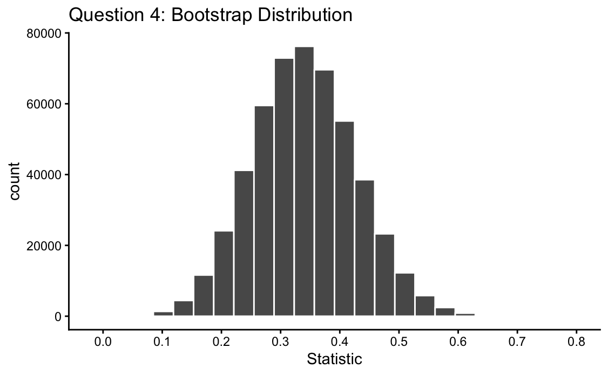

## Due: Friday, March 20th at 11:59pm on Gradescope

In this homework assignment you will:

- Sample from a population and compare parameters and statistics
- Generate sampling distributions in R and calculate their properties
- Generate bootstrap distributions in R and calculate their properties


### Add any collaborators here!

I collaborated with...

**Remember that you are not allowed to use any internet resources or generative AI models (like ChatGPT or Claude) on your assignment. While there are many ways to achieve tasks in R, you may only use packages and functions that have been covered in this class. If you are unsure of how to approach an exercise or of what function to use, help is available to you! Please visit office hours, collaborate with your peers, or post in the Slack channel.**


```{r, include = FALSE}
# Do not edit this code block/chunk
knitr::opts_chunk$set(echo = TRUE, message=FALSE, warning = FALSE,
                      fig.width = 16/2, fig.height = 9/2)
library(tidyverse)
library(moderndive)
library(ggplot2)
library(dplyr)
library(forcats)
library(pdxTrees)
library(gridExtra)
```


## Exercise 1: Sampling Distribution for n = 15
In Lab 6, we used the `pdxtrees` data to practice working with sampling distributions in R. The chunk below loads the data set and subsets it to only the condition variable for Western Redcedars. Recall that we were interested in targeting the population proportion $p$ of Western Redcedars in good condition.

```{r}
pdxTrees_parks <- get_pdxTrees_parks()
trees <- pdxTrees_parks %>% 
  filter(Common_Name == "Western Redcedar") %>% 
  select(Condition)  # This takes just the column "Condition"
```

Let's practice adapting the code from lab to estimate a sampling distribution for samples of size $n=15$. (HINT: For this exercise, **you may copy/paste the code provided to you in lab**, making minor changes for this new sample size of 15.)

**a.** Use the `rep_sample_n` function to collect 1000 virtual samples of size *n* = 15. Save these 1000 virtual samples into an object named `my_n15_1000rep`. Use **seed 910** to generate your sample. **Include your code, but you don't need to print the output of the code.**

*******************************************************************************


 
*******************************************************************************


**b.** Calculate sample proportion $\hat{p}$ of good condition Western Redcedars for each replicate of your n = 15 sampling. **Include your code, but you don't need to print the output of the code.** 

*******************************************************************************


*******************************************************************************


**c.** Explain in words how each line of the code from (b) relates to the process of creating a sampling distribution.

*******************************************************************************


*******************************************************************************


**d.** Visualize the sampling distribution of $\hat{p}$ from your 1000 samples of size n = 15 using a histogram.

*******************************************************************************


*******************************************************************************


**e.** Compare the means and standard errors of your sampling distribution for samples of size $n=15$ and for $n=50$ from the lab by visual inspection of the histograms (no need to calculate these numbers specifically!). Explain why these similarities or differences are expected. [Only text for this part]

*******************************************************************************


*******************************************************************************


**f.** Which sampling distribution looked more normally distributed (bell shaped and symmetric): the one built on n = 15 or 50?

*******************************************************************************


*******************************************************************************


## Exercise 2: Practicality of Sampling Distributions

In your own words, why can't we usually create sampling distributions in the real world?

*******************************************************************************


*******************************************************************************


## Exercise 3: Bootstrapping Procedure

**a**. Bootstrapping is a practical way to approximate a sampling distribution, but while using only a single sample. In your own words, explain the steps required for the bootstrapping procedure that we learned in class.

*******************************************************************************


*******************************************************************************


**b**. In your own words, what does it mean to sample "with replacement"? Why would sampling "without replacement" not make sense if we want to understand variability in sample statistics?

*******************************************************************************


*******************************************************************************


## Exercise 4: Creating a Bootstrap for n=50

Imagine that instead of having access to the entire population of Western Redcedars in Portland parks, we only have access to the following sample.

```{r}
our_sample50 <- trees %>% # Take the population of trees
  rep_sample_n(size = 50, reps = 1) # Take ONE sample of size n = 50
```


The following code can be used to carry out the bootstrap procedure, based on this single sample of size $n=50$. As you look at each line of code below, try to see how each line accomplishes what is stated in the comments.

```{r}
set.seed(42) # Ensure we each get the same "random" sample

n50_1000bootstrap_rep <- our_sample50 %>%  # Take our one *sample*
  rep_sample_n(size = 50, replace=TRUE, reps = 1000)  # Take 1000 samples of size n=50, with replacement

p_hat_n50_1000bootstrap_rep <- n50_1000bootstrap_rep %>% # Take our bootstrap samples...
  group_by(replicate...1) %>% # ... and for each bootstrap sample...
  summarize(Good = sum(Condition == "Good"), # ...calculate the number of "good" condition trees...
            n = n()) %>% # ...and the total number of trees in the bootstrap sample...
  mutate(p_hat = Good / n) # ...and ultimately, our sample statistic in our bootstrap sample.

boostrap_n50_histogram <- ggplot(p_hat_n50_1000bootstrap_rep, aes(x = p_hat)) +
  geom_histogram(binwidth = 0.02, color = "black", fill = "lightblue3") +
  labs(x = "Sample proportion of Western Redcedars in Good Condition", 
       title = "Bootstrap distribution of p-hat based on n = 50") 
boostrap_n50_histogram
```

Remember that bootstrap distributions are used to approximate sampling distributions. Below, we show both a theoretical sampling distribution (for $n=50$, recreated from Lab 6) and a corresponding bootstrap distribution (based on a single sample of size $n=50$, created above).

```{r warning=FALSE, message=FALSE}
set.seed(42)

n50_1000rep <- trees %>% rep_sample_n(size = 50, reps = 1000)
p_hat_n50_1000rep <- n50_1000rep %>% 
  group_by(replicate) %>% 
  summarize(Good = sum(Condition == "Good"), n = n()) %>% 
  mutate(p_hat = Good / n)
sampling_n50_histogram <- ggplot(p_hat_n50_1000rep, aes(x = p_hat)) +
  geom_histogram(binwidth = 0.02, color = "black", fill = "aquamarine3") +
  labs(x = "Sample proportion of Western Redcedars in Good Condition", 
       title = "Sampling distribution of p-hat based on n = 50") 

grid.arrange(sampling_n50_histogram +
               labs(title = "Sampling Distribution, n=50") +
               geom_vline(xintercept = mean(p_hat_n50_1000rep$p_hat),
                          color = "red") +
               scale_x_continuous(limits = c(0, 0.3)),
             boostrap_n50_histogram +
               labs(title = "Bootstrap Distribution, n=50") +
               geom_vline(xintercept = mean(p_hat_n50_1000bootstrap_rep$p_hat),
                          color = "red") +
               scale_x_continuous(limits = c(0, 0.3)),
             ncol = 1)
```

How do these two distributions compare? Consider similarities/differences based on their shape, center, and spread. 

*******************************************************************************


*******************************************************************************


## Exercise 5: Creating a Bootstrap for n=15

**a**. Using the above provided code for a bootstrap distribution based on a sample of size $n=50$, create and display a bootstrap distribution based on the following sample of size $n=15$. 

*******************************************************************************

```{r}
our_sample15 <- trees %>% # Take the population of trees
  rep_sample_n(size = 15, reps = 1) # Take ONE sample of size n = 15


### Your code below


```


*******************************************************************************


**b**. How does the bootstrap distribution that you just created compare to: (1) the sampling distribution for $n=15$ from lab, (2) the sampling distribution for $n=50$ in Lab 6, and (3) the bootstrap distribution (for $n=50$)? Consider similarities/differences based on their shape, center, and spread.

(*You may wish to visualize all four distributions together. Code to do so is prepared for you below, but depending on names chosen for your saved variables, you may need to adapt it.*)

*******************************************************************************

```{r}
# grid.arrange(sampling_n15_histogram + ## Your histogram for sampling n=15
#                labs(title = "Sampling Distribution, n=15") +
#                geom_vline(xintercept = mean(p_hat_n15_1000rep$p_hat),
#                           color = "red") +
#                scale_x_continuous(limits = c(0, 0.3)),
#              sampling_n50_histogram + ## Our histogram from sampling n=50
#                labs(title = "Sampling Distribution, n=50") +
#                geom_vline(xintercept = mean(p_hat_n50_1000rep$p_hat),
#                           color = "red") +
#                scale_x_continuous(limits = c(0, 0.3)),
#              boostrap_n15_histogram + ## Your histogram from bootstrap n=15
#                labs(title = "Bootstrap Distribution, n=15") +
#                geom_vline(xintercept = mean(p_hat_n15_1000bootstrap_rep$p_hat),
#                           color = "red") +
#                scale_x_continuous(limits = c(0, 0.3)),
#              boostrap_n50_histogram + ## Your histogram from bootstrap n=50
#                labs(title = "Bootstrap Distribution, n=50") +
#                geom_vline(xintercept = mean(p_hat_n50_1000bootstrap_rep$p_hat),
#                           color = "red") +
#                scale_x_continuous(limits = c(0, 0.3)),
#              ncol = 2)
```


*******************************************************************************


## Exercise 6: Practice Identifying Components of Sampling

In each of the following scenarios, (i) identify the population, (ii) identify the parameter of interest, (iii) identify the sample, (iv) identify and calculate the statistic, and (v) state whether or not the sample is representative of the population.

**a.** Suppose you are an epidemiologist looking to understand Covid rates in Oregon over the last 3 months. Specifically, you would like to estimate the proportion of Oregon residents who had Covid between July 1 and October 1 of this year. To answer the question, you randomly sample 50 Oregon residents and ask each if they had Covid in that time period. 10 of the 50 individuals in your sample had Covid between July 1 and October 1.

*******************************************************************************


*******************************************************************************

**b.** Suppose you are a naval engineer interested in understanding how resilient ships are to collisions with icebergs. Specifically, you would like to estimate the proportion of ships which would sink if they struck an iceberg. To answer this question, you randomly sample 10 historic ships from the US Naval Museum and see if each had sunk after a collision with an iceberg. None of the 10 historic ships in your sample had sunk after a collision with an iceberg.

*******************************************************************************


*******************************************************************************


## Exercise 7: Quick Learning Checks


**a.** A sampling distribution is made up of many values. What does one value in a sampling distribution represent? What causes values to differ?

*******************************************************************************


*******************************************************************************


**b.** The following image shows a bootstrap distribution (you may need to render your PDF to see it). Based on the distribution, would you say it was common or uncommon to see a value close to 0.6 across bootstrap statistics? How about a value of 0.3? 

{width=5in, height=2in}

*******************************************************************************


*******************************************************************************


**c.** Based on the same image of the bootstrap distribution above, give what your best guess would be for the value of the parameter of interest. 

*******************************************************************************


*******************************************************************************


**d.** What are the two main differences between a bootstrap distribution and a sampling distribution?

*******************************************************************************


*******************************************************************************


