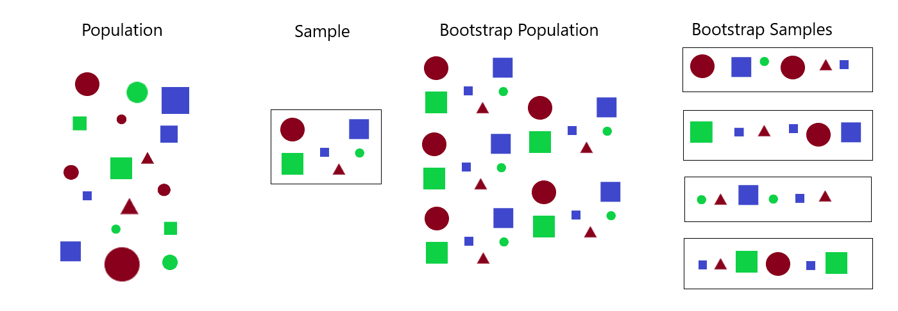

```{r}
#| include: false
#| warning: false
#| message: false

knitr::opts_chunk$set(echo = TRUE, warning = FALSE, message = FALSE, 
                      fig.align = 'center')
library(knitr)
library(tidyverse)
library(ggthemes)
library(moderndive)
library(gapminder)
library(infer)
library(tufte)
```

::::: columns
::: {.column .center width="50%"}
{width="90%"}
:::

::: {.column .center width="50%"}
<br>

[Bootstrapping]{.custom-title}

<br> <br> 

[Megan Ayers]{.custom-subtitle}

[Math 141 \| Spring 2026 <br> Wednesday, Week 6]{.custom-subtitle}
:::
:::::


------------------------------------------------------------------------

### Midterm Check In

- If you have exam accommodations and have **not** discussed them with me via email, please let me know asap! 


------------------------------------------------------------------------

### Goals for Today

- Review how sampling distributions can be used to assess sampling variability

- Discuss bootstrapping as a way of approximating the sampling distribution

------------------------------------------------------------------------

### Sampling Distribution: Polling Example

An October 2020 poll by Marist College surveyed \color{red}{1020 registered voters in Pennsylvania} by phone, asking 

> If November's election were held today, whom would you support?

- 50% of respondents supported Biden/Harris, 46% supported Trump/Pence, 1% supported another candidate, and 3% were undecided
- In the Nov. 3 2020 election, Biden/Harris had 50.01% of the vote, while Trump/Pence had 48.84% of the vote. 
    - **Population**: All registered voters in Pennsylvania ($N \approx 9 \textrm{ million}$)
    - **Population Parameter**: The proportion $p$ of registered voters who plan to vote for Trump/Pence. Based on election results, $p = 0.4884$.
    - **Sampling Method**: SRS(?) of size $n = 1020$ obtained using phone-numbers
    - **Sample Statistic**: The sample proportion $\widehat{p}$ of Americans who plan to vote for Trump/Pence. In this case, $\widehat{p} = 0.46$.


------------------------------------------------------------------------

## Sampling Variability

How confident should we be in the accuracy of our estimate of $\widehat{p} = 0.46$?

  - There are about $9$ million registered voters in Pennsylvania. Marist College surveyed only $1020$ of them ($0.01\%$ of the population)
  
  - We should be skeptical that our estimate is *exactly* equal to true proportion.
  
  - But we should feel confident that our estimate is *close* to the true proportion. 
  

::: fragment
**Why?**
:::

  - The sampling distribution tells us how much variability to expect from sample to sample.

  - Using probability theory, we know standard error for the sampling distribution for the sample proportion with sample size $n$ is $SE = \sqrt{\frac{p(1-p)}{n}}$
  
  - With $n = 1020$ and $p = 0.4884$, the standard error is $SE \approx 0.016$.

------------------------------------------------------------------------

## Sampling Variability

**Suppose** the true proportion of support for Trump/Pence was actually $p = 0.49$

- **Reminder**: In our sample, $\widehat{p} = 0.46$ (0.03 away from $p=0.49$).

::: fragment
Let's draw $5000$ simulated samples of size 1020 to see how many have $\widehat{p}$ far from $p = 0.49$.
:::
  
::: fragment

```{r fig.height=2.5, echo = F}
set.seed(121)
election <- data.frame(trump = c(rep(0,51), rep(1,49)))
sampling_dist <- election %>% rep_sample_n(size = 1020, replace = T, reps = 5000) %>% group_by(replicate) %>% summarize(p_hat = mean(trump))
q1<-quantile(sampling_dist$p_hat,.025)
q3<-quantile(sampling_dist$p_hat,.975)
sampling_dist %>% ggplot()+geom_histogram(aes(x = p_hat),bins = 30, color = "white")+
  labs(title = "Sampling Distribution, n = 1020",
       x = expression(hat(p))) +
  geom_rect(data = data.frame(x1 = .5, y1 = 1), xmin = .46, xmax = .52, ymin=0, ymax=Inf, fill = "springgreen", alpha = 0.3)
```

:::

- In 95% of samples, the sample proportion $\widehat{p}$ is at most 0.03 away from the true proportion $p$!

  - [Implication]{.underline}: If 49% of voters support Trump/Pence, then $\approx 95 \%$ of samples of size 1020 will show Trump/Pence's support, $\widehat{p}$, to be $46\% \leq \widehat{p} \leq 52\%$
  
  - **Q**: How does this contextualize conclusions based on the poll's sample statistic?
  

------------------------------------------------------------------------

## The Problem

- For sampling distributions that are $\approx$ bell-shaped, 95% of sample statistics will be within 2 standard errors of the true parameter.

- This helps us assess **how close** a sample **statistic** tends to be to the population **parameter**.

- But in practice, we don't know the sampling distribution!
    - In the polls example, we **guessed** what the true $p$ was to get a sampling distribution.
    - This is helpful as a thought experiment, but what if our guess was way off?
    - In order to form the actual sampling distribution, we need to collect many, many samples. 
    - In the real world, we usually only have **one sample!**

- **The fix?**


# Bootstrapping


------------------------------------------------------------------------

## Bootstrapping

::::: columns
::: {.column width=65%}

- The term *bootstrapping* refers to the phrase "to pull oneself up by one's bootstraps"

- Originated in the 19th century as reference to a ludicrous or impossible feat
  
- By mid 20th century, meaning had changed to suggest a success by one's own efforts, without outside help (the "American Dream" myth)
  
- Its use in statistics (dating from 1979) alludes to both interpretations.

:::

::: {.column width=35%}


:::
:::::

------------------------------------------------------------------------

## The Bootstrap Trick

- [The Impossible Task]{.underline}:
    - How can we learn about the sampling distribution, if we only have 1 sample?


- [The "Ludicrous" Solution obtained without outside help]{.underline}:
    - Draw repeated samples from the **original sample** 
    - Compute the statistic of interest in each new sample, and plot the resulting distribution

- [The Main Idea]{.underline}:
    - The original sample approximates the population
    - Resampling from the sample approximates sampling many times from the population
    - The distribution of statistics from the resamples approximates the sampling distribution

------------------------------------------------------------------------

## Theory

{width=85%}

- The sample "represents" the population. Many copies of the sample still "represents" the population

- **Idea**: Copy the sample many times to create "a bootstrap population", and then sample from this to get "bootstrap samples"

- Same result, save time: Just sample *with replacement* from the one original sample.


------------------------------------------------------------------------

## The Bootstrap Procedure

To generate a **Bootstrap Distribution** given a sample of size $n$ from the population,

1. Generate a **bootstrap sample** of size $n$ by resampling *with* replacement from the original sample

2. Repeat (1) a large number of times (with technology, at least 1000 times)

3. For each bootstrap sample, calculate the appropriate statistic (called the **bootstrap statistic**)

4. The collection of the bootstrap statistics form the **Bootstrap distribution**.

::: fragment
**Q:** How does this process of generating a bootstrap distribution differ from the process of generating the *sampling* distribution?
:::

- We sample from the [original sample]{.underline} here; for sampling distributions, we sample from the [population]{.underline}

- We sample [with]{.underline} replacement here; for sampling distributions, we sample [without]{.underline} replacement

```{r}
#| echo: false
countdown::countdown(3)
```

------------------------------------------------------------------------

## Proof of Concept

- **Population:** Consider a very large deck of cards (5200 cards) with 400 of each card value. 

- **Question:** What's the mean value from the deck of cards?

- **How We'll Answer:**
  - Draw a sample hand of $n=25$ cards, and calculate the mean value.
  - Estimate uncertainty using the bootstrap distribution.

::: fragment

Since we have the deck of cards, we can look at:

:::

  1. The population distribution
  
  2. The sampling distribution for sample means
  
  3. The single sample's distribution
  
  4. The bootstrap distribution for sample means
  
```{r, echo = FALSE}
library(gridExtra)
set.seed(1231)
value<-c(rep(1:13, each = 4))
value<-rep(value, 100)
my_cards<-data.frame(value)
my_sample<-rep_sample_n(my_cards, size = 25, reps = 1)
my_samp_dist<-rep_sample_n(my_cards, size = 25, reps = 4000) %>% group_by(replicate) %>% summarize(x_bar = mean(value) )
my_boots <- my_sample %>% ungroup() %>% select(value) %>% rep_sample_n( size = 25, replace = T, reps = 4000)
my_boot_dist<- my_boots %>% group_by(replicate) %>% summarize(x_bar = mean(value) )
```

------------------------------------------------------------------------
  
## World's Largest Deck of Cards: Population

```{r out.width="90%", echo = FALSE}
p<-ggplot(my_cards, aes(x = value) )+geom_histogram(breaks = 0:13+.5, color = "white")+
  geom_vline(aes(xintercept = mean(value)),col='red',size=1)+
  scale_x_continuous(breaks = 1:13)+
  labs(title = "Population Distribution",subtitle="Red line is true parameter", x = "Card Values")
p
```

------------------------------------------------------------------------

## World's Largest Deck of Cards: Sampling Distribution

```{r out.width="90%", echo = FALSE}
s1 <- ggplot(my_samp_dist, aes(x = x_bar) )+geom_histogram( bins = 40, color = "white", size = .2)+
  geom_vline(aes(xintercept = mean(x_bar)),col='red',size=1)+
  scale_x_continuous(limits = c(0.5,13.5), breaks = 1:13)+
  scale_y_continuous(labels = NULL)+
  labs(title = "Sampling Distribution",subtitle="IF we could take lots of samples (we can't in the real world!)", x = "Mean of 25 cards")
s1
```

------------------------------------------------------------------------

## World's Largest Deck of Cards: Sample Distribution

```{r out.width="90%", echo = FALSE}
s <- ggplot(my_sample, aes(x = value) )+geom_histogram(breaks = 0:13+.5, color = "white")+scale_x_continuous(breaks = 1:13)+
  geom_vline(aes(xintercept = mean(value)),col='red',size=1)+
  labs(title = "Sample's Distribution", subtitle="Values of cards in our sample of 25 cards", x = "Card values")
s
```

------------------------------------------------------------------------

## World's Largest Deck of Cards: Bootstrap Samples

```{r out.width="90%", echo = FALSE}
s_tmp <- ggplot(my_sample, aes(x = value) )+geom_histogram(breaks = 0:13+.5, color = "white")+scale_x_continuous(breaks = 1:13)+
  geom_vline(aes(xintercept = mean(value)),col='red',size=1)+
  labs(title = "Original Sample", x = "Card values")
bs1 <- ggplot(my_boots %>% filter(replicate == 1),aes(x=value))+geom_histogram(breaks = 0:13+.5, color = "white")+scale_x_continuous(breaks = 1:13)+
  geom_vline(aes(xintercept = mean(value)),col='red',size=1)+
  labs(title = "One Bootstrap Sample", x = "Card values")
bs<-ggplot(my_boot_dist[1:1,], aes(x = x_bar) )+geom_histogram( bins = 40, color = "white", size = .2)+
  scale_x_continuous(limits = c(0.5,13.5), breaks = 1:13)+
  scale_y_continuous(labels = NULL)+
  labs(title = "Bootstrap Distribution", x = "Means of Bootstrapped Samples")
# grid.arrange(s_tmp,bs1,bs,layout_matrix=rbind(c(1,2),c(3,3)))
```

::::: columns
::: {.column width=50%}

```{r, echo = FALSE}
s_tmp
```

:::

::: {.column width=50% .fragment}

```{r, echo = FALSE}
bs1
```

:::

:::::

::: fragment

```{r, echo = FALSE, fig.height = 4}
bs
```

:::


------------------------------------------------------------------------

## World's Largest Deck of Cards: Bootstrap Samples

```{r out.width="90%", echo = FALSE}
s_tmp <- ggplot(my_sample, aes(x = value) )+geom_histogram(breaks = 0:13+.5, color = "white")+scale_x_continuous(breaks = 1:13)+
  geom_vline(aes(xintercept = mean(value)),col='red',size=1)+
  labs(title = "Original Sample", x = "Card values")
bs1 <- ggplot(my_boots %>% filter(replicate == 2),aes(x=value))+geom_histogram(breaks = 0:13+.5, color = "white")+scale_x_continuous(breaks = 1:13)+
  geom_vline(aes(xintercept = mean(value)),col='red',size=1)+
  labs(title = "Second Bootstrap Sample", x = "Card values")
bs<-ggplot(my_boot_dist[1:2,], aes(x = x_bar) )+geom_histogram( bins = 40, color = "white", size = .2)+
  scale_x_continuous(limits = c(0.5,13.5), breaks = 1:13)+
  scale_y_continuous(labels = NULL)+
  labs(title = "Bootstrap Distribution", x = "Means of Bootstrapped Samples")
# grid.arrange(s_tmp,bs1,bs,layout_matrix=rbind(c(1,2),c(3,3)))
```


::::: columns
::: {.column width=50%}

```{r, echo = FALSE}
s_tmp
```

:::

::: {.column width=50%}

```{r, echo = FALSE}
bs1
```

:::

:::::


```{r, echo = FALSE, fig.height = 4}
bs
```


------------------------------------------------------------------------

## World's Largest Deck of Cards: Bootstrap Samples

```{r out.width="90%", echo = FALSE}
s_tmp <- ggplot(my_sample, aes(x = value) )+geom_histogram(breaks = 0:13+.5, color = "white")+scale_x_continuous(breaks = 1:13)+
  geom_vline(aes(xintercept = mean(value)),col='red',size=1)+
  labs(title = "Original Sample", x = "Card values")
bs1 <- ggplot(my_boots %>% filter(replicate == 100),aes(x=value))+geom_histogram(breaks = 0:13+.5, color = "white")+scale_x_continuous(breaks = 1:13)+
  geom_vline(aes(xintercept = mean(value)),col='red',size=1)+
  labs(title = "100th Bootstrap Sample", x = "Card values")
bs<-ggplot(my_boot_dist[1:100,], aes(x = x_bar) )+geom_histogram( bins = 40, color = "white", size = .2)+
  scale_x_continuous(limits = c(0.5,13.5), breaks = 1:13)+
  scale_y_continuous(labels = NULL)+
  labs(title = "Bootstrap Distribution", x = "Means of Bootstrapped Samples")
# grid.arrange(s_tmp,bs1,bs,layout_matrix=rbind(c(1,2),c(3,3)))
```

::::: columns
::: {.column width=50%}

```{r, echo = FALSE}
s_tmp
```

:::

::: {.column width=50%}

```{r, echo = FALSE}
bs1
```

:::

:::::


```{r, echo = FALSE, fig.height = 4}
bs
```

------------------------------------------------------------------------

## World's Largest Deck of Cards: Bootstrap Samples

```{r out.width="90%", echo = FALSE}
s_tmp <- ggplot(my_sample, aes(x = value) )+geom_histogram(breaks = 0:13+.5, color = "white")+scale_x_continuous(breaks = 1:13)+
  geom_vline(aes(xintercept = mean(value)),col='red',size=1)+
  labs(title = "Original Sample", x = "Card values")
bs1 <- ggplot(my_boots %>% filter(replicate == 2),aes(x=value))+geom_histogram(breaks = 0:13+.5, color = "white")+scale_x_continuous(breaks = 1:13)+
  geom_vline(aes(xintercept = mean(value)),col='red',size=1)+
  labs(title = "4000th Bootstrap Sample", x = "Card values")
bs<-ggplot(my_boot_dist, aes(x = x_bar) )+geom_histogram( bins = 40, color = "white", size = .2)+
  scale_x_continuous(limits = c(0.5,13.5), breaks = 1:13)+
  scale_y_continuous(labels = NULL)+
  labs(title = "Bootstrap Distribution", x = "Means of Bootstrapped Samples")
# grid.arrange(s_tmp,bs1,bs,layout_matrix=rbind(c(1,2),c(3,3)))
```

::::: columns
::: {.column width=50%}

```{r, echo = FALSE}
s_tmp
```

:::

::: {.column width=50%}

```{r, echo = FALSE}
bs1
```

:::

:::::


```{r, echo = FALSE, fig.height = 4}
bs
```

------------------------------------------------------------------------

## World's Largest Deck of Cards: Recap

```{r, out.width = "70%", echo = FALSE}
p<-ggplot(my_cards, aes(x = value) )+geom_histogram(breaks = 0:13+.5, color = "white")+
  geom_vline(aes(xintercept = mean(value)),col='red',size=1)+
  scale_y_continuous(labels = NULL)+scale_x_continuous(breaks = 1:13)+
  labs(title = "Population Distribution", x = "Value of 1 card")

s <- ggplot(my_sample, aes(x = value) )+geom_histogram(breaks = 0:13+.5, color = "white")+scale_x_continuous(breaks = 1:13)+
  geom_vline(aes(xintercept = mean(value)),col='red',size=1)+
    scale_y_continuous(labels = NULL)+
  labs(title = "Sample's Distribution", x = "Value of 1 card")

s1 <- ggplot(my_samp_dist, aes(x = x_bar) )+geom_histogram( bins = 40, color = "white", size = .2)+
  geom_vline(aes(xintercept = mean(x_bar)),col='red',size=1)+
  scale_x_continuous(limits = c(0.5,13.5), breaks = 1:13)+
  scale_y_continuous(labels = NULL)+
  labs(title = "Sampling Distribution", x = "Mean of 25 cards")

s2 <- ggplot(my_boot_dist, aes(x = x_bar) )+geom_histogram( bins = 40, color = "white", size = .2)+
  geom_vline(aes(xintercept = mean(x_bar)),col='red',size=1)+
  scale_x_continuous(limits = c(0.5,13.5), breaks = 1:13)+
  scale_y_continuous(labels = NULL)+
  labs(title = "Bootstrap Distribution", x = "Mean of 25 cards")

grid.arrange(p,s,s1,s2, ncol = 2)
```

**Q:** Compare the Sampling Distribution and the Bootstrap Distribution. How are they similar? How do they differ?

<!-- - Slightly different center/mean, but similar shape and spread! -->

```{r}
#| echo: false
countdown::countdown(3)
```

------------------------------------------------------------------------

## World's Largest Deck of Cards

We can compute some relevant statistics:


::::: columns

::: {.column width=45%}

Population:

```{r, echo = FALSE}
my_cards %>% summarize(mean_value = mean(value), sd_value = sd(value)) %>% kable()
```

Sampling Distribution:

```{r, echo = FALSE}
my_samp_dist %>% ungroup() %>% summarize(mean_xbar = mean(x_bar), sd_xbar = sd(x_bar)) %>% kable()
```

:::

::: {.column width=45%}

Sample:

```{r, echo = FALSE}
my_sample %>% ungroup() %>% summarize(mean_value = mean(value), sd_value = sd(value)) %>% kable()
```
 

Bootstrap Distribution:

```{r, echo = FALSE}
my_boot_dist %>% ungroup() %>% summarize(mean_xbar = mean(x_bar), sd_xbar = sd(x_bar)) %>% kable()
```

:::

:::::

- [Sampling and Bootstrap have slightly different means, but have similar standard deviations!]{style="color:blue;"}

- [Mean of Sampling is the *true* mean]{style="color:blue;"}

- [Mean of Bootstrap is the *sample* mean]{style="color:blue;"}

------------------------------------------------------------------------

## Recap 

- Sampling distributions are useful for understanding how close a statistic (ex. $\widehat{p}$) might be to a parameter (ex. $p$) 
  - But we rarely know the sampling distribution. We usually only have one sample!
  
- Bootstrap samples allow us to **approximate the sampling distribution.**
  - Almost magically, we can use a single sample to generate many "bootstrap samples"
  - Bootstrap samples behave very much like regular samples
  
- Bootstrap distributions look very similar to sampling distributions, 
  - ...but without the work of taking many samples!
  - The center is shifted (around the statistic instead of the parameter), but, very importantly, similar shape and **spread**! 
  - The **standard deviation of the bootstrap distribution** can help us estimate the **standard error of the sampling distribution** (next week)

------------------------------------------------------------------------

