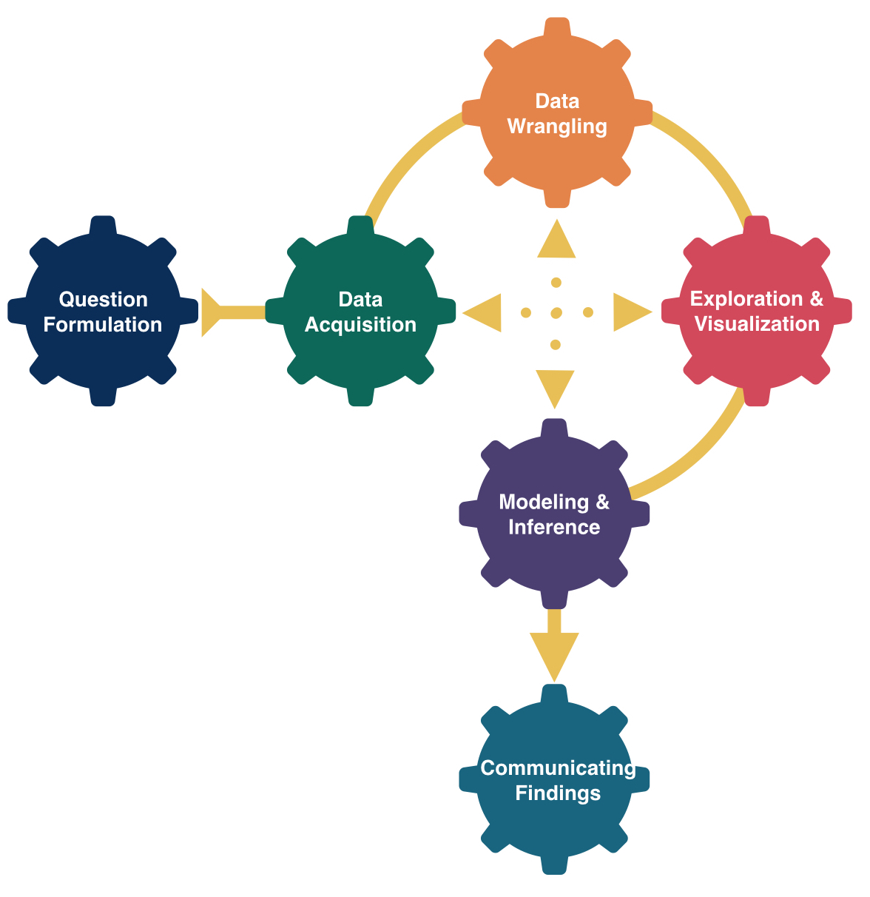

```{r}
#| include: false
#| warning: false
#| message: false
#| echo:    false

knitr::opts_chunk$set(echo = TRUE, warning = FALSE, message = FALSE, 
                      fig.align = 'center')
library(knitr)
library(tidyverse)
library(ggthemes)
library(moderndive)
library(gapminder)
library(infer)
library(tufte)
```

::::: columns

::: {.column .center width="50%"}

{width="90%"}

:::

::: {.column .center width="50%"}

<br>

[Confidence Intervals II]{.custom-title}

<br> <br> 

[Megan Ayers]{.custom-subtitle}

[Math 141 \| Spring 2026 <br> Wednesday, Week 7]{.custom-subtitle}

:::

:::::


------------------------------------------------------------------------

## Midterm logistics

- Please be mindful of students finishing exam from the previous section when arriving for the midterm (section 2)

- Lab 5 grades are posted

- Final office hours before midterm: Megan's office today from 3:30-5pm


------------------------------------------------------------------------

## Goals for today

- Review the concept of a 95\% confidence interval

- Discuss (one way) of creating confidence intervals with different confidence levels.

- Interpret confidence intervals and discuss common misconceptions


# Review

------------------------------------------------------------------------

## Setting

- There is some **population** we're interested in studying.
    - e.g., Reed College students


- There is a population **parameter** we want to know
    - e.g., average nightly hours of sleep ($\mu$)


- We draw a **sample** from the population with sample size $n$
    - e.g., We survey $n=50$ Reed students


- We provide a **point estimate** of the parameter with a statistic
    - e.g., average hours of sleep in our sample ($\bar{x}=8.02 \ \text{hours}$)


- We construct an **interval estimate** centered at our statistic
    - e.g., $8.02 \pm 0.16 \ \text{hours}$


------------------------------------------------------------------------

## Warm-Up

1. What are the differences between a sampling distribution and a bootstrap distribution?


2. Suppose we created confidence intervals based on **distinct** samples of size $n=10$ and $n=100$. How might they differ?


------------------------------------------------------------------------

## Confidence Intervals {.smaller}

::: {.fragment .nonincremental}
- A **confidence interval** gives a range of plausible values for a parameter. It usually takes the form:

$$
\textrm{Statistic }\pm \textrm{ Margin of Error (ME)}
$$

:::

- The Margin of Error (ME) is partially determined by our sample size:
    - Bigger samples yield smaller ME and interval (more data $\implies$ more certainty)
    - Smaller samples yield wider ME and interval (less data $\implies$ less certainty)

<br>

- Every confidence interval has a **confidence level:**
    - the percentage of samples that would yield a corresponding confidence interval that contains the true value of the parameter.

<br>

- For example, were we to:
    - Repeatedly draw samples from the population
    - Create 95\% confidence intervals in each sample
    - 95\% of those confidence intervals would contain the true parameter


------------------------------------------------------------------------

## Sampling Distributions can determine the Margin of Error

- Reminders:
    - Sampling distribution is *often* bell-shaped, with the mean equal to the parameter
    - In bell-shaped (normal) distributions, 95\% of observations lie in the range:

::: fragment
$$
\text{Mean} \pm 2*\text{Standard Error}
$$
:::

::: fragment
```{r out.width = "70%", fig.height=2.5, echo=FALSE}
set.seed(1010)
n<-10000
p <- 0.25
sample_size <- 48
p_hat<-rbinom(n, size = sample_size, prob = p)/sample_size
se <- sqrt(p*(1-p)/sample_size)
dd<-data.frame(p_hat)

ggplot()+geom_histogram(data = dd, aes(x  = p_hat), binwidth = 1/sample_size, color = "white", fill = "gray50")+
  labs(x = "Sample Statistics", title = "Example Sampling Distribution", y = NULL)+
  geom_rect(data =data.frame(x=0, y = 0), xmin = p-2*se, xmax =p+2*se, ymin = 0, ymax = Inf, fill = "gray60", alpha = .3)+
 scale_x_continuous(breaks = seq(0, .5, by = .05))+
#  scale_y_continuous(labels = NULL)+
  annotate(geom = "text", label = "Truth", color = "magenta2", x = p+.02, y = 1500, size = 5, face = "bold")+
  geom_vline(xintercept = p, color = "magenta2", lwd = 1)+theme_bw()
```

:::

------------------------------------------------------------------------

## Sampling Distributions can determine the Margin of Error {.smaller}

```{r out.width = "70%", fig.height=2, echo=FALSE}
set.seed(1010)
n<-10000
p <- 0.25
sample_size <- 48
p_hat<-rbinom(n, size = sample_size, prob = p)/sample_size
se <- sqrt(p*(1-p)/sample_size)
dd<-data.frame(p_hat)

ggplot()+geom_histogram(data = dd, aes(x  = p_hat), binwidth = 1/sample_size, color = "white", fill = "gray50")+
  labs(x = "Sample Statistics", title = "Example Sampling Distribution", y = NULL)+
  geom_rect(data =data.frame(x=0, y = 0), xmin = p-2*se, xmax =p+2*se, ymin = 0, ymax = Inf, fill = "gray60", alpha = .3)+
 scale_x_continuous(breaks = seq(0, .5, by = .05))+
#  scale_y_continuous(labels = NULL)+
  annotate(geom = "text", label = "Truth", color = "magenta2", x = p+.02, y = 1500, size = 5, face = "bold")+
  geom_vline(xintercept = p, color = "magenta2", lwd = 1)+theme_bw()
```

**Implication:** in the sampling distribution, 95\% of sample statistics lie in the range:
$$
\text{Parameter} \pm 2*\text{Standard Error}
$$
where the **Standard Error** is the standard deviation of the sampling distribution


- So, 95\% of sample statistics are within $2*\mathrm{SE}$ from the parameter!


- Thus, 95\% confidence intervals [usually]{.underline} take the form:

::: fragment
$$
\textrm{Statistic }\pm 2*\textrm{Standard Error (SE)}
$$
:::

- We typically estimate the SE (i) with the bootstrap, or (ii) with a formula


# Bootstrapping Confidence Intervals


------------------------------------------------------------------------

## Example: Reproduction Rate for Covid-19

- Researchers are interested in the COVID-19 **reproduction rate** (the average number of individuals each infected person further infects)  

- Sample 50 infected individuals and perform contract tracing.


::::: {.columns .fragment}

::: {.column width=30%}

```{r echo=FALSE}
infected<-rep( 0:6, c(5,13,14,12,5,0,1))
covid<-data.frame(infected)
covid %>% count(infected)
covid %>% summarize(mean_infected = mean(infected))
```

:::

::: {.column width=70%}

```{r fig.width=8, fig.height=3.5, echo=FALSE}
ggplot(covid, aes(x = infected))+geom_histogram(bins = 7, color = "white")+scale_x_continuous(breaks = 0:6)+labs(title = "Distribution of Sample",y="Count")+
  geom_vline(xintercept = mean(covid$infected), color = "red", size = 1.5)+
  annotate("text", x = mean(covid$infected)+.25, y = 1, label = expression(bar(x)), color = "red", size = 9)+theme_bw(base_size = 15)
```


:::

:::::


- **Goal:** Create an interval of plausible values for the reproduction rate.

- **Q:** What is the population? What is the parameter?

- **Q:** What is the sample? What is the statistic?


------------------------------------------------------------------------

## Bootstrap Reproduction Rate {.small}


We can use our sample to create a 95% confidence interval. **What is each step doing, and why?**

::: {.fragment .nonincremental}
1. Step 1:

```{r echo = T, eval = T}
set.seed(121)
bootstrap_samples <- covid %>% rep_sample_n(size = 50, replace = TRUE, reps = 5000)
```
:::


::: {.fragment .nonincremental}
2. Step 2:

```{r echo = T}
bootstrap_stats <- bootstrap_samples %>% group_by(replicate) %>% summarize(x_bar = mean(infected))
```

:::


::: {.fragment .nonincremental}

::::: columns

::: {.column width=30%}

3. Step 3:

:::

::: {.column width=40%}
```{r fig.height=3, fig.width = 8, echo = F}
ggplot(bootstrap_stats, aes(x = x_bar))+
  geom_histogram(bins = 34, color = "white")+
  labs(title = "Bootstrap Distribution, n = 50", x = expression(bar(x)))+theme_bw(base_size=14)
```

:::

::: {.column width=30%}

:::

:::::
:::

::::: columns

::: {.column width=50% .fragment .nonincremental}
4. Step 4:

```{r echo = T}
bootstrap_stats %>% summarize(SE = sd(x_bar))
```

:::

::: {.column width=50% .fragment .nonincremental}

5. Step 5:

$$
\bar x \pm 2 \cdot SE \implies 2.06 \pm 2 \cdot 0.181
$$

:::
:::::

```{r}
#| echo: false
countdown::countdown(4)
```

------------------------------------------------------------------------

## Bootstrap Reproduction Rate {.small}


We can use our sample to create a 95% confidence interval. 

::: {.fragment .nonincremental}
1. Create the bootstrap samples:

```{r echo = T, eval = T}
set.seed(121)
bootstrap_samples <- covid %>% rep_sample_n(size = 50, replace = TRUE, reps = 5000)
```
:::


::: {.fragment .nonincremental}
2. Compute bootstrap statistics within each bootstrap sample:

```{r echo = T}
bootstrap_stats <- bootstrap_samples %>% group_by(replicate) %>% summarize(x_bar = mean(infected))
```

:::


::: {.fragment .nonincremental}

::::: columns

::: {.column width=30%}

3. Graph the bootstrap distribution to check shape:

:::

::: {.column width=40%}
```{r fig.height=3, fig.width = 8, echo = F}
ggplot(bootstrap_stats, aes(x = x_bar))+
  geom_histogram(bins = 34, color = "white")+
  labs(title = "Bootstrap Distribution, n = 50", x = expression(bar(x)))+theme_bw(base_size=14)
```

:::

::: {.column width=30%}

:::

:::::
:::

::::: columns

::: {.column width=50% .fragment .nonincremental}
4. Estimate the standard error

```{r echo = T}
bootstrap_stats %>% summarize(SE = sd(x_bar))
```

:::

::: {.column width=50% .fragment .nonincremental}

5. Because the bootstrap distribution is bell-shaped, we use $2 \times$ the estimated SE as our **margin of error** to create a 95% confidence interval

$$
\bar x \pm 2 \cdot SE \implies 2.06 \pm 2 \cdot 0.181
$$

:::
:::::


------------------------------------------------------------------------

## Generalized Confidence Intervals

- In the previous example, we used our knowledge that for approximately bell-shaped sampling distributions, 95\% of sample statistics are within 2 SE of the population parameter
    - Suppose we instead want a **different success rate** for our estimation method
    - Or suppose we want interval estimates for **sampling distributions that are NOT bell-shaped**


- We can make these modifications again using the bootstrap approximation to the sampling distribution and make:


::: {.fragment .callout-note icon=false}

## General Confidence Intervals

The $C\%$ confidence interval for a parameter is an interval estimate that is computed from sample data by a method that captures the parameter for $C\%$ of all samples.

:::


------------------------------------------------------------------------

## Review: Percentiles and Quantiles {.smaller}

::: {.nonincremental}

- For a number $k$ between $0$ and $100$, the $k$th **percentile** of a distribution is the value so that $k\%$ of the data is less than or equal to that value.
    - The median is the 50th percentile of a distribution
    - 1st/3rd quartiles (Q1/Q3) are the 25th and 75th percentiles, respectively.
    
:::


```{r fig.height=3.5, fig.width = 7.5, echo = F}
set.seed(39)

proportion <-  c(.25,.5,.75)
quantiles <- quantile(bootstrap_stats$x_bar, proportion)
quantiles_df <- data.frame(quantiles, proportion, summary_stat = factor(c("Q1", "Median", "Q3"), levels = c("Q1", "Median", "Q3")))


ticks <- c(1.4, 1.7, 2.3, 2.6, quantiles[1], quantiles[2], quantiles[3])
labels <- as.character(ticks)

ggplot(bootstrap_stats, aes(x = x_bar))+
  geom_histogram(bins = 34, color = "white")+
  labs(title = "Bootstrap Distribution", color = "summary statistic",  x = expression(bar(x)))+
  geom_vline(data = quantiles_df, aes(xintercept = quantiles, color = summary_stat), size = 1.5)+
#  scale_color_manual(values = c("#b30000", "#e34a33"))+
  scale_x_continuous(breaks = ticks, labels = labels)
#  annotate("rect", xmin = -Inf, xmax =quantiles[1], ymin = 0, ymax = Inf, fill = "salmon", alpha = .3)+
#  annotate("text", x = 61, y = 50, label = "2.5% Area", color = "darkred", size = 3)+
#  annotate("rect", xmin = Inf, xmax =quantiles[2], ymin = 0, ymax = Inf, fill = "salmon", alpha = .3)+
#  annotate("text", x = 90, y = 50, label = "2.5% Area", color = "darkred", size = 3)
```


- For a number $p$ between $0$ and $1$, the $p$ **quantile** of a distribution is the value so that a proportion $p$ of the data is less than or equal to that value.
    - The median is the $0.5$ quantile of a distribution
    - 1st/3rd quartiles (Q1/Q3) are the $0.25$ and $0.75$ quantiles, respectively.


------------------------------------------------------------------------

## Quantiles and Percentiles

By definition, 2.5% of the data is less than the .025 quantile, and 2.5% of the data is greater than the .975 quantile

```{r fig.height=3.5, fig.width = 7.5, echo = F}
proportion <-  c(.025,0.975)
quantiles <- quantile(bootstrap_stats$x_bar, proportion)
quantiles_df <- data.frame(quantiles, proportion = as.factor(proportion))

ticks <- c(seq(1.5, 2.5, by = .5), quantiles[1], quantiles[2])
labels <- as.character(ticks)

ggplot(bootstrap_stats, aes(x = x_bar))+
  geom_histogram(bins = 34, color = "white")+
  labs(title = "Bootstrap Distribution", color = "quantile",x = expression(bar(x)))+
  geom_vline(data = quantiles_df, aes(xintercept = quantiles, color = proportion), size = 2)+
  scale_color_manual(values = c("#b30000", "#e34a33"))+
  scale_x_continuous(breaks = ticks, labels = labels)+
  annotate("rect", xmin = -Inf, xmax =quantiles[1], ymin = 0, ymax = Inf, fill = "salmon", alpha = .3)+
  annotate("text", x = 1.5, y = 250, label = "2.5%", color = "darkred", size = 3)+
  annotate("rect", xmin = Inf, xmax =quantiles[2], ymin = 0, ymax = Inf, fill = "salmon", alpha = .3)+
  annotate("text", x = 2.5, y = 250, label = "2.5%", color = "darkred", size = 3)
```

- This means that 95\% of the data is between the .025 and the .975 quantiles.


------------------------------------------------------------------------

## Quantiles and Percentiles

By definition, 2.5% of the data is less than the .025 quantile, and 2.5% of the data is greater than the .975 quantile

```{r fig.height=3.5, fig.width = 7.5, echo = F}

ggplot(bootstrap_stats, aes(x = x_bar))+
  geom_histogram(bins = 34, color = "white")+
  labs(title = "Bootstrap Distribution", color = "quantile", x = expression(bar(x)))+
  geom_vline(data = quantiles_df, aes(xintercept = quantiles, color = proportion), size = 2)+
  scale_color_manual(values = c("#b30000", "#e34a33"))+
  scale_x_continuous(breaks = ticks, labels = labels)+
  annotate("rect", xmin = -Inf, xmax =quantiles[1], ymin = 0, ymax = Inf, fill = "salmon", alpha = .3)+
  annotate("text", x = 1.5, y = 250, label = "2.5%", color = "darkred", size = 3)+
  annotate("rect", xmin = Inf, xmax =quantiles[2], ymin = 0, ymax = Inf, fill = "salmon", alpha = .3)+
  annotate("text", x = 2.5, y = 250, label = "2.5%", color = "darkred", size = 3)+
  annotate("rect",xmin = quantiles[1], xmax = quantiles[2], ymin = 0, ymax = Inf, fill = "dodgerblue", alpha = .3)+
  annotate("text", x = 2.05, y = 100, label = "95%", color = "white", size = 5)
```

::: nonincremental
- This means that 95% of the data is between the .025 and the .975 quantiles
:::

- *For sampling distributions that are bell-shaped*, the .025 quantile is about $2\cdot SE$ below the mean, and the .975 quantile is about $2\cdot SE$ above the mean

- So using the .025 and .975 quantiles is roughly equivalent to forming a 95\% CI as: $\text{Statistic} \pm 2*\text{SE}$!


------------------------------------------------------------------------

## 95\% Confidence Interval: 2 ways

1.  $\color{red}{\text{Statistic} \pm 2*\text{SE}}$
    - $\mathrm{Statistic} \ (\bar{x}) = 2.06$
    - $\mathrm{SE} = 0.18$
    - $95\% \ \mathrm{CI} = 1.70 \ \text{to} \ 2.42$


::: {.fragment .nonincremental}

2. $\color{red}{\text{Percentile Method}}$


::::: columns

::: {.column width=50%}

```{r fig.height=3.5, fig.width = 5, echo = F}

ggplot(bootstrap_stats, aes(x = x_bar))+
  geom_histogram(bins = 34, color = "white")+
  labs(title = "Bootstrap Distribution", color = "quantile", x = expression(bar(x)))+
  geom_vline(data = quantiles_df, aes(xintercept = quantiles, color = proportion), size = 2)+
  scale_color_manual(values = c("#b30000", "#e34a33"))+
  scale_x_continuous(breaks = ticks, labels = labels)+
  annotate("rect", xmin = -Inf, xmax =quantiles[1], ymin = 0, ymax = Inf, fill = "salmon", alpha = .3)+
  annotate("text", x = 1.5, y = 250, label = "2.5%", color = "darkred", size = 3)+
  annotate("rect", xmin = Inf, xmax =quantiles[2], ymin = 0, ymax = Inf, fill = "salmon", alpha = .3)+
  annotate("text", x = 2.5, y = 250, label = "2.5%", color = "darkred", size = 3)+
  annotate("rect",xmin = quantiles[1], xmax = quantiles[2], ymin = 0, ymax = Inf, fill = "dodgerblue", alpha = .3)+
  annotate("text", x = 2.05, y = 100, label = "95%", color = "white", size = 5)
```

:::

::: {.column width=50%}

```{r, echo=T}
quantile(bootstrap_stats$x_bar, c(0.025, 0.975))
```

:::

:::::

:::

------------------------------------------------------------------------

## Percentile Method for Confidence Intervals

- **Percentile Method:** For a $C\%$ Confidence Interval, report the quantiles of the *bootstrap distribution* such that:
    - $C\%$ lies in the middle
    - $\frac{(100-C)}{2}\%$ lies on either end (i.e., "the rest" is evenly distributed on the ends)


- **Ex:** For $C\% = 95\%$ (i.e., a 95\% Confidence Interval), we want
    - 95\% in the middle
    - $\frac{(100-C)}{2}\% = \frac{(100-95)}{2}\% = {2.5\%}$ **on either end**


- Report the **0.025 quantile** (or 2.5th percentile) and the **0.975 quantile** (or 97.5th percentile)!


------------------------------------------------------------------------

## The Percentile Method: Example

- Suppose we want to construct a **90% confidence interval** for the reproduction rate
    - Find the .05 and .95 quantiles in the bootstrap distribution.
    - 90% of bootstrap sample statistics will be between these values


```{r fig.height=2.25, fig.width = 6 , echo = F}

proportion <-  c(.05,0.95)
quantiles <- quantile(bootstrap_stats$x_bar, proportion)
quantiles_df <- data.frame(quantiles, proportion = as.factor(proportion))

ticks <- c(seq(1.5, 2.5, by = .5), quantiles[1], quantiles[2])
labels <- as.character(ticks)


ggplot(bootstrap_stats, aes(x = x_bar))+
  geom_histogram(bins = 34, color = "white")+
  labs(title = "Bootstrap Distribution", color = "quantile", x = expression(bar(x)))+
  geom_vline(data = quantiles_df, aes(xintercept = quantiles, color = proportion), size = 2)+
  scale_color_manual(values = c("#b30000", "#e34a33"))+
  scale_x_continuous(breaks = ticks, labels = labels)+
  annotate("rect", xmin = -Inf, xmax =quantiles[1], ymin = 0, ymax = Inf, fill = "salmon", alpha = .3)+
  annotate("text", x = 1.5, y = 250, label = "5%", color = "darkred", size = 3)+
  annotate("rect", xmin = Inf, xmax =quantiles[2], ymin = 0, ymax = Inf, fill = "salmon", alpha = .3)+
  annotate("text", x = 2.5, y = 250, label = "5%", color = "darkred", size = 3)+
  annotate("rect",xmin = quantiles[1], xmax = quantiles[2], ymin = 0, ymax = Inf, fill = "dodgerblue", alpha = .3)+
  annotate("text", x = 2.05, y = 100, label = "90%", color = "white", size = 5)
```


- We can use the `quantile` function in R to calculate the .05 and .95 quantiles

::: fragment
```{r echo = T}
quantile(bootstrap_stats$x_bar, c(.05, .95))
```
:::

------------------------------------------------------------------------

## The Percentile Method: Example

::: nonincremental

- Suppose we want to construct a **90% confidence interval** for the reproduction rate
    - Find the .05 and .95 quantiles in the bootstrap distribution.
    - 90% of bootstrap sample statistics will be between these values

:::

```{r fig.height=2.25, fig.width = 6 , echo = F}

proportion <-  c(.05,0.95)
quantiles <- quantile(bootstrap_stats$x_bar, proportion)
quantiles_df <- data.frame(quantiles, proportion = as.factor(proportion))

ticks <- c(seq(1.5, 2.5, by = .5), quantiles[1], quantiles[2])
labels <- as.character(ticks)


ggplot(bootstrap_stats, aes(x = x_bar))+
  geom_histogram(bins = 34, color = "white")+
  labs(title = "Bootstrap Distribution", color = "quantile", x = expression(bar(x)))+
  geom_vline(data = quantiles_df, aes(xintercept = quantiles, color = proportion), size = 2)+
  scale_color_manual(values = c("#b30000", "#e34a33"))+
  scale_x_continuous(breaks = ticks, labels = labels)+
  annotate("rect", xmin = -Inf, xmax =quantiles[1], ymin = 0, ymax = Inf, fill = "salmon", alpha = .3)+
  annotate("text", x = 1.5, y = 250, label = "5%", color = "darkred", size = 3)+
  annotate("rect", xmin = Inf, xmax =quantiles[2], ymin = 0, ymax = Inf, fill = "salmon", alpha = .3)+
  annotate("text", x = 2.5, y = 250, label = "5%", color = "darkred", size = 3)+
  annotate("rect",xmin = quantiles[1], xmax = quantiles[2], ymin = 0, ymax = Inf, fill = "dodgerblue", alpha = .3)+
  annotate("text", x = 2.05, y = 100, label = "90%", color = "white", size = 5)
```


::: nonincremental
- Our 90\% confidence interval is therefore 1.76 to 2.36


```{r echo = T}
quantile(bootstrap_stats$x_bar, c(.05, .95))
```

:::


------------------------------------------------------------------------

## Percentile Method: Practice

**With neighbor(s)**, name the quantiles of the bootstrap distribution you would need for:

1) 80\% Confidence Interval

2) 99\% Confidence Interval

3) 2\% Confidence Interval *(You would never do this! This is just for fun (: )*


::: fragment
**Answers:**

1) 0.10 and 0.90 quantiles

2) 0.005 and 0.995 quantiles

3) 0.49 and 0.51 quantiles
:::

```{r}
#| echo: false
countdown::countdown(2)
```

------------------------------------------------------------------------

## Width of Confidence Intervals {.smaller}

Two factors determine the width of a confidence interval:

1) **Sample Size**
    - The Standard Error of the sampling distribution decreases as sample size increases.
    - Smaller sample size $\implies$ larger interval
    - Larger sample size $\implies$ smaller interval


2) **Confidence Level**
    - Decreasing the confidence level brings the relevant quantiles closer to the middle, decreasing the width of the interval.
    - Higher confidence level $\implies$ larger interval
    - Lower confidence level $\implies$ smaller interval


::: {.fragment .nonincremental}
**Discuss with Neighbor(s):** Confidence Intervals get smaller with:

- a larger sample size

- a lower confidence level

*Intuitively*, why does this make sense?
:::

```{r}
#| echo: false
countdown::countdown(2)
```

------------------------------------------------------------------------

## Width of Confidence Intervals

::: nonincremental
Confidence Intervals get smaller with:

- a larger sample size

- a lower confidence level
:::

::: fragment
**Note:** These reasons for getting smaller are competing in terms of certainty!
:::

- With a larger sample size, the interval gets smaller because we're *more* certain the statistic is close to the parameter.
- With a lower confidence level, we become *less* certain the interval will contain the true parameter.

::: fragment
**Reminder:** While a lower confidence level gives you a smaller interval, there is a cost! (i.e., lower success rate)
:::


# Confidence Interval Misunderstandings


------------------------------------------------------------------------

## Misunderstanding 1

Suppose we wish to estimate the number of hours a Reed student sleeps on a typical night. We obtain the following 95% confidence interval: $(7.86, 8.34)$


1. A 95% confidence interval **does not** contain 95% of observations in the population.

::: fragment

```{r fig.height=3, echo = FALSE}
library(gridExtra)
set.seed(10)
pop <- data.frame(x = 9 - rgamma(1000, 2, 2))

my_boot<- pop %>% rep_sample_n(size = 30,reps = 1000) %>% group_by(replicate) %>% summarize(x_bar = mean(x)+.15)

L<-quantile(my_boot$x_bar,.025)
U<-quantile(my_boot$x_bar,.975)

p1<- pop %>% ggplot(aes(x = x))+geom_histogram(bins = 20, color = "white")+scale_x_continuous(limits = c(5,9))+labs(title = "Population Distribution")
p2 <- my_boot %>% ggplot(aes(x = x_bar))+geom_histogram(bins = 50, color = "white",size = .2)+scale_x_continuous(limits = c(5,9))+labs(title = "Bootstrap Distribution")

grid.arrange(p1,p2, ncol =2)
```

:::

------------------------------------------------------------------------

## Misunderstanding 1

::: nonincremental
Suppose we wish to estimate the number of hours a Reed student sleeps on a typical night. We obtain the following 95% confidence interval: $(7.86, 8.34)$

1. A 95% confidence interval **does not** contain 95% of observations in the population.
:::

```{r fig.height=3, echo = FALSE}
library(gridExtra)
p3<- p1+geom_rect(data = data.frame(x=8,y=0), xmin = 7.9, xmax = 8.3, ymin = 0, ymax = Inf, fill = "dodgerblue", alpha = .3,inherit.aes = F)
p4 <- p2+geom_rect(data = data.frame(x=8,y=0), xmin = 7.9, xmax = 8.3, ymin = 0, ymax = Inf, fill = "dodgerblue", alpha = .3,inherit.aes = F)

grid.arrange(p3,p4, ncol =2)
```


- Saying that 95% of all Reed students sleep between 7.86 and 8.34 hours should just feel wrong.  That's a pretty narrow interval!


------------------------------------------------------------------------

## Misunderstanding 2

2. A 95% confidence interval **does not** mean that 95% of all sample means fall within the given range.


```{r  fig.height=3, echo=FALSE}
set.seed(10)
my_sample <- pop %>% rep_sample_n(size = 30,reps = 1000) %>% group_by(replicate) %>% summarize(x_bar = mean(x))

my_boot2<- pop %>% rep_sample_n(size = 30,reps = 1000) %>% group_by(replicate) %>% summarize(x_bar = mean(x)-.4)

m <-mean(my_boot2$x_bar)

p5<- my_sample %>% ggplot(aes(x = x_bar))+geom_histogram(bins = 25, color = "white")+scale_x_continuous(limits = c(7,8.5))+labs(title = "Sampling Distribution")
p6 <- my_boot2 %>% ggplot(aes(x = x_bar))+geom_histogram(bins = 25, color = "white",size = .3)+scale_x_continuous(limits = c(7,8.5))+labs(title = "Bootstrap Distribution")

grid.arrange(p5,p6, ncol =2)
```


------------------------------------------------------------------------

## Misunderstanding 2

::: nonincremental
2. A 95% confidence interval **does not** mean that 95% of all sample means fall within the given range.
:::

```{r fig.height=3,  echo=FALSE}

L<-quantile(my_boot2$x_bar, .025)[[1]]
U<-quantile(my_boot2$x_bar, .975)[[1]]

p7<- p5 + geom_rect(data = data.frame(x=8,y=0), xmin = L, xmax = U, ymin = 0, ymax = Inf, fill = "dodgerblue", alpha = .3,inherit.aes = F)
p8 <- p6 + geom_rect(data = data.frame(x=8,y=0), xmin = L, xmax = U, ymin = 0, ymax = Inf, fill = "dodgerblue", alpha = .3,inherit.aes = F)

grid.arrange(p7,p8, ncol =2)
```


- **Q:** Why do the sampling distribution and bootstrap distribution look different?


------------------------------------------------------------------------

## Misunderstanding 2

::: nonincremental
2. A 95% confidence interval **does not** mean that 95% of all sample means fall within the given range.


```{r fig.height=3,  echo=FALSE}

L<-quantile(my_boot2$x_bar, .025)[[1]]
U<-quantile(my_boot2$x_bar, .975)[[1]]

p7<- p5 + geom_rect(data = data.frame(x=8,y=0), xmin = L, xmax = U, ymin = 0, ymax = Inf, fill = "dodgerblue", alpha = .3,inherit.aes = F) +
  geom_vline(aes(xintercept = mean(my_boot2$x_bar)), color = "magenta2", lwd = 1)
p8 <- p6 + geom_rect(data = data.frame(x=8,y=0), xmin = L, xmax = U, ymin = 0, ymax = Inf, fill = "dodgerblue", alpha = .3,inherit.aes = F)  +
  geom_vline(aes(xintercept = mean(my_boot2$x_bar)), color = "magenta2", lwd = 1)

grid.arrange(p7,p8, ncol =2)
```


- **Q:** Why do the sampling distribution and bootstrap distribution look different?

:::

------------------------------------------------------------------------

## Misunderstanding 3


3. Given a 95\% confidence interval, **Do Not Say:** "There is a 95% chance that the true parameter falls within my interval."


- Once we take a sample and calculate a confidence interval, there's no more randomness!

    - The interval either does or doesn't contain the (unknown) parameter.

- This is may seem like arguing over semantics -- but it's an important distinction!


::: fragment
Instead, say either:

+ "If we were to take many samples and calculate a 95\% confidence interval for each, then 95\% of them would contain the true parameter"

+ "We are 95\% confident that the true parameter is in our confidence interval"
:::

------------------------------------------------------------------------

::: nonincremental

### Next time

- Hypothesis testing! 

<br>

### With any time left...

- Midterm review questions?

:::


------------------------------------------------------------------------
