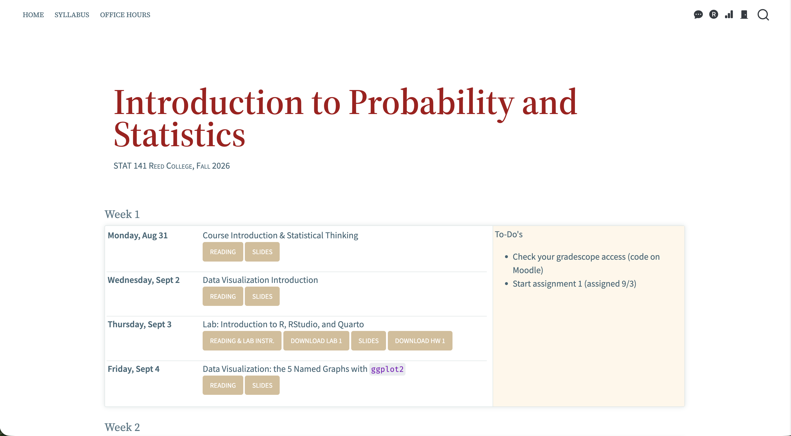
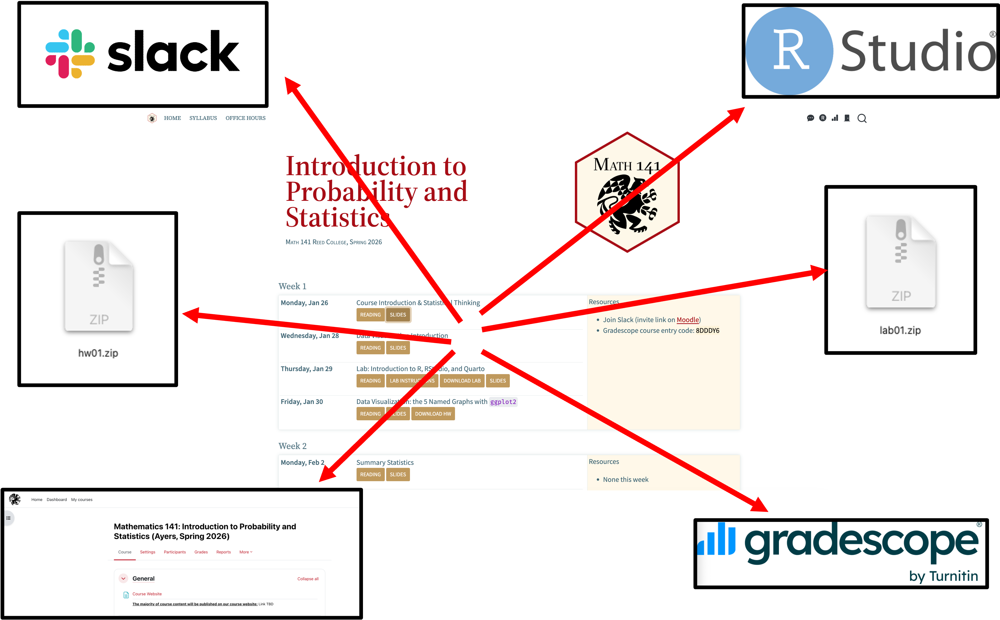
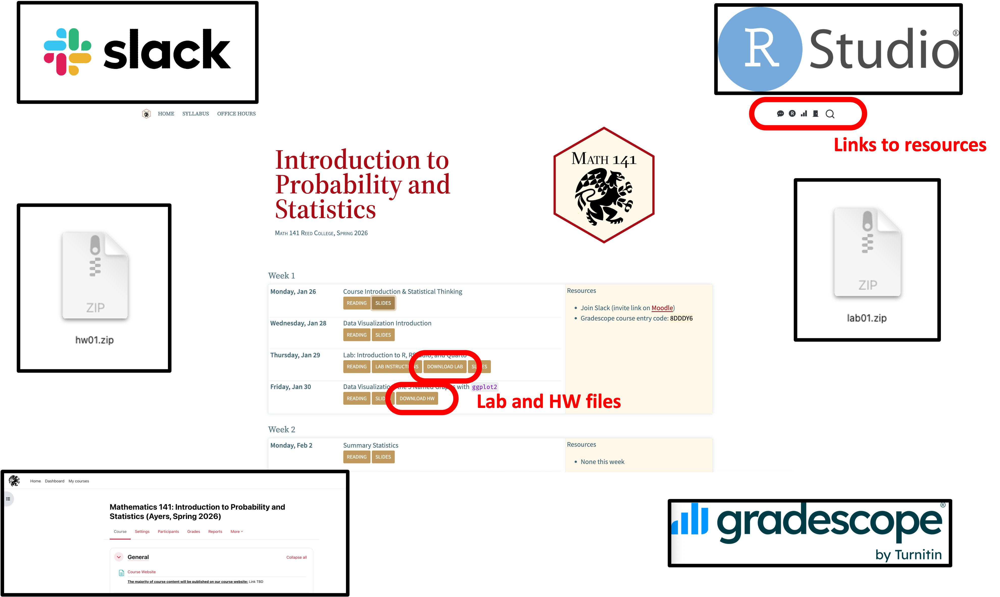
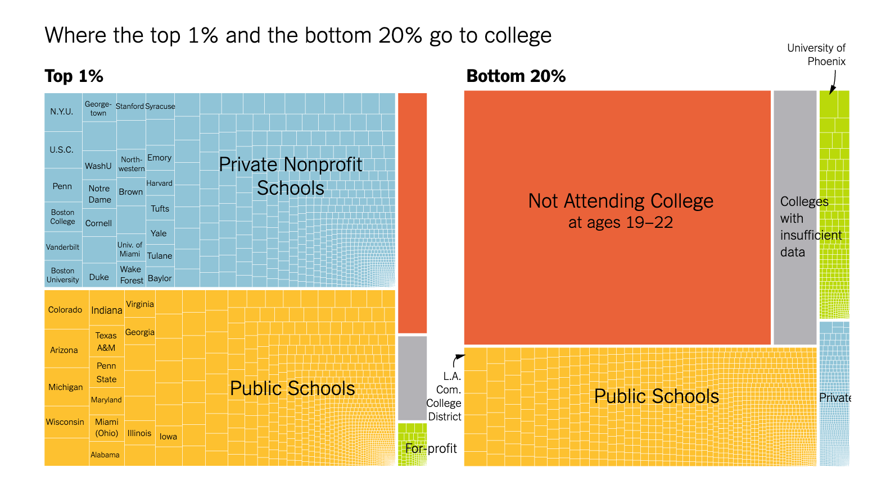
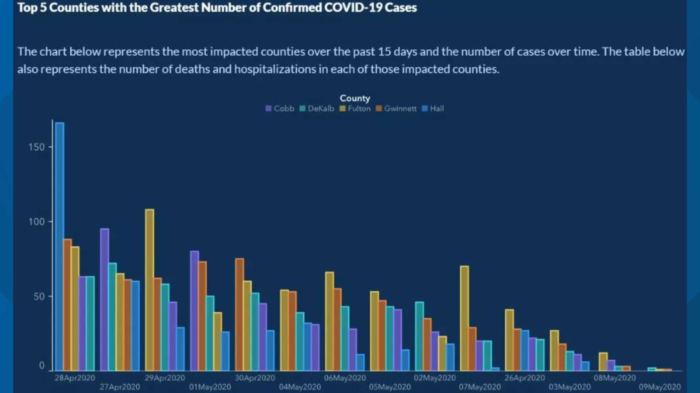
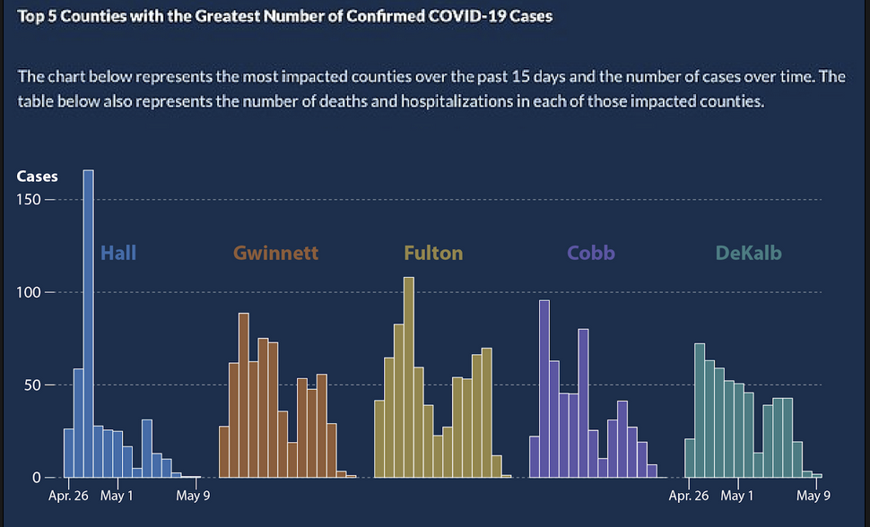

```{r}
#| include: false
#| warning: false
#| message: false

knitr::opts_chunk$set(echo = TRUE, warning = FALSE, message = FALSE, 
                      fig.retina = 3, fig.align = 'center')
library(knitr)
library(tidyverse)
```

::: columns
::: {.column width="60%"}
{width="90%"}
:::

::: {.column width="40%"}
<br>

[Statistical Thinking]{.custom-title}

<br> <br> <br> <br>

[Megan Ayers]{.custom-subtitle}

[Math 141 \| Spring 2026 <br> Monday, Week 1]{.custom-subtitle}
:::
:::

------------------------------------------------------------------------

::: {style="margin-top: 80px; font-size: 3em; color: #3F6574; text-align: center;"}
Before we get started...

<br><br>

**Attendance/waitlist form check**
:::


------------------------------------------------------------------------

## Goals for Today

::: nonincremental
1.  Getting started in Math 141
    i.  Course structure and technologies
    ii. Where to find resources
    iii. Course expectations
2.  Introduce statistical thinking
3.  Introduce data frames
:::

------------------------------------------------------------------------


### A bit about me

- Boise, ID → Lewis & Clark College (Portland) → Yale (New Haven) → back to Portland!
- My Research Interests:
    - Causal inference
    - Environmental policy evaluation
    - Text as data
    - R programming

- I'm looking forward to getting to know each other more in lab! 

------------------------------------------------------------------------

::: {style="margin-top: 80px; font-size: 2.5em; color: #3F6574; text-align: center;"}
Getting Started in Math 141
:::

------------------------------------------------------------------------

## Getting Started in Math 141

#### Course website

::: columns
::: {.column width="60%"}

:::

::: {.column width="40%"}
-   The course website, [megan-k-ayers.github.io/math-141-sp26](https://megan-k-ayers.github.io/math-141-sp26/), will be the central location for all our course materials.

-   We'll use a few other resources to navigate Math 141, but everything will be linked/directed to from the course website.
:::
:::

------------------------------------------------------------------------

## Getting Started in Math 141

#### Other Resources

<br>

::: {.fragment .fade-up .midi style="font-size: 0.9em;"}
Reed's **RStudio Server**, for coursework,
:::

<br>

::: {.fragment .fade-up .midi style="font-size: 0.9em;"}
A course-wide **Slack** workspace, for course communication,
:::

<br>

::: {.fragment .fade-up .midi style="font-size: 0.9em;"}
**Gradescope**, for turning in assignments, and
:::

<br>

::: {.fragment .fade-up .midi style="font-size: 0.9em;"}
**Moodle**, sparingly, for private course materials & info about meeting times/locations
:::

<br>

::: {.fragment .fade-up .midi style="font-size: 0.9em;"}
**Textbooks** (all free and online)

-   [Statistical Inference via Data Science: A ModernDive into R and the tidyverse, Second Edition](https://moderndive.com/v2) (**MD**)
-   [Introduction to Modern Statistics, Second Edition](https://www.openintro.org/book/ims/) (**IMS**)
-   [OpenIntro Statistics, Fourth Edition](https://www.openintro.org/book/os/) (**OI**)
:::

------------------------------------------------------------------------

## Getting Started in Math 141

#### Other Resources

<br><br><br>

You will need access to a computer for this course. 

<br><br>

**Please let me know ASAP after class or via email if you do not have access to a personal computer.**

<!-- ------------------------------------------------------------------------ -->

<!-- ## Getting Started in Math 141 -->
<!-- #### Finding Resources -->

<!-- ::: columns -->
<!-- ::: {.column width="20%"} -->
<!-- ::: -->

<!-- ::: {.column width="60%"} -->
<!-- {fig-align="center"} -->
<!-- ::: -->

<!-- ::: {.column width="20%"} -->
<!-- ::: -->
<!-- ::: -->

<!-- ------------------------------------------------------------------------ -->

<!-- ## Getting Started in Math 141 -->
<!-- #### Finding Resources -->

<!-- ::: columns -->
<!-- ::: {.column width="15%"} -->
<!-- ::: -->

<!-- ::: {.column width="70%"} -->
<!-- {fig-align='center'} -->

<!-- ::: -->

<!-- ::: {.column width="15%"} -->
<!-- ::: -->
<!-- ::: -->


------------------------------------------------------------------------

## Getting Started in Math 141
#### Finding Resources

::: columns
::: {.column width="15%"}
:::

::: {.column width="70%"}
{fig-align='center'}

:::

::: {.column width="15%"}
:::
:::


------------------------------------------------------------------------


## My info {.center}

<br>

::: {.fragment .fade-up .midi}


**Name**: Megan Ayers (she/her), you can call me 'Megan'

**Email**: [meganayers@reed.edu](mailto:meganayers@reed.edu)

**Office and office hours**: Posted on Moodle, or by appointment

:::


------------------------------------------------------------------------

## Learning support resources

- The Math 141 Teaching Team are excited to support your learning!
    - Course assistant office hours coming soon on Moodle
- Each student is entitled to [one hour of individual tutoring](https://www.reed.edu/academic_support/individual_tutoring.html) per week

------------------------------------------------------------------------

## A typical week in Math 141

::: {.nonincremental}

- **Monday**
    - Attend lecture
- **Tuesday**
    - Turn in lab assignment from previous week by 11:59pm
- **Wednesday** 
    - Attend lecture
- **Thursday** 
    - Attend lab
- **Friday**
    - Turn in homework assignment by 11:59pm (most weeks)
    - Attend lecture
    - Next homework assignment is released
    
:::


------------------------------------------------------------------------

## Assignments and Exams


::: {.nonincremental}

:::: {.columns}

::: {.column width="45%"}

::: {.fragment .fade-up}

-   **Lab assignments (*weekly-ish*)**
    - Assigned Thursday in lab
    - Due the next Tuesday, 11:59pm on **Gradescope**
    - Mostly R practice. Please collaborate!
    
:::

::: {.fragment .fade-up}

-   **Homework assignments (*weekly-ish*)**
    - Assigned on Friday (usually)
    - Due the next Friday (usually), 11:59pm on **Gradescope**
    - Mostly theory/conceptual, some R. Please collaborate!
    
:::

:::

::: {.column width="10%"}

:::

::: {.column width="45%"}

::: {.fragment .fade-up}

-   **In-class activities (*semi-regular*)**
    - Individual activities
    - Group activities
    
:::

::: {.fragment .fade-up}


-   **Exams (*1 midterm, 1 final*)**
    - Both are written and in-person
    - Midterm: 3/12
    - Final: Finals week
    
:::

:::

::::

:::

------------------------------------------------------------------------

## Expectations for submitted work

- Address questions completely. If you have a partial solution, say so, explain what you've tried.
- Respond in full sentences for written answers.
- Show your work.
- Write comments in your code explaining your work.

------------------------------------------------------------------------

## Late Work

::: {.nonincremental}

:::{.fragment .fade-up}

-   **Labs**: up to 4 extensions days can be used throughout the semester.
    - e.g., 1 additional day for 4 labs, 4 additional days for 1 lab, ...
    - rounding days up
-   **HW**: up to 4 extensions days can be used throughout the semester.
    - e.g., 1 additional day for 4 HWs, 4 additional days for 1 HW, ...
    - rounding days up
-   Lab extension days cannot be used for HW, and vice versa
    
:::

:::{.fragment .fade-up}

- **Any other late work has a 50\% grade deduction, no guarantees on grading timing/feedback**

:::

:::{.fragment .fade-up}

-   **In-class assignments**: cannot be made up.

:::

:::{.fragment .fade-up}

-   **Exams**: no late exams are accepted. Please arrive on time! 

:::

:::

------------------------------------------------------------------------

## Engagement

-   Being **actively present** is key. This requires **attendance**, and can look like:
    -   Active listening
    -   Contributing to discussion at the small group and/or classroom level
    -   Contributing to discussions on Slack
    
-   Missing more than 4 lectures or 1 lab will have a small, accumulating impact on your grade.

-   During lecture and lab, remove distractions.
    -   When we are on our computers, close email, social media, news, etc.
    -   Hide your phone.
  


------------------------------------------------------------------------

## Engagement

  
-   I have high expectations but know that all of you (regardless of your stats, math, or computing background) have the ability to meet them.

-   We are all going to make mistakes, we will learn more because of them. 


------------------------------------------------------------------------

## Course Climate 

::: blockquote

We expect everyone in this class to strive to foster a learning environment that is equitable, inclusive, and welcoming. If you experience any barriers to learning, please come to Professor Megan Ayers or a college administrator with your concerns.

<br>

**Code of Conduct**:


We expect all members of Math 141 to make participation a harassment-free experience for everyone, regardless of age, body size, visible or invisible disability, ethnicity, sex characteristics, gender identity and expression, level of experience, education, socio-economic status, nationality, personal appearance, race, religion, or sexual identity and orientation.

We expect everyone to act and interact in ways that contribute to an open, welcoming, inclusive, and healthy community of learners. You can contribute to a positive learning environment by demonstrating empathy and kindness, being respectful of differing viewpoints and experiences, and giving and gracefully accepting constructive feedback.[^1]

[^1]: This Code of Conduct is adapted from the [Contributor Covenant](https://www.contributor-covenant.org/version/2/0/code_of_conduct.html), version 2.0.

:::

------------------------------------------------------------------------

## Academic Accomodations

If you plan to request academic accommodations, please submit these **through the DAR student portal** as soon as possible. 

------------------------------------------------------------------------

## Artificial Intelligence (AI) Policy


::: blockquote

Artificial intelligence (AI) tools, such as ChatGPT, Claude, Gemini, and others are being used to generate code, analyze data, and much more. However, learning to think critically about a problem at hand, and engaging with your peers, tutors, and instructors when not understanding a concept or question are integral components of a liberal arts education. Further, a key goal of this course is for you to learn how to thoughtfully, ethically, and independently extract knowledge from data and engage in statistical reasoning. Therefore, the use of generative AI tools, such as ChatGPT and others, is strictly prohibited in any stage of the work process for this course. If you have questions about whether a tool is allowed for this course, ask the Instructor before using it.

:::


------------------------------------------------------------------------

## Course or syllabus questions? 

------------------------------------------------------------------------

## Math 141: The whole game {.center}

:::: {.columns}

::: {.column width="55%"}

::: {.fragment .fade-up .midi}


:::

:::

::::

------------------------------------------------------------------------

## Learning Outcomes {.center}

:::: {.columns}

::: {.column width="45%"}


:::


::: {.column width="55%"}

-   In this course, you will learn how to think critically with data by engaging in the entire data analysis process.

-   Most of our time will be spent in the **Exploration and Visualization**, **Data Wrangling**,  and **Modeling and Inference** steps, but we will spend some time in each cog!
    - First ~3 weeks in **Exploration and Visualization**, **Data Wrangling**, and **Data Acquisition**
    - Next ~2 weeks in **Modeling**
    - Next ~6 weeks of the course in **Inference**
    - Final weeks combining **Modeling** and **Inference**

:::

::::

------------------------------------------------------------------------

::: {style="margin-top: 80px; font-size: 2.5em; color: #3F6574; text-align: center;"}
Statistical thinking
:::

------------------------------------------------------------------------

## Math 141 is about developing our **statistical thinking** skills. {.center}

<br>

::: {.fragment .fade-up .midi}
What is **statistical thinking**?
:::

<br>

::: {.fragment .fade-up .midi}
It is distinct from mathematical thinking.
:::

<br>

::: {.fragment .fade-up .midi}
Let's discover what **statistical thinking** is through some examples.
:::

------------------------------------------------------------------------

## Data in Math 141

Will use a wide-range of **real** and **relevant** data examples

::::: columns
::: {.column .center width="50%"}
{width="100%"}
:::

::: {.column .center width="50%"}
{width="80%"}
:::
:::::

# Example: Visualizing COVID Prevalence

------------------------------------------------------------------------

## Example: Visualizing COVID Prevalence

-   In May of 2020, the Georgia Department of Public Health posted the following graph:

::: {.fragment .midi}
{width="75%" fig-align="center"}
:::


------------------------------------------------------------------------

## Example: Visualizing COVID Prevalence

::: nonincremental
{width="70%" fig-align="center"}

-   At a quick first glance, what story does the graph appear to be telling?

:::

------------------------------------------------------------------------

## Example: Visualizing COVID Prevalence

::: nonincremental
{width="70%" fig-align="center"}

-   What is misleading about the graph? How could we fix this issue?

:::

------------------------------------------------------------------------


## Example: Visualizing COVID Prevalence

-   After public outcry, the Georgia Department of Public Health updated the graph:

::: {.fragment .midi}
{fig-align="center" width="70%"}
:::


------------------------------------------------------------------------

## Example: Visualizing COVID Prevalence

::: nonincremental
-   After public outcry, the Georgia Department of Public Health updated the graph:

{fig-align="center" width="50%"}

-   How do your conclusions about COVID-19 cases in Georgia change when interpreting the new graph?

:::

------------------------------------------------------------------------

## Example: Visualizing COVID Prevalence 

Alberto Cairo, a journalist and designer, created the second graph of the Georgia COVID-19 data:

::: {.fragment .midi}
{width="50%"} {width="45%"}
:::

-   A key principle of data visualization is to **"help the viewer make meaningful comparisons"**.

-   What comparisons are made easy by the lefthand graph? What about by the righthand graph?


## Statistical Thinking

-   About developing **reasoning** (not just learning definitions and formulae).

-   Statistical thinking requires **judgment** that takes time to develop.

    -   Will see **examples** and **practice** applying statistical thinking throughout the course.
    - Numeric calculations only get us so far: it is critical to understand the **underlying data** and **assumptions**

-   Developing our statistical thinking skills will allow us to soundly **extract knowledge from data**!

------------------------------------------------------------------------

## [What are/is Data?]{.center}

<br>

<br>

::: blockquote
[*"'Raw data' is an oxymoron."* -- Lisa Gitelman](https://catalog.library.reed.edu/permalink/01ALLIANCE_REED/ivkaaq/alma99900791224501841)
:::

<br>

::: blockquote
[*"Data ... is information made tractable."* -- Catherine D'Ignazio and Lauren Klein](https://catalog.library.reed.edu/permalink/01ALLIANCE_REED/ivkaaq/alma99900435411901841)
:::

------------------------------------------------------------------------

::: {style="margin-top: 80px; font-size: 2.5em; color: #3F6574; text-align: center;"}
Data Frames
:::

------------------------------------------------------------------------

## Data Frames

Data in **spreadsheet**-like format where:

-   Rows = Observations/cases

-   Columns = Variables

```{r}
#| echo: false
# pak::pak("simonpcouch/detectors")
library(tidyverse)
library(knitr)
library(kableExtra)
library(detectors)

detectors %>%
  mutate(ID = row_number()) %>%
  relocate(ID) %>%
  select(-document_id, -prompt) %>%
  head() %>%

  kable() %>%   
  kable_styling(bootstrap_options = c("responsive", "bordered", "striped", "compact"),
                font_size = 32)

```

-   Data from **GPT Detectors Are Biased Against Non-Native English Writers.** *Weixin Liang*, *Mert Yuksekgonul*, *Yining Mao*, *Eric Wu*, *James Zou.* [CellPress Patterns](https://doi.org/10.1016/j.patter.2023.100779) and available in the `R` package `detectors`.

------------------------------------------------------------------------

## Data Frames

```{r}
#| echo: false

detectors %>%
  mutate(ID = row_number()) %>%
  relocate(ID) %>%
  select(-document_id, -prompt) %>%
  head() %>%

  kable() %>%   
  kable_styling(bootstrap_options = c("responsive", "bordered", "striped", "compact"),
                font_size = 32)

```

Rows = Observations/cases

**What are the cases? What does each row represent?**

------------------------------------------------------------------------

## Data Frames

```{r}
#| echo: false

detectors %>%
  mutate(ID = row_number()) %>%
  relocate(ID) %>%
  select(-document_id, -prompt) %>%
  head() %>%

  kable() %>%   
  kable_styling(bootstrap_options = c("responsive", "bordered", "striped", "compact"),
                font_size = 32)

```

Columns = Variables

**Variables**: Describe characteristics of the observations

-   **Quantitative**: Numerical in nature

-   **Categorical**: Values are categories

-   **Identification**: Uniquely identify each case

------------------------------------------------------------------------

## Data Frames

```{r}
#| echo: false

detectors %>%
  mutate(ID = row_number()) %>%
  relocate(ID) %>%
  select(-document_id, -prompt) %>%
  head() %>%

  kable() %>%   
  kable_styling(bootstrap_options = c("responsive", "bordered", "striped", "compact"),
                font_size = 32)

```

Every time you get a new dataset, spend time exploring the variables.

Example questions:

-   Is each variable capturing the desired information?

-   For categorical variables, what are the categories? Do those categories adequately represent that variable?

-   For quantitative variables, what values are possible? Were the data rounded or binned? Are those values actually encoding categories? What are the units of measurement?

------------------------------------------------------------------------

## Next time
- Introduction to data visualization!

------------------------------------------------------------------------
