```{r}
#| include: false
#| warning: false
#| message: false

knitr::opts_chunk$set(echo = TRUE, warning = FALSE, message = FALSE, 
                      fig.retina = 3, fig.align = 'center')
library(knitr)
library(tidyverse)
```

::::: columns
::: {.column .center width="60%"}
{width="90%"}
:::

::: {.column .center width="40%"}
<br>

[Data Visualization]{.custom-title}

<br> <br> <br> <br>

[Megan Ayers]{.custom-subtitle}

[Stat 141 \| Fall 2026 <br> Wednesday, Week 1]{.custom-subtitle}
:::
:::::

------------------------------------------------------------------------


### Announcements/reminders

- Room change reminder for afternoon lab section

- Waitlist movement - let me know if you're still on the waitlist and haven't heard from me

- Math/Stats colloquium tomorrow - information session about Math/Math-Stats majors


------------------------------------------------------------------------


### Last Time

::: nonincremental
-  Introductions
-  Statistical thinking
-  Introduced data frames
:::

### Goals for Today

::: nonincremental
-   Review data frames
-   Motivate data visualizations
-   Develop **language** to talk about the components of a graphic
-   Practice deconstructing graphics
-   Discuss good graphical practices
:::

<!-- ------------------------------------------------------------------------ -->

<!-- ## Reminders -->

<!-- -   DAR accommodations. -->
<!-- -   **Slack** for communication. -->
<!--     - `general-qa` and `coding-qa` channels -->
<!-- -   Course assistant (CA) office hours are now posted on Moodle -->
<!--     - CA Office hours start next week -->
<!--     - Coverage every week day!  -->
<!-- -   Other resources -->
<!--     - Individual tutoring -->
    
    
<!-- ## Math 141 Office Hours Schedule {.center} -->

<!-- ::: nonincremental -->
<!-- - On [Moodle](https://moodle.reed.edu/course/view.php?id=6317) -->
<!-- ::: -->


## Data Frames

Data in **spreadsheet**-like format where:

-   Rows = Observations/cases

-   Columns = Variables

```{r}
#| echo: false
# pak::pak("simonpcouch/detectors")
library(tidyverse)
library(knitr)
library(kableExtra)
library(detectors)

detectors %>%
  mutate(ID = row_number()) %>%
  relocate(ID) %>%
  select(-document_id, -prompt) %>%
  head() %>%

  kable() %>%   
  kable_styling(bootstrap_options = c("responsive", "bordered", "striped", "compact"),
                font_size = 32)

```

-   Data from **GPT Detectors Are Biased Against Non-Native English Writers.** *Weixin Liang*, *Mert Yuksekgonul*, *Yining Mao*, *Eric Wu*, *James Zou.* [CellPress Patterns](https://doi.org/10.1016/j.patter.2023.100779) and available in the `R` package `detectors`.

------------------------------------------------------------------------

## Data Frames

```{r}
#| echo: false

detectors %>%
  mutate(ID = row_number()) %>%
  relocate(ID) %>%
  select(-document_id, -prompt) %>%
  head() %>%

  kable() %>%   
  kable_styling(bootstrap_options = c("responsive", "bordered", "striped", "compact"),
                font_size = 32)

```

Columns = Variables

**Variables**: Describe characteristics of the observations

-   **Quantitative**: Numerical in nature

-   **Categorical**: Values are categories

-   **Identification**: Uniquely identify each case

------------------------------------------------------------------------


## Types of variables

:::: {.columns}

::: {.column width = "50%"}

-   **Identification**: Uniquely identify each case

<br>

-   **Quantitative**: Numerical in nature
    - Those that can take a range of values are called **continuous** (e.g., age, income)
    - Those that only take particular (often whole number) values are called **discrete** (e.g., result of a dice roll)
    - Not every variable involving numbers is quantitative!

:::

::: {.column width = "50%"}

-   **Categorical**: Values represent categories
    - Usually take *non-numeric* values (e.g., Race/Ethnicity or Gender)
    - But can take numeric values! (e.g., zip code)
    - The values that a categorical variable can take are called its **levels** 
    - **Ordinal** categorical variables can be ordered (e.g., level of education, variables collected with a Likert scale)
    - Categorical variables that cannot be ordered are called **nominal** (e.g., Race/Ethnicity)
  


:::


::::

## Why construct a graph? {.center}

<br>

::: {.fragment .fade-up .midi}
To **explore** the data.
:::

::: {.fragment .fade-up .midi}
To **summarize** the data.
:::

::: {.fragment .fade-up .midi}
To showcase **trends** and make **comparisons**.
:::

::: {.fragment .fade-up .midi}
To tell a compelling **story**.
:::

<br><br>

::: {.fragment .fade-up .midi}
Doing any of this by only looking at a data frame (even a small one) would be hard! 
:::

------------------------------------------------------------------------

## Challenger

-   On January 27th, 1986, engineers from Morton Thiokol recommended NASA delay launch of space shuttle *Challenger* due to cold weather.

    -   Believed cold weather impacted the o-rings that held the rockets together.
    -   Used 13 charts in their argument.

-   After a two hour conference call, the engineer's recommendation was overruled due to lack of persuasive evidence and the launch proceeded.

-   The Challenger exploded 73 seconds into launch.

------------------------------------------------------------------------

## Challenger

Here's one of those charts.

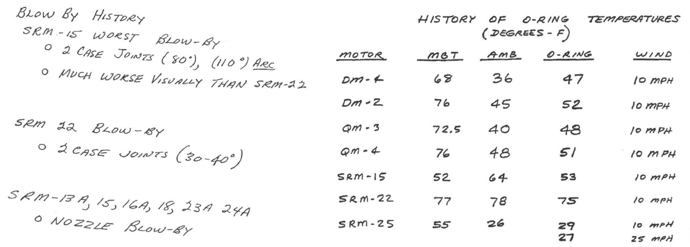{width="90%" fig-align="center"}

------------------------------------------------------------------------

## Challenger

Here's another one of those charts.

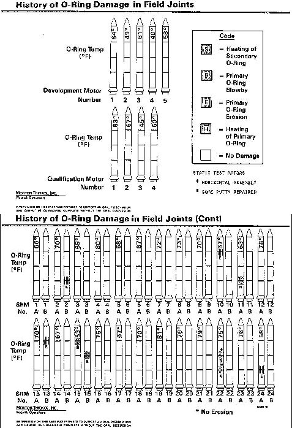{width="30%" fig-align="center"}

------------------------------------------------------------------------

## Challenger

Here's a graphic created in `R` from Statistician [Edward Tufte](https://en.wikipedia.org/wiki/Edward_Tufte)'s data.

```{r, echo = FALSE, out.width = "60%", fig.asp = .6}
library(ggplot2)
library(dplyr)
library(readr)
Challenger <- read_delim("data/Challenger2.txt", 
                         "\t", escape_double =
                           FALSE, trim_ws = TRUE)


ggplot(data = Challenger, mapping = aes(x = T, y = I)) + geom_point(alpha = 0.5, color = "orange", size = 5) + labs(y = "Tufte's O-ring damage index", x = "Temperature (degrees F) at launch") #+ geom_smooth(se = FALSE)
```

------------------------------------------------------------------------

## Challenger

This adaptation is a recreation of Edward Tufte's graphic.

::: aside
For more information on this example and other examples, check out [Tufte's book](https://catalog.library.reed.edu/permalink/01ALLIANCE_REED/ivkaaq/alma99121646650101841).
:::

```{r, echo = FALSE, out.width = "60%", fig.align='center', fig.asp= .6}

ggplot() + geom_point(data = Challenger, mapping = aes(x = T, y = I),alpha = 0.5, color = "orange", size = 5) + labs(y = "Tufte's O-ring damage index", x = "Temperature (degrees F) at launch") +
  xlim(22, 85) +
  geom_rect(mapping = aes(xmin = 26, xmax = 29, ymin = 0, ymax = 11), alpha = 0.2) +  annotate(geom = "text", x = 28, y = 6, label = "Forcasted \ntemperature \nfor \nJanuary 27th")#+ geom_smooth(se = FALSE) 
```

## Now let's learn the **Grammar of Graphics**. {.center}

::: {.fragment .fade-up .midi}
We will use this grammar to:
:::

::: {.fragment .fade-up .midi}
Decompose and understand existing graphs.
:::

::: {.fragment .fade-up .midi}
Create our own graphs with the `R` package `ggplot2`.
:::

------------------------------------------------------------------------

## Grammar of Graphics

-   **data**: Data frame that contains the raw data
    -   Columns are variables used in the graph
-   **geom**: Geometric **form** that the data are mapped to.
    -   EX: Point, line, bar, text, ...
-   **aesthetic**: Visual properties of the **geom**
    -   EX: X (horizontal) position, y (vertical) position, color, fill, shape
-   **scale**: Controls how data are mapped to the visual values of the aesthetic.
    -   EX: particular colors, log scale
-   **guide**: Legend/key to help user convert visual display back to the data

::: fragment
For right now, we won't focus on the **names** of particular types of graphs (e.g., scatterplot) but on the **elements** of graphs.
:::

------------------------------------------------------------------------

:::::: columns
:::: {.column width="40%"}
### Example 1: Think-pair-share

::: nonincremental
-   What are the variables?
-   What **geom** (i.e. shape, form) are the variables mapped to?
-   What are the **aesthetic**s (visual properties) of the **geom**?
-   How is each variable mapped to an **aesthetic**?
-   What additional context is provided? Is any missing?
-   What story is the graph telling?
:::
::::

::: {.column width="60%"}
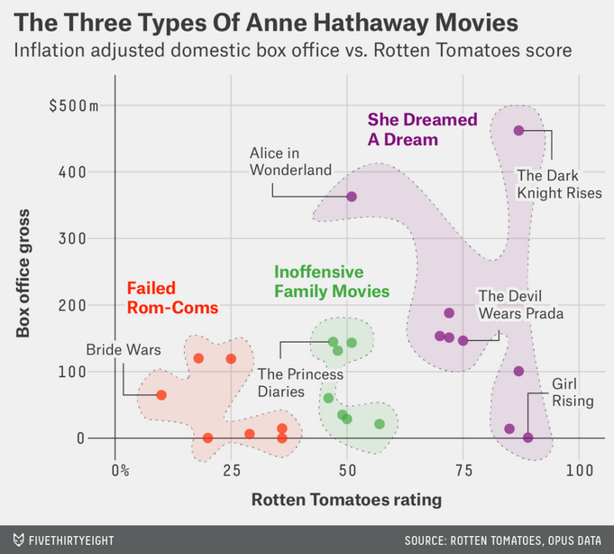{width="85%" fig-align="center" fig-dpi="200"}
:::
::::::

```{r}
#| echo: false
countdown::countdown(5)
```

------------------------------------------------------------------------

:::::: columns
:::: {.column width="30%"}
### Example 2: Think-pair-share

::: nonincremental
-   What are the variables?
-   What **geom** are the variables mapped to?
-   What are the **aesthetic**s of the **geom**?
-   How is each variable mapped to an **aesthetic**?
-   What additional context is provided? Is any missing?
-   What story is the graph telling?
:::
::::

::: {.column .center width="70%"}
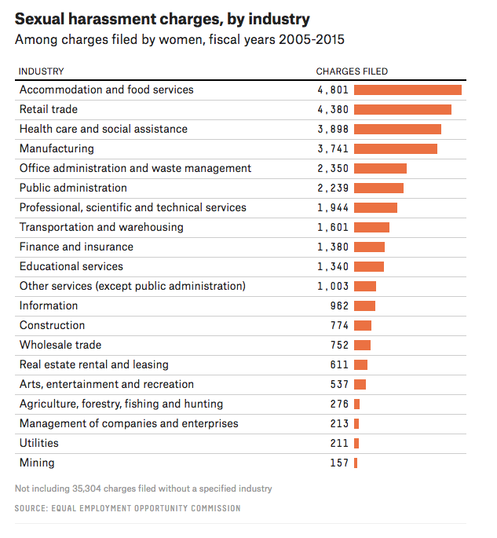{width="75%" fig-align="center" fig-dpi="200"}
:::
::::::

```{r}
#| echo: false
countdown::countdown(4)
```

# Visualization Considerations

------------------------------------------------------------------------

### What additional context should my graphs have?

-   For context, at a minimum include

    -   Axis labels (with units reported).
    -   Legends.
    -   Data source.

-   Think about the **stories/questions** your visualization answers.

-   Determine what **context/background information** your viewer needs.

-   Visualizing data involves **editorial choices**.

    -   What to highlight.
    -   What comparisons to make easy to see.
    -   What scales to use.

------------------------------------------------------------------------

### Context Example

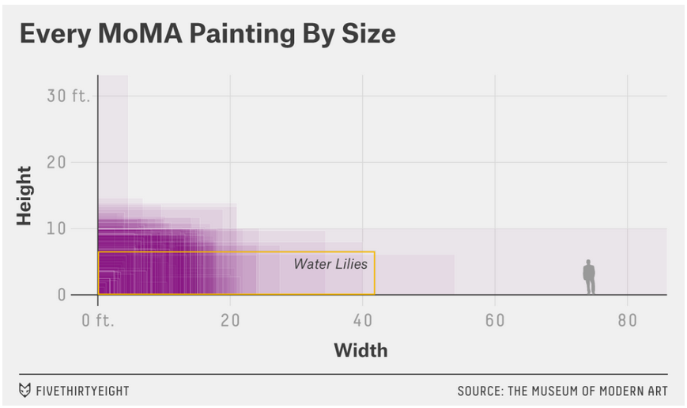{width="70%" fig-align="center"}

------------------------------------------------------------------------

### Water Lilies

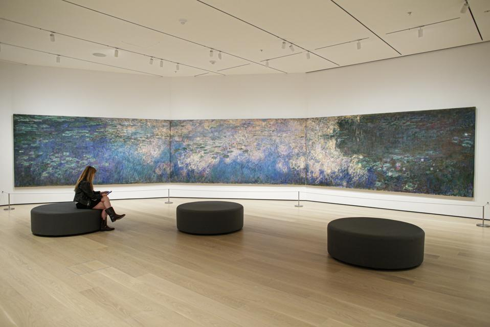{width="70%" fig-align="center"}

------------------------------------------------------------------------

### What visual cues are easier to compare?

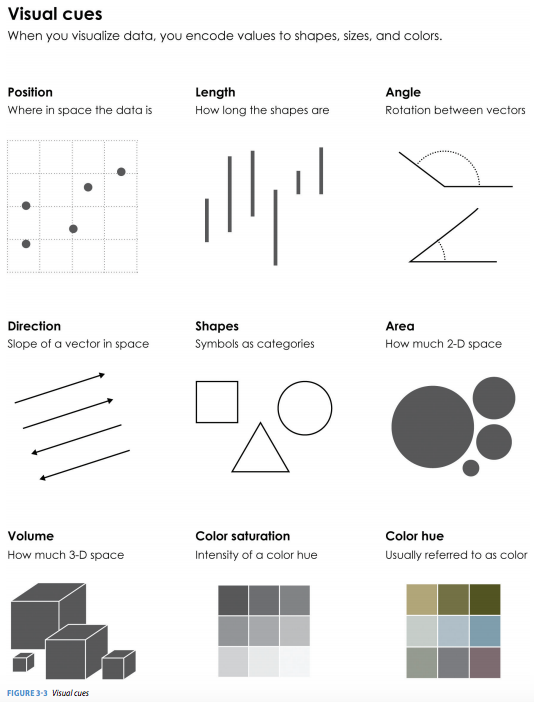{width="37.5%" fig-align="center"}

------------------------------------------------------------------------

### What to consider with color?

Consider color blindness [(click here for a helpful tool for picking colors)](https://davidmathlogic.com/colorblind/#%23D81B60-%231E88E5-%23FFC107-%23004D40).

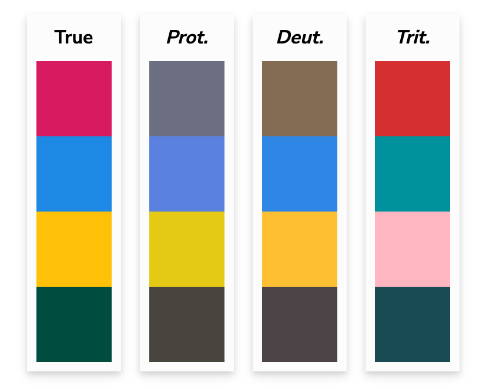{width="55%" fig-align="center"}

------------------------------------------------------------------------

### Color Palettes -- Sequential

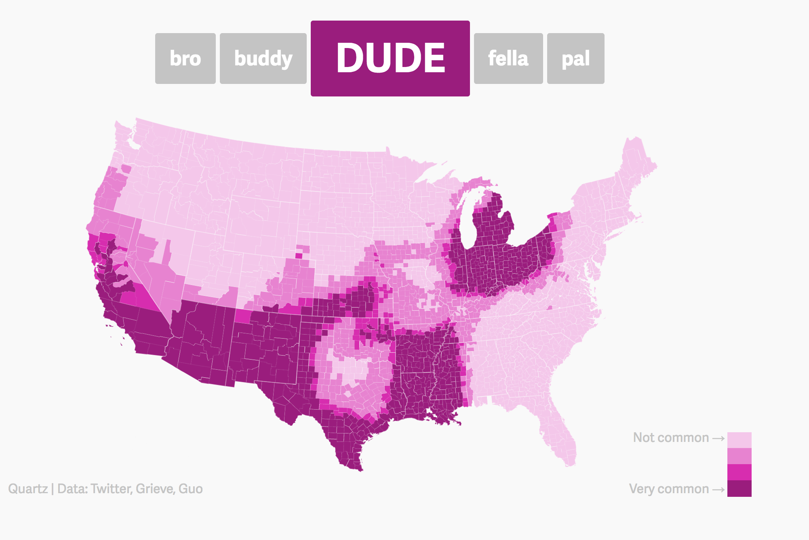{width="60%" fig-align="center"}

::: {aside}
Maps, like the [Dude map](https://qz.com/316906/the-dude-map-how-american-men-refer-to-their-bros/) are also a great way to provide context!
:::

------------------------------------------------------------------------

### Color Palettes -- Diverging

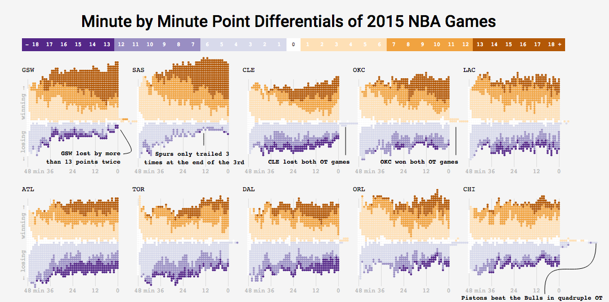{width="90%" fig-align="center"}

::: {aside}
[Adam Pearce's 2015 NBA Games](https://roadtolarissa.com/nba-minutes/)
:::

------------------------------------------------------------------------

### Color Palettes -- Qualitative

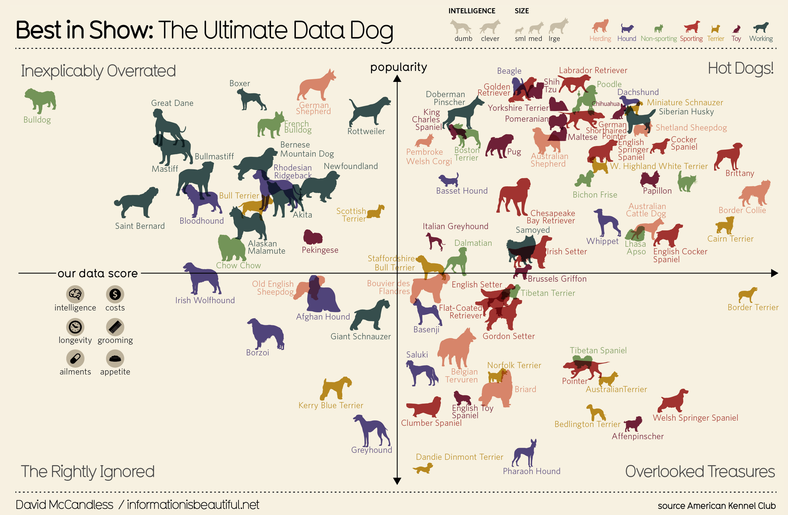{width="68%" fig-align="center"}

::: {aside}
[information is beautiful's Best in Show](https://www.informationisbeautiful.net/visualizations/best-in-show-whats-the-top-data-dog/)
:::


------------------------------------------------------------------------

## Bad Graphics

Because of all the design choices, it is much easier to make a bad graph than a good graph.

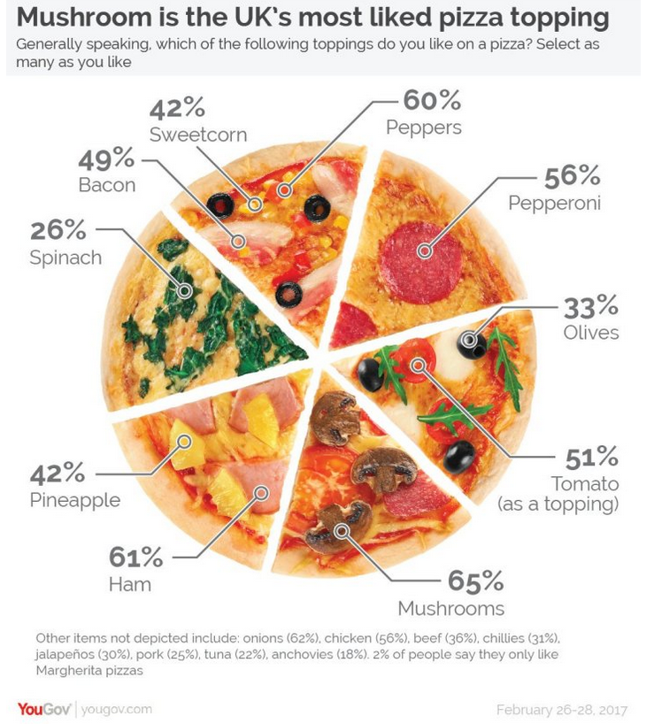{width="40%" fig-align="center"}

------------------------------------------------------------------------

## Misleading Graphics

Be careful that your design choices don't cause your viewer to draw incorrect conclusions about the data:

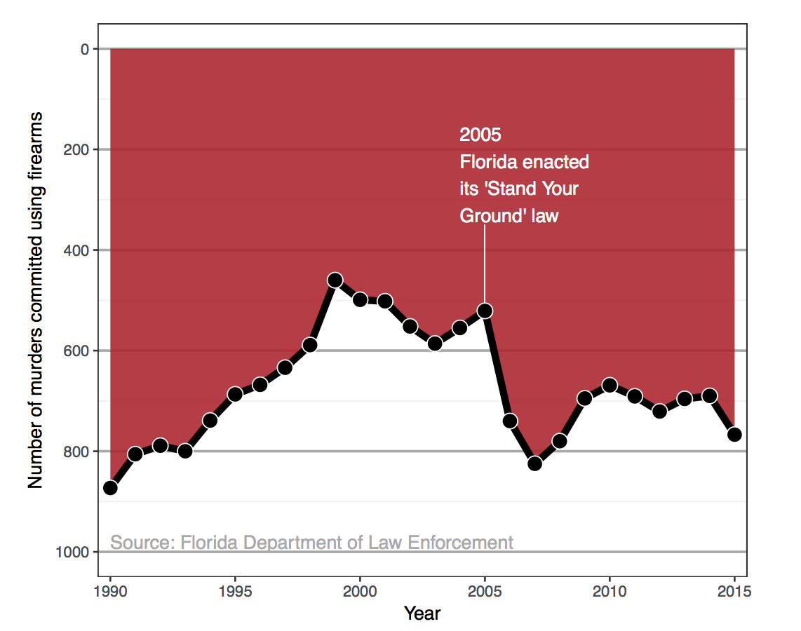{width="40%" fig-align="center"}

-   Just letting the software make all the design choices can still lead to misleading graphs (recall the Georgia COVID graph).

------------------------------------------------------------------------

## Summary Thoughts on Graphical Considerations

-   Good graphics are one's where the findings and insights are **obvious** to the viewer.

    -   Add information and key **context**.

-   Facilitate the **comparisons** that correspond to the research question.

    -   Recall the three Georgia COVID counts graphs from Day 1!

-   Data visualizations are **not neutral**.

-   It is easier to see the differences and similarities between different types of graphics if we learn the **grammar of graphics**.

-   Practicing **decomposing** graphics should make it easier for us to **compose** our own graphics.


<!-- # [The DataLab @ Reed](https://www.reed.edu/data-at-reed/data_lab/) -->

------------------------------------------------------------------------

### Recap

::: {.nonincremental .fragment}

Today we...

-   Reviewed data frames
-   Motivated data visualizations
-   Developed **language** to talk about the components of a graphic
-   Practiced deconstructing graphics
-   Discussed good graphical practices
:::


### Next time

-   Tomorrow in lab: intro to using RStudio to code and explore data frames 
-   Friday: We'll learn about the `ggplot2` package so that we can use the grammar of graphics to create beeaauutiful visualizations!! 
    - (This is my favorite part of any project, and soon I hope it is yours too)

