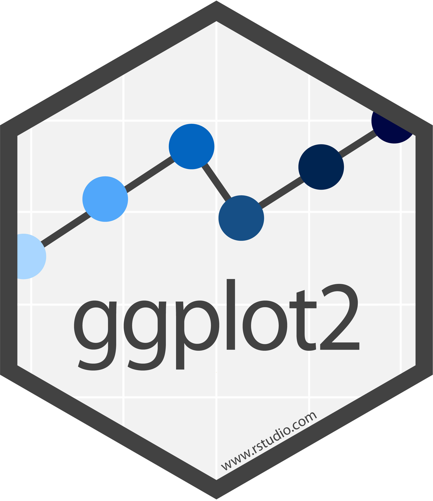
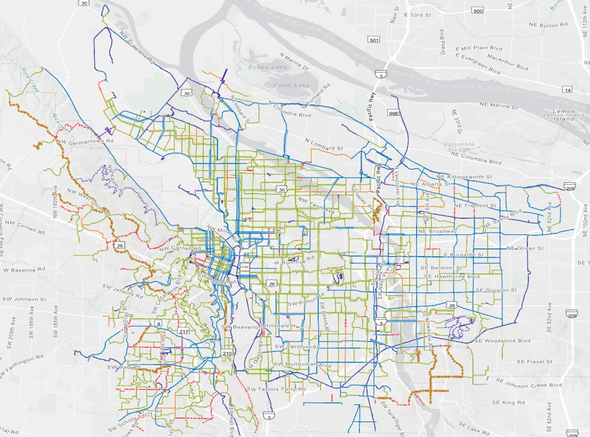

```{r}
#| include: false
#| warning: false
#| message: false

knitr::opts_chunk$set(echo = TRUE, warning = FALSE, message = FALSE, 
                      fig.retina = 3, fig.align = 'center')
library(knitr)
library(tidyverse)
```

::::: columns
::: {.column .center width="60%"}
{width="90%"}
:::

::: {.column .center width="40%"}
<br>

[Data Visualization: the 5 Named Graphs with <code>ggplot2</code>]{.custom-title}

<br> <br> <br> <br> <br>

[Megan Ayers]{.custom-subtitle}

[Stat 141 \| Fall 2026 <br> Friday, Week 1]{.custom-subtitle}
:::
:::::

------------------------------------------------------------------------


### Reminders/Announcements

-   If you plan to request academic accommodations, please submit these through the **DAR student portal**
-   Course assistant office hours are now on Moodle
-   [The DataLab @ Reed](https://www.reed.edu/data-at-reed/data_lab/)
-   First homework assignment is posted! 

```{r, echo = FALSE, eval = FALSE}

library(tidyverse)
qod <- read.csv("data/qod_coffee-tea.csv")
qod %>% count(clean.answer) %>%
  ggplot(aes(y = reorder(clean.answer, n), x = n)) +
  geom_col() +
  ylab("") +
  theme_classic()

```

------------------------------------------------------------------------


### Last Time

::: nonincremental
-   Data frames
-   Motivation for data visualizations
-  "Grammar" of graphics and good graphical practices
:::

### Goals for Today
-   Recall our motivation for good graphics
-   Learn the general structure of `ggplot2`
-   Learn five standard graphs for numerical/quantitative data:
    -   **Histogram**: one numerical variable
    -   **Boxplot**: one numerical variable
    -   **Barplot**: one numerical variable and at least one categorical variable
    -   **Scatterplot** and **Linegraph**: two numerical variables

------------------------------------------------------------------------

## Load Necessary Packages

{width="15%" fig-align="center"}

`ggplot2` is part of this collection of data science packages.

```{r}
#| message: true
#| warning: true
# Load necessary packages
library(tidyverse)
```

<br>

Also, above is an example of a code comment: `# Load necessary packages`

------------------------------------------------------------------------

## Data Setting: [Portland Bikeshare Data](https://biketownpdx.com)

::::: columns
::: {.column width="40%" fig-align="center"}
{width="100%"}
:::

::: {.column width="60%" fig-align="center"}
{width="100%"}
:::
:::::

------------------------------------------------------------------------

## Import the Data

```{r}
biketown <- read.csv("data/biketown.csv")

# Inspect the data
glimpse(biketown)
```


------------------------------------------------------------------------

## Inspect the Data

```{r}
# Look at first few rows
head(biketown)
```

What does a row represent here?

------------------------------------------------------------------------

## Inspect the Data

```{r}
# Determine type
# To access one variable: dataset$variable
class(biketown$BikeName)
class(biketown$Distance_Miles)
class(biketown)

```

------------------------------------------------------------------------

## Grammar of Graphics

::: nonincremental
-   **data**: Data frame that contains the raw data
    -   Variables used in the graph
-   **geom**: Geometric **shape** that the data are mapped to.
    -   EX: Point, line, bar, text, ...
-   **aesthetic**: Visual properties of the **geom**
    -   EX: X (horizontal) position, y (vertical) position, color, fill, shape
-   **scale**: Controls how data are mapped to the visual values of the aesthetic.
    -   EX: particular colors, log scale
-   **guide**: Legend/key to help user convert visual display back to the data
:::

------------------------------------------------------------------------

## `ggplot2` example code

**Guiding Principle**: We will map variables from the **data** to the **aes**thetic attributes (e.g. location, size, shape, color) of **geom**etric objects (e.g. points, lines, bars).

```{r, eval = FALSE, tidy = FALSE}
ggplot(data = ---, mapping = aes(---)) +
  geom_---(---) 
```

-   There are other layers, such as `scale_---_---()` and `labs()`, but we will wait on those.

<br>

-   We are about to touch on many details of graphs - focus on recognizing this general pattern, revisit the slides to refresh on the coding specifics

------------------------------------------------------------------------

## Histograms

::::: columns
::: {.column width="33%"}
-   Binned counts of data.

-   Great for assessing data distribution and shape.

- **Question**: are histograms used for *quantitative* or *categorical* variables?

- **Answer**: *Quantitative*. 
:::

::: {.column width="66%"}
```{r, echo = FALSE}
# Create histogram
ggplot(data = biketown, mapping = aes(x = Distance_Miles)) +
  geom_histogram()

```
:::
:::::

------------------------------------------------------------------------

## Data Shapes

```{r, echo=FALSE, fig.width = 12, fig.asp = .4}
set.seed(1)
dat <- data_frame(x1 = rf(200,12,8), x2 = rnorm(200), x3 = (-1)*rf(200, 12, 8)+20)
p1 <- ggplot(dat, aes(x = x1)) +
  geom_histogram(bins = 20) +
  labs(title = "Right Skewed Shape")
p2 <- ggplot(dat, aes(x = x2)) +
  geom_histogram(bins = 15) +
  labs(title = "Bell Shaped \nand Symmetric")
p3 <- ggplot(dat, aes(x = x3)) +
  geom_histogram(bins = 15) + 
  labs(title = "Left Skewed Shape")
library(cowplot)
plot_grid(p1, p2, p3, ncol = 3)
```

------------------------------------------------------------------------

## Histograms

```{r hist}
#| output-location: column
# Create histogram
ggplot(data = biketown, 
       mapping = aes(x = Distance_Miles)) +
  geom_histogram()
```

------------------------------------------------------------------------

## Histograms

```{r hist2}
#| output-location: column
#| code-line-numbers: "4-6"
# Create histogram
ggplot(data = biketown, 
       mapping = aes(x = Distance_Miles)) +
  geom_histogram(color = "white",
                 fill = "violetred1",
                 bins = 50)
```

-   **mapping** to a variable goes in `aes()`
-   **setting** to a specific, *constant*, value goes in the `geom_---()`
<br><br>
-   Does the right **tail** of this distribution make sense? 

------------------------------------------------------------------------

## Boxplots

::::: columns
::: {.column width="50%"}
-   **Five number summary**:
    -   Minimum
    -   First quartile (Q1)
    -   Median
    -   Third quartile (Q3)
    -   Maximum
-   Interquartile range (IQR) $=$ Q3 $-$ Q1
-   Outliers: **unusual** points
    -   Boxplot defines unusual as being beyond $1.5*IQR$ from $Q1$ or $Q3$.
-   Whiskers: reach out to the furthest point that is NOT an outlier
:::

::: {.column width="50%"}
```{r echo = FALSE}
ggplot(data = biketown, 
       mapping = aes(x = PaymentPlan, 
                     y = Distance_Miles)) +
  geom_boxplot()
```
:::
:::::

------------------------------------------------------------------------

## Boxplots

```{r}
#| output-location: column
# Create boxplot
ggplot(data = biketown, 
       mapping = aes(x = PaymentPlan, 
                     y = Distance_Miles)) +
  geom_boxplot()
```

------------------------------------------------------------------------

## Boxplots

```{r box2}
#| output-location: column
#| code-line-numbers: "4"
ggplot(data = biketown, 
       mapping = aes(x = PaymentPlan, 
                     y = Distance_Miles)) +
  geom_boxplot(fill = "springgreen3")
```

-   Is this `fill` an `aes`thetic mapping? 

------------------------------------------------------------------------

## Boxplots

```{r box3}
#| output-location: column
#| code-line-numbers: "4"
ggplot(data = biketown, 
       mapping = aes(x = PaymentPlan, 
                     y = Distance_Miles,
                     fill = PaymentPlan)) +
  geom_boxplot()
```

-   Is this `fill` an `aes`thetic mapping? 

-   What variable is mapped to `fill`? 

------------------------------------------------------------------------

## Boxplots

```{r box4}
#| output-location: column
#| code-line-numbers: "6"
ggplot(data = biketown, 
       mapping = aes(x = PaymentPlan, 
                     y = Distance_Miles,
                     fill = PaymentPlan)) +
  geom_boxplot() +
  guides(fill = "none")
```

------------------------------------------------------------------------

## Barplots
```{r, echo = FALSE}
# Ignore this line - just pulling out month 
biketown$month <- gsub("^([0-9]{1,2})/.*", "\\1",
                       biketown$StartDate)
```

```{r bar}
#| output-location: column

ggplot(data = biketown, 
       mapping = aes(x = month)) +
  geom_bar()
```
- Boxplots and histograms show the overall distribution of *quantitative* variables 
- Barplots show the distribution of quantitative variables within distinct levels defined by a *categorical* variable

------------------------------------------------------------------------

## Barplots

```{r}
#| output-location: column
ggplot(data = biketown, 
       mapping = aes(x = month,
                     fill = PaymentPlan)) +
  geom_bar()
```
- Barplots can also show the joint distribution of *two* categorical variables via the color or fill **aes**thetic. 
- Here, each bar is divided into separate counts with respect to the `Payment Plan` variable. 

------------------------------------------------------------------------

## Barplots

```{r}
#| output-location: column
ggplot(data = biketown, 
       mapping = aes(x = month,
                     fill = PaymentPlan)) +
  geom_bar(position = "fill")
```
- Alternatively, we can consider the y-axis to represent proportion, making direct comparison easier.

------------------------------------------------------------------------


## New Data Context: `pdxTrees`

-   The `pdxTrees` R package contains data on all the trees in the Portland Metro Area. 
-   Today, we'll look at the Maple, Oak, Pine, Cedar, and Douglas-fir trees in a few parks near Reed. 
-   Let's load the data

## New Data Context: `pdxTrees`

::: {.nonincremental}

-   The `pdxTrees` R package contains data on all the trees in the Portland Metro Area. 
-   Today, we'll look at the Maple, Oak, Pine, Cedar, and Douglas-fir trees in a few parks near Reed. 
-   Let's load the data
-   Don't worry, we haven't learned the below code yet. 

:::

```{r}
library(pdxTrees)
near_Reed <- get_pdxTrees_parks(park = c("Woodstock Park", "Sellwood Riverfront Park", "Kenilworth Park"))
near_Reed <- near_Reed[near_Reed$Genus %in% c("Acer", "Quercus", "Pinus", "Thuja", "Pseudotsuga"), ]

```

## Inspect the data

```{r}
glimpse(near_Reed)
```

## Inspect the data

```{r}
head(near_Reed)
```

What does a row represent here? 


## Scatterplots

-   Explore relationships between numerical variables.
    -   We will be especially interested in **linear** relationships.

::: fragment
```{r}
#| output-location: column

ggplot(data = near_Reed,
       mapping = aes(x = DBH,
                     y = Carbon_Storage_lb)) +
  geom_point(size = 2)
```
:::

::: fragment
Is there something visually off with the points in this graph?
:::


------------------------------------------------------------------------

## Scatterplots

```{r}
#| output-location: column


ggplot(data = near_Reed,
       mapping = aes(x = DBH,
                     y = Carbon_Storage_lb)) +
  geom_point(size = 2, alpha = 0.25)
```

-   Fix over-plotting (using **alpha**)
-   What's going on in this graph?


------------------------------------------------------------------------

## Scatterplots

::: {.nonincremental}
```{r}
#| output-location: column


ggplot(data = near_Reed,
       mapping = aes(x = DBH,
                     y = Carbon_Storage_lb)) +
  geom_point(size = 2, alpha = 0.25) +
  labs(x = "Diameter at Breast Height",
       y = "Carbon Storage (lbs)",
       caption = "Data Collected as part of the Urban Forestry Tree Inventory Project",
       title = "Tree Species Relationships Near Reed College")
```

-   Fix over-plotting (using **alpha**)
-   What's going on in this graph? (labels help add context)
:::

------------------------------------------------------------------------

## Scatterplots

```{r}
#| output-location: column


ggplot(data = near_Reed,
       mapping = aes(x = DBH,
                     y = Carbon_Storage_lb,
                     color = Genus)) +
  geom_point(size = 2, alpha = 0.25)
```


------------------------------------------------------------------------

## Linegraphs


```{r}
#| output-location: column


ggplot(data = near_Reed,
       mapping = aes(x = DBH,
                     y = Carbon_Storage_lb)) +
  geom_line(linewidth = 2)
```

## Linegraphs


```{r}
#| output-location: column


ggplot(data = near_Reed,
       mapping = aes(x = DBH,
                     y = Carbon_Storage_lb,
                     color = Genus)) +
  geom_line(linewidth = 2)
```

## Linegraphs vs scatterplots

::::: columns
::: {.column width="50%"}


```{r}
#| echo: false
ggplot(data = near_Reed,
       mapping = aes(x = DBH,
                     y = Carbon_Storage_lb,
                     color = Genus)) +
  geom_line(linewidth = 2)
```
:::

::: {.column width="50%"}

```{r}
#| echo: false
ggplot(data = near_Reed,
       mapping = aes(x = DBH,
                     y = Carbon_Storage_lb,
                     color = Genus)) +
  geom_point(size = 2)
```

:::

::::


- Which do you prefer?
- Does it depend on context?


## A speedy peek at advanced techniques! 

If we run out of time, we'll pick this back up during lab next Thursday.


## Faceting


```{r}
#| output-location: column


ggplot(data = near_Reed,
       mapping = aes(x = DBH,
                     y = Carbon_Storage_lb,
                     color = Genus)) +
  geom_line(linewidth = 2) +
  facet_wrap(~Genus) +
  guides(color = "none")
```

- Faceting is used to split one graphic into several smaller ones, based on the values of a categorical variable


## Customizing your `ggplot2` Plots

-   There are so **many** ways you can customize the look of your `ggplot2` plots 

-   Let's look quickly at some common changes:

    -   Fussing with labels
    -   Zooming in
    -   Using multiple `geoms`
    -   Color!
    -   Themes

------------------------------------------------------------------------

## Fussing with Labels: Rotate

```{r bar4}

biketown$month <- ifelse(biketown$month == 7, "July",
                         ifelse(biketown$month == 8, "August", "September"))
ggplot(data = biketown, 
       mapping = aes(x = month)) +
  geom_bar() +
    theme(axis.text.x =
          element_text(angle = 45,
                       vjust = 1,
                       hjust = 1))

```

------------------------------------------------------------------------

## Zooming In

```{r}

ggplot(data = biketown, 
       mapping = aes(x = PaymentPlan, 
                     y = Distance_Miles,
                     fill = PaymentPlan)) +
  geom_boxplot() +
  guides(fill = "none")
```

------------------------------------------------------------------------

## Zooming In

```{r box5}
ggplot(data = biketown, 
       mapping = aes(x = PaymentPlan, 
                     y = Distance_Miles,
                     fill = PaymentPlan)) +
  geom_boxplot() +
  guides(fill = "none") +
  coord_cartesian(ylim = c(0, 5))
```

------------------------------------------------------------------------

## Multiple `geom`s

```{r}
#| output-location: column
ggplot(data = biketown, 
       mapping = aes(x = PaymentPlan, 
                     y = Distance_Miles,
                     color = PaymentPlan)) +
  guides(fill = "none") +
  coord_cartesian(ylim = c(0, 10)) +
  geom_jitter(width = 0.1,
              height = 0, 
              alpha = 0.1) +
    geom_boxplot(fill = NA, color = "black")
```

------------------------------------------------------------------------

## Multiple `geom`s

```{r}
#| output-location: column
ggplot(data = near_Reed,
       mapping = aes(x = DBH,
                     y = Carbon_Storage_lb,
                     color = Genus)) +
  geom_line() +
  theme(legend.position = "bottom") +
  geom_point(size = 2)
```

------------------------------------------------------------------------

## Change the Color

```{r}
colors()
```

<br>

::: fragment
You can also use hex color codes to fully customize colors.
::: 

------------------------------------------------------------------------

## Change the Color

```{r}
#| output-location: column
ggplot(data = near_Reed,
       mapping = aes(x = DBH,
                     y = Carbon_Storage_lb,
                     color = Genus)) +
  geom_line(size = 2) +
  theme(legend.position = "bottom") +
  scale_color_manual(values = c("violetred2",
                                "steelblue4",
                                "forestgreen",
                                "goldenrod",
                                "#aa0951"))
```

------------------------------------------------------------------------

## Use a [Different Theme](https://ggplot2.tidyverse.org/reference/ggtheme.html)

```{r}
#| output-location: column
ggplot(data = near_Reed,
       mapping = aes(x = DBH,
                     y = Carbon_Storage_lb,
                     color = Genus)) +
  geom_line(size = 2) +
  scale_color_manual(values = c("violetred2",
                                "steelblue4",
                                "forestgreen",
                                "goldenrod",
                                "maroon")) +
  theme_bw() +
  theme(legend.position = "bottom") 
```


## Recap: `ggplot2`

```{r, eval = FALSE, tidy = FALSE}
library(tidyverse)
ggplot(data = ---, mapping = aes(---)) +
  geom_---(---) 
```

<br><br>

- This is the major concept to remember
- We covered a lot of ground - it takes lots of practice to become fluent in the details! 


## Next time: 

::: {.nonincremental}

-  Data wrangling! 

:::


------------------------------------------------------------------------