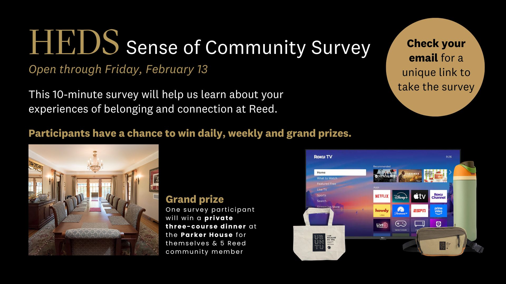
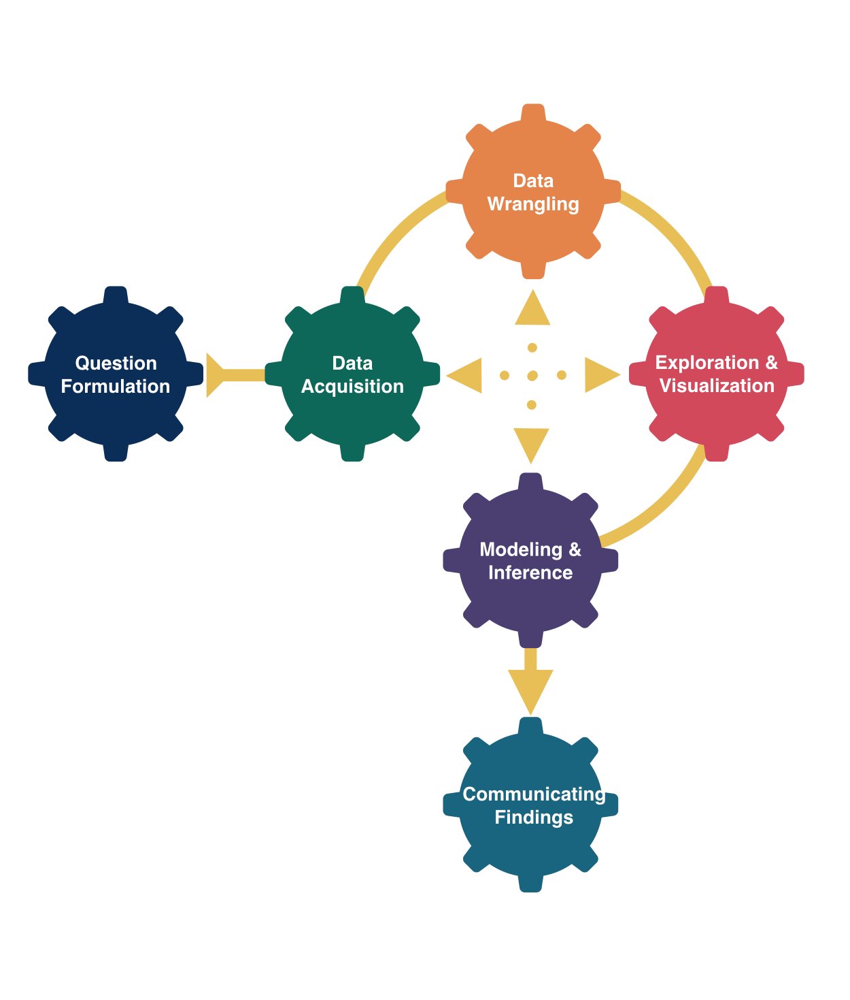
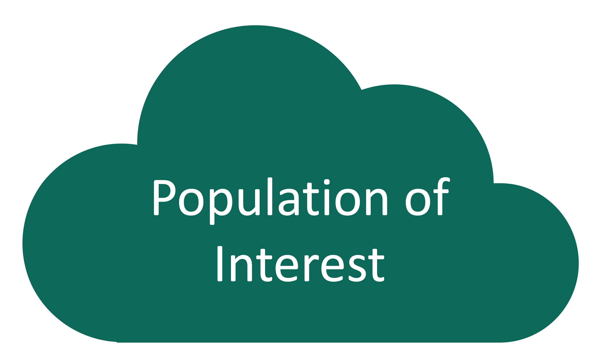
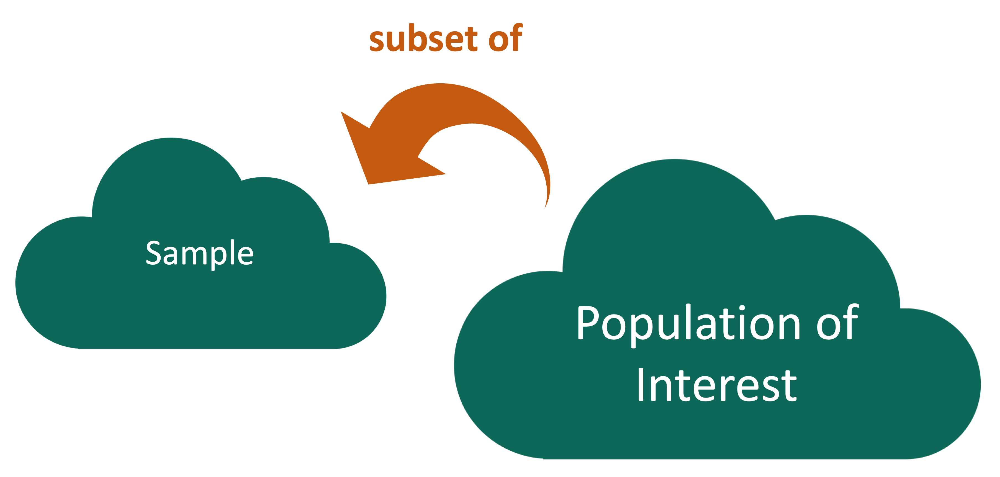

```{r}
#| include: false
#| warning: false
#| message: false

knitr::opts_chunk$set(echo = TRUE, warning = FALSE, message = FALSE, 
                      fig.retina = 3, fig.align = 'center')
library(knitr)
library(tidyverse)
```

::::: columns
::: {.column .center width="60%"}
{width="90%"}
:::

::: {.column .center width="40%"}
<br>

[Data Collection and Sampling]{.custom-title}

<br> <br> <br> <br> <br> 

[Megan Ayers]{.custom-subtitle}

[Stat 141 \| Fall 2026 <br> Friday, Week 3]{.custom-subtitle}
:::
:::::

------------------------------------------------------------------------

## Announcements/Reminders

{width=80%}

------------------------------------------------------------------------

## Goals for Today

-   Discuss principles of data collection/acquisition
-   Investigate 3 methods of drawing random samples

------------------------------------------------------------------------

### When to Get Coding Help

`r emo::ji("cry")` *"I have no idea how to do this problem."*

::: fragment
→ Ask someone to point you to a similar example from the lecture or readings.
:::

::: fragment
→ Talk it through with a course assistant, a fellow Math 141 student, or Megan so together we can verbalize the process of going from Q to A.
:::

<br>

::: fragment
`r emo::ji("rage")` *"I am getting a weird error but really think my code is correct/on the right track/matches the examples from class."*
:::

::: fragment
→ It is time for a second pair of eyes. Don't stare at the error for over 10 minutes.
:::

<br>

::: fragment
`r emo::ji("star-struck")` And lots of other times too! `r emo::ji("grimace")`
:::

------------------------------------------------------------------------

### When to Get Help

Remember:

::: fragment
→ Struggling is part of learning.
:::

::: fragment
→ But let us help you ensure it is a **productive** struggle.
:::

::: fragment
→ Struggling does NOT mean you are bad at stats, it actually means you are doing the work to **learn** the material!
:::

------------------------------------------------------------------------

## Now for Data Collection

{width="50%" fig-align="center"}

------------------------------------------------------------------------

## Who are the data supposed to represent?

Every statistical investigation should clearly identify and compare:

-   The **population** to be studied
-   The **sample** from which measurements (data) will be taken


::: fragment
**Key questions:**

-   What evidence is there that the sample is **representative** of the population?
-   Who is present? Who is absent?
-   Who is overrepresented? Who is underrepresented?
:::

------------------------------------------------------------------------

## Who are the data supposed to represent?

{width="60%" fig-align="center"}

In a **census**, we have data on the entire population! 

But usually, we don't have the money, time, or ability to do this. 

------------------------------------------------------------------------

## Who are the data supposed to represent?

{width="50%" fig-align="center"}

Instead, we use a **sample** of the population, and use the sample to draw conclusions about the **population**.

------------------------------------------------------------------------

## Who are the data supposed to represent?

{width="50%" fig-align="center"}

**Key questions:**

-   What evidence is there that the **sample** is **representative** of the **population**?
-   Who is present? Who is absent?
-   Who is overrepresented? Who is underrepresented?

------------------------------------------------------------------------

## Sampling Bias

{width="75%" fig-align="center"}

**Sampling bias**: When certain individuals are more likely to be sampled than others

------------------------------------------------------------------------

## Sampling Bias

{width="30%" fig-align="center"}

**Sampling bias**: When certain individuals are more likely to be sampled than others

**Q:** Consider a telephone poll for an election - where might we get sampling bias? 

-   Non-response: individual can't or won't contribute
-   Undercoverage: some groups are less likely to be called
-   Inaccurate response
-   Self-selection: membership in the sample is voluntary
-   Convenience: selecting a convenient but non-representative block to sample

------------------------------------------------------------------------

### Sampling Bias Example

The **Literary Digest** was a political magazine that correctly predicted the presidential outcomes from 1916 to 1932. In 1936, they conducted the most extensive (to that date) public opinion poll. They mailed questionnaires to over 10 million people (about 1/3 of US households) whose names and addresses they obtained from telephone books and vehicle registration lists.

**Population of Interest**:

<br>

**Sample**:

<br>

**Sampling bias**:

```{r}
#| echo: false
countdown::countdown(3)
```

------------------------------------------------------------------------

### Sampling Bias Example

::: nonincremental
We want to know how Portlanders feel about a new coffee shop in Woodstock.

-   The coffee shop has a Yelp rating of 3.5/5 stars with 10 reviews.

:::

::: fragment
**Q1**: Can we conclude that a typical Portlander would rate this coffee shop at 3.5 stars? 

<br>

**Q2**: What sources of bias are present in this sample?  

<br>

**Q3**: A year later, the coffee shop still has 3.5 stars, but 1000 reviews. Does the verdict change?  

<br>

**Q4**: A second coffee shop opens up nearby with a Yelp rating of 4 stars and 1000 reviews. Can we conclude Portlanders prefer the second restaurant to the first? 

:::

```{r}
#| echo: false
countdown::countdown(4)
```

------------------------------------------------------------------------

## Random Sampling

Use random sampling (a random mechanism for selecting cases from the population) to remove sampling bias.

#### Types of random sampling

We'll explore 3 types of random sampling

::: nonincremental
-   Simple random sampling

-   Cluster sampling

-   Stratified random sampling

:::


------------------------------------------------------------------------

### Simple Random Sampling

*Motivating question*: what is the average amount of student loan debt in Oregon?

::: {.fragment fragment-index=1}
**Simple Random Sampling**: Imagine that a unique ID for each student *in the population* is written on a slip of paper...
:::

-   Shuffle the slips of paper in a bowl
-   Draw $n$ IDs/slips one-by-one to create a sample

::: {.fragment fragment-index=2}
```{r echo = FALSE}

set.seed(123)
n <- 1000
students <- data.frame(id = 1:n, x = runif(n, 0, 1.5), y = runif(n))

ggplot(students, aes(x = x, y = y)) +
  geom_point(color = "steelblue4", size = 0.35) +
  theme_bw() + 
  xlab("") + ylab("") +
  theme(
    panel.grid.major = element_blank(),
    panel.grid.minor = element_blank(),
    panel.border = element_rect(fill = NA, color = "black", size = 1), 
    axis.line = element_blank(), 
    axis.text = element_blank(),
    axis.ticks = element_blank()
  )

```
:::

------------------------------------------------------------------------

### Simple Random Sampling

::: nonincremental
*Motivating question*: what is the average amount of student loan debt in Oregon?

**Simple Random Sampling**: Imagine that a unique ID for each student *in the population* is written on a slip of paper...

-   Shuffle the slips of paper in a bowl
-   Draw $n$ IDs/slips one-by-one to create a sample


```{r echo = FALSE}

students$sampled <- students$id %in% sample(students$id, 100)
students_in <- students[students$sampled, ]

(gg1 <- ggplot(students, aes(x = x, y = y)) +
  geom_point(color = "steelblue4", size = 0.25) +
  annotate("point", x = students_in$x, y = students_in$y, color = "maroon2") +
  theme_bw() + 
  xlab("") + ylab("") +
  theme(
    panel.grid.major = element_blank(),
    panel.grid.minor = element_blank(),
    panel.border = element_rect(fill = NA, color = "black", size = 1), 
    axis.line = element_blank(), 
    axis.text = element_blank(),
    axis.ticks = element_blank()
  ))

```
:::

------------------------------------------------------------------------

### Simple Random Sampling

Consequences:

-   Every member of the population has an **equal chance of being selected** for the sample
-   There is **no inherent correlation** between any two members of the sample

::::: columns

::: {.column width=45%}
::: fragment
**Q:** Can a simple random sample be non-representative? 
:::

::: fragment
**A:** Yes, even if all goes as planned! 

-   For large sample sizes, it's unlikely
-   The sample will be **representative on average**
:::

::: fragment
**Q:** Why aren't all samples generated using simple random sampling?
:::

:::

::: {.column width=55%}
```{r echo = FALSE}
gg1
```
:::
:::::

------------------------------------------------------------------------

### Simple Random Sampling

::::: columns
::: {.column width=45%}
**Advantages**:

-   Relatively simple to interpret and analyze
-   Non-biased (in theory)

**Disadvantages**:

-  May not be as "precise" as other sampling techniques
-  Can be difficult to perform in practice
:::

::: {.column width=55%}
```{r echo = FALSE}
gg1
```
:::
:::::

------------------------------------------------------------------------

### Stratified Random Sampling

*Motivating question*: what is the average amount of student loan debt in Oregon?

**Stratified Random Sampling**: "Strata" are made up of similar individuals, then simple random samples are taken from each stratum.

-   e.g. define strata based on public vs private college and family income ranges

::: fragment
```{r echo = FALSE}

students$grp <- rep(c("Public - High Inc.", "Public - Med Inc.", "Public - Low Inc.", 
                      "Private - High Inc.", "Private - Med Inc.", "Private - Low Inc."),
                    times = c(150, 250, 100, 275, 150, 75))
students$grp <- factor(students$grp,
                       levels = c("Public - High Inc.", "Public - Med Inc.", "Public - Low Inc.", 
                                  "Private - High Inc.", "Private - Med Inc.", "Private - Low Inc."))

students_in <- students %>%
  group_by(grp) %>%
  slice_sample(prop = 0.1)

students$sampled <- students$id %in% students_in$id

(gg2 <- ggplot(students, aes(x = x, y = y, color = sampled, size = sampled)) +
    geom_point() +
    scale_color_manual(values = c("steelblue4", "maroon2")) +
    scale_size_manual(values = c(0.75, 2)) +
    theme_bw() + 
    facet_wrap(~grp) +
    xlab("") + ylab("") +
    theme(
      panel.grid.major = element_blank(),
      panel.grid.minor = element_blank(),
      strip.text = element_text(size = 14),
      panel.border = element_rect(fill = NA, color = "black", size = 1), 
      axis.line = element_blank(), 
      axis.text = element_blank(),
      axis.ticks = element_blank(),
      legend.position = "none"
    ))

```
:::

------------------------------------------------------------------------

### Stratified Random Sampling

**Stratified Random Sampling**: "Strata" are made up of similar individuals, then simple random samples are taken from each stratum.

::::: columns

::: {.column width=50%}

**Advantages**:

- Can be more "precise" than simple random sampling, requiring lower sample size
- Hedges against non-representative samples

**Disadvantages**:

- Statistical analysis is more complex
- Strata creation isn't always straightforward (need additional data, and to have compelling reasons for strata definitions)

:::

::: {.column width=50%}
```{r echo = FALSE}
gg2
```
:::
:::::

------------------------------------------------------------------------

### Cluster Random Sampling

*Motivating question*: what is the average amount of student loan debt in Oregon?

**Cluster Random Sampling**: "Clusters" are non-homogeneous. We take a simple random sample of the clusters, and use all observations in those clusters as the sample.

-   e.g. we take a simple random sample of schools, include all students in those schools in the sample

::: fragment
```{r echo = FALSE}

students$school <- sample(rep(1:12,
                              times = c(25, 25, 50, 50, 50, 75, 75, 75, 100, 100, 175, 200)))
schools_in <- sample(1:12, 4)
students$sampled <- students$school %in% schools_in
students$school <- paste0("School ", students$school)

(gg3 <- ggplot(students, aes(x = x, y = y, color = sampled, size = sampled)) +
    geom_point() +
    scale_color_manual(values = c("steelblue4", "maroon2")) +
    scale_size_manual(values = c(0.75, 1.25)) +
    theme_bw() + 
    facet_wrap(~school) +
    xlab("") + ylab("") +
    theme(
      panel.grid.major = element_blank(),
      panel.grid.minor = element_blank(),
      panel.border = element_rect(fill = NA, color = "black", size = 1), 
      axis.line = element_blank(), 
      axis.text = element_blank(),
      axis.ticks = element_blank(),
      legend.position = "none"
    ))

```
:::

------------------------------------------------------------------------

### Cluster Random Sampling

**Cluster Random Sampling**: "Clusters" are non-homogeneous. We take a simple random sample of the clusters, and use all observations in those clusters as the sample.

::::: columns

::: {.column width=50%}

**Advantages**:

- Useful when it's difficult/impossible to exhaustively list the population
- Often more time/cost effective per $n$
- Useful when population is naturally concentrated in heterogeneous groups

**Disadvantages**:

- Less precise than simple or stratified sampling
- Statistical analysis is more complicated
- Natural clusters may not always exist

:::

::: {.column width=50%}
```{r echo = FALSE}
gg3
```
:::
:::::

------------------------------------------------------------------------

### National Health and Nutrition Examination Survey {.smaller}

::::: columns
::: {.column width="20%"}
{fig-align="center"}
:::

::: {.column width="80%"}
> Mission: "Assess the health and nutritional status of adults and children in the United States."
:::
:::::

How are these data collected?

------------------------------------------------------------------------

### NHANES Sampling Design

-   **Stage 1**: US is stratified by geography and distribution of minority populations. Counties are randomly selected within each stratum.

-   **Stage 2**: From the sampled counties, city blocks are randomly selected. (City blocks are clusters.)

-   **Stage 3**: From sampled city blocks, households are randomly selected. (Households are clusters.)

-   **Stage 4**: From sampled households, people are randomly selected. For the sampled households, a mobile health vehicle goes to the house and medical professionals take the necessary measurements.

::: fragment
**Why don't they use simple random sampling?**
:::

------------------------------------------------------------------------

### Careful Using Non-Simple Random Sample Data

::::: columns
::: {.column width="50%"}
```{r, echo = FALSE}
library(NHANES)
library(tidyverse)

ggplot(data = NHANESraw, mapping = aes(x = fct_infreq(Race1),
                                    fill = Race1)) +
  geom_bar() + labs(x = "Race of Respondents", 
                    y = "Count",
                    title = "Original NHANES Data") +
  guides(fill = 'none')
```
:::

::: {.column .fragment width="50%"}
```{r, echo = FALSE}


ggplot(data = NHANES, mapping = aes(x = fct_infreq(Race1),
                                    fill = Race1)) +
  geom_bar() + labs(x = "Race of Respondents", 
                    y = "Count",
                    title = "NHANES Data Adjusted to Mimic SRS") +
  guides(fill = 'none')
```
:::
:::::


# Detour: Data Ethics

------------------------------------------------------------------------

### Data Ethics

> "Good statistical practice is fundamentally based on transparent assumptions, reproducible results, and valid interpretations." -- Committee on Professional Ethics of the American Statistical Association (ASA)

The ASA has created ["Ethical Guidelines for Statistical Practice"](https://www.amstat.org/ASA/Your-Career/Ethical-Guidelines-for-Statistical-Practice.aspx)

::: fragment
→ These guidelines are for EVERYONE doing statistical work.
:::

::: fragment
→ There are ethical decisions at all steps of the Data Analysis Process.
:::

::: fragment
→ We will periodically refer to specific guidelines throughout this class.
:::

::: fragment
> "Above all, professionalism in statistical practice presumes the goal of advancing knowledge while avoiding harm; using statistics in pursuit of unethical ends is inherently unethical."
:::

------------------------------------------------------------------------

## Responsibilities to Research Subjects

> "The ethical statistician protects and respects the rights and interests of human and animal subjects at all stages of their involvement in a project. This includes respondents to the census or to surveys, those whose data are contained in administrative records, and subjects of physically or psychologically invasive research."

------------------------------------------------------------------------

### Responsibilities to Research Subjects

Why do you think the `Age` variable maxes out at 80?

```{r, echo = FALSE, fig.asp = 0.35}
library(tidyverse)
library(NHANES)


ggplot(data = NHANES, mapping = aes(x = Age, y = Height)) +
  geom_point(alpha = 0.1) +
  geom_smooth(color = "skyblue") +
  labs(title = "NHANES: Age versus Height")
```

::: fragment
> "Protects the privacy and confidentiality of research subjects and data concerning them, whether obtained from the subjects directly, other persons, or existing records."
:::

------------------------------------------------------------------------

## Next time: 

-   Study design

------------------------------------------------------------------------
