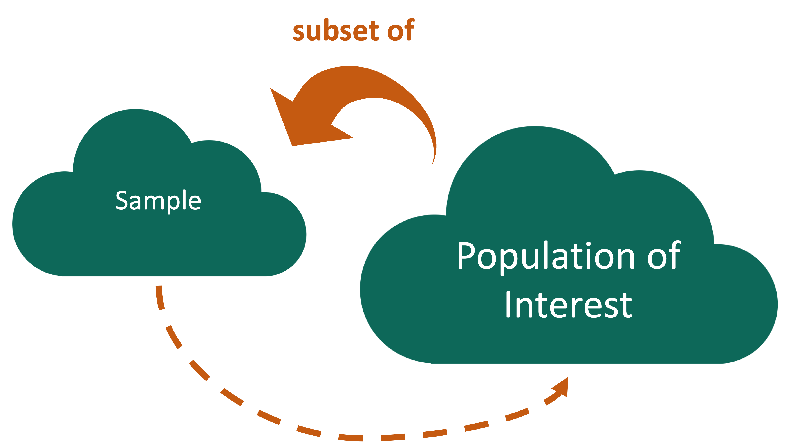
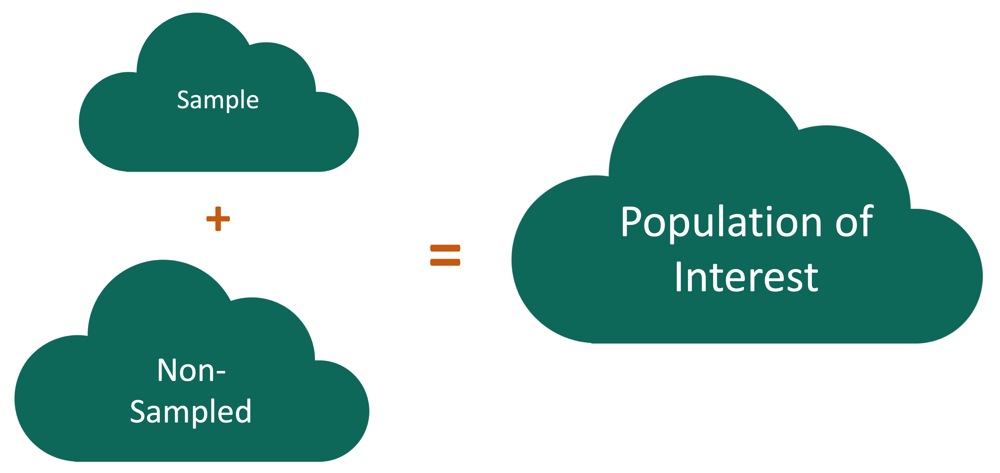
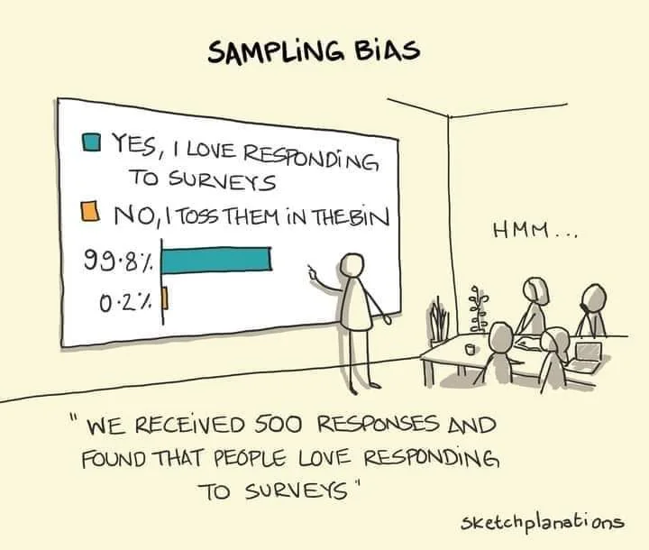

```{r}
#| include: false
#| warning: false
#| message: false

knitr::opts_chunk$set(echo = TRUE, warning = FALSE, message = FALSE, 
                      fig.retina = 3, fig.align = 'center')
library(knitr)
library(tidyverse)
```

::::: columns
::: {.column .center width="60%"}
{width="90%"}
:::

::: {.column .center width="40%"}
<br>

[Study Design]{.custom-title}

<br> <br> <br> <br> <br> 

[Megan Ayers]{.custom-subtitle}

[Stat 141 \| Fall 2026 <br> Friday, Week 3]{.custom-subtitle}
:::
:::::

------------------------------------------------------------------------

## Reminders/Announcements

-   Feedback for Lab 01 posted on Gradescope
-   Feedback for HW 01 coming soon

------------------------------------------------------------------------

## Math/Stats course interest form

::: smaller
> The Mathematics and Statistics Department is currently in the process of drafting a schedule for next academic year. In order to have a better sense of how many sections of each class to offer, we would like to know your plans for next year.
:::

::::: columns
::: {.column width=35% .center}
[https://tinyurl.com/math-prefs](https://tinyurl.com/math-prefs)
{width=50%}

:::

::: {.column width=5%}
:::

::: nonincremental
::: {.column width=30% .smaller}

-   **MATH 111**: Calculus
-   **MATH 112**: Intro to Analysis
-   **MATH 113**: Discrete Structures
-   **MATH 201**: Linear Algebra
-   **MATH 202**: Vector Calculus
-   **MATH 291**: Probability
-   **MATH 321**: Real Analysis

:::

::: {.column width=30% .smaller}
-   **MATH 332**: Abstract Algebra
-   **STAT 241**: \*Data Science\*
-   **STAT 243**: \*Statistical Learning\*
-   **STAT 343**: Statistics Practicum
-   **STAT 394**: Causal Inference
:::
:::
:::::

------------------------------------------------------------------------

## Goals for Today

-   Recap sampling bias
-   Discuss drawing conclusions from our sample and types of studies

# Data Collection

------------------------------------------------------------------------

## Who are the data supposed to represent?

{width="55%" fig-align="center"}

------------------------------------------------------------------------

## Who are the data supposed to represent?

{width="55%" fig-align="center"}

**Key questions:**

-   What evidence is there that the **respondents** are **representative** of the **population**?
-   Who is present? Who is absent?
-   Who is overrepresented? Who is underrepresented?

------------------------------------------------------------------------

## Nonresponse bias

{width="60%" fig-align="center"}

**Nonresponse bias**: The respondents are **systematically** different from the non-respondents for the variables of interest.

------------------------------------------------------------------------

## Nonresponse bias

{width="60%" fig-align="center"}

**Nonresponse bias**: The respondents are **systematically** different from the non-respondents for the variables of interest.

------------------------------------------------------------------------

### Come Back to Literary Digest Example

Of the 10 million people surveyed, more than 2.4 million responded with 57% indicating that they would vote for Republican Alf Landon in the upcoming presidential election instead of the current President Franklin Delano Roosevelt.

<br>

**Non-response bias? Sample creation issues?**

<!-- Sample generated using lists of phone numbers, drivers registrations, COUNTRY CLUB MEMBERSHIPS!! At the height of the depression. Sampling skewed heavily wealthy, in an election greatly determined by economic policy. -->

<!-- Additionally, nonresponse bias. -->

------------------------------------------------------------------------

## Tackling Nonresponse bias

{width="60%" fig-align="center"}

-   Use **multiple modes** (mail, phone, in-person) and **multiple attempts** for reaching sampled cases.

-   Explore key demographic variables to see how respondents and non-respondents vary.

-   In survey statistics, we can create **survey weights** to adjust for potential nonresponse bias.

------------------------------------------------------------------------

## Is Bigger Always Better?

For our **Literary Digest Example**, Gallup predicted Roosevelt would win based on a survey of **50,000** people (instead of 2.4 million).

<br><br>

Quality over quantity! 

------------------------------------------------------------------------

## Thoughts on Sampling

-   **Random** sampling is important to ensure the sample is **representative** of the population.

    -   Word we will use: **generalizability**

-   Representativeness isn't about **size**.

    -   Small random samples will tend to be more representative than large non-random samples.

-   However, I bet most samples you will encounter **won't** have arisen from a random mechanism.

-   How do we draw conclusions about the population from **non-random samples**?

    -   Determine if your sampled cases (and respondents) are systematically different from the non-sampled cases (and non-respondents) for the variables you care about.
    -   Adjust your population of interest.


# Now let's shift our discussion to the conclusions we can draw from the sample we have.

------------------------------------------------------------------------

### Typical Analysis Goals

**Descriptive**: Want to estimate quantities related to the population.

→ *How many trees are in the Amazon?*

::: fragment
**Predictive**: Want to predict the value of a variable.

→ *Can I use remotely sensed data to predict forest types in the Amazon?*
:::

::: fragment
**Causal**: Want to determine if changes in a variable cause changes in another variable.

→ *Do financial contracts prevent people from deforesting their land in the Amazon?*
:::

------------------------------------------------------------------------

### Typical Analysis Goals

For these goals will differentiate between the roles of the variables:

-   **Response variable**: Variable I want to better understand

-   **Explanatory/predictor variables**: Variables I think might explain/predict the response variable

::: fragment
**Q**: What is the role of each variable for each goal?
:::

::: fragment
→ *How many trees are in the Amazon?*
:::

::: fragment
→ *Can I use remotely sensed data to predict forest types in the Amazon?*
:::

::: fragment
→ *Do financial contracts prevent people from deforesting their land in the Amazon?*
:::

------------------------------------------------------------------------

### Key Mechanism for Causal Goal

**Random assignment**: Cases are randomly assigned to levels of the **explanatory variable**

-   **Random assignment** allow us to conclude if the explanatory variable **causes** changes in the response variable.

::: fragment
**Example**: [COVID Vaccine Trials](https://www.nih.gov/news-events/nih-research-matters/experimental-coronavirus-vaccine-highly-effective)

To study the effectiveness of the Moderna vaccine (mRNA-1273), researchers carried out a study on over 30,000 adult volunteers with no known previous COVID-19 infection. Volunteers were randomly assigned to either receive two doses of the vaccine or two shots of saline. The incidence of symptomatic COVID-19 was 94% lower in those who received the vaccine than those who did not.
:::

::: fragment
**Question**: Why does random assignment allow us to conclude that this vaccine was effective at preventing (early strains of) COVID-19?
:::

------------------------------------------------------------------------

## Careful with Non-Random Assignment Data

::::: columns
::: {.column width="50%"}
We have data on the number of Methodist ministers in New England and the number of barrels of rum imported into Boston each year. The data range from 1860 to 1940.

-   **Q**: Should we conclude that ministers drink a lot of rum? Or maybe that rum drinking encourages church attendance?
:::

::: {.column width="50%"}
```{r}
#| echo: false


library(Lock5withR)
ggplot(data = MinistersRum, mapping = aes(x = Ministers, 
                                          y = Rum)) +
  geom_point(alpha = 0.6, size = 4, color = "green4")
```
:::
:::::

-   **Confounding variable**: A third variable that is associated with both the explanatory variable and the response variable.

-   Unclear if the explanatory variable or the confounder (or some other variable) is causing changes in the response.

------------------------------------------------------------------------

## Causal Inference

-   **Spurious relationship**: Two variables are associated but not causally related
    -   In the age of big data, lots of good examples [out there](https://tylervigen.com/spurious-correlations).

::: fragment
→ *"Correlation does not imply causation."*
:::

::: fragment
→ *"Correlation does not imply not causation."*
:::

-   **Causal inference**: Methods for measuring causal relationships, both with and without random assignment.
      

------------------------------------------------------------------------

## An (In)famous Historical Example: Smoking and Lung Cancer

Correlation does not imply causation ... but sometimes there's causation! 

-   In 1950, a large study showed extremely strong association between smoking and lung cancer.
-   In a 1958 article in *Nature*, **R.A. Fisher** argued that smoking does not cause lung cancer
-   He argued "correlation does not imply causation"
-   Context: Fisher was a smoker, and happened to be being paid by big tobacco
-   How do we know Fisher was wrong? Tools from causal inference! 

<!-- If time, can give interesting side notes about Fisher. Very smart, very difficult. Often ran into trouble because he thought his insights were totally obvious, couldn't bring himself to explain them to other people. -->

------------------------------------------------------------------------

## Notes on Correlation and Causation

-   Even if we aren't intending to make rigorous causal claims, we often use the terms **explanatory** and **response** variables in analyses and modeling.
-   **Correlation** is bi-directional: If $X$ is correlated with $Y$, then $Y$ is correlated with $X$
-   **Causation** is mono-directional: If $X$ causes $Y$, $Y$ may not cause $X$.
-   Academics in quantitative fields can be **very** sensitive to implications of causal claims - be careful with your vocab choices ("caused" vs "is associated with" vs "trends with"). 
-   At the same time, p-hacking (for both causal and correlational findings) is a common unethical practice! We'll return to this.

------------------------------------------------------------------------


# Types of Studies

------------------------------------------------------------------------

## Observational Studies

-   A study in which the researchers don't actively control the value of any variable, but simply observe the values as they naturally exist.

-   **Example**: Hand washing study

    -   To estimate what percent of people in the US wash their hands after using a public restroom, researchers pretended to comb their hair while observing 6000 people in public restrooms throughout the United States. They found that 85% of the people who were observed washed their hands after going to the bathroom.

------------------------------------------------------------------------

## (Randomized) Experiment

-   A study in which the researcher actively controls one or more of the explanatory variables through random assignment.

-   **Example**: COVID Trial

-   Common features:

    -   **Control** group that gets no treatment or a standard treatment. 
    -   **Placebo**: A fake treatment to control for the **placebo effect** where if people believe they are receiving a treatment, they may experience the desired effect regardless of whether the treatment is any good.
    -   **Blinding**: When the subjects and/or researchers don't know the explanatory group assignments.

------------------------------------------------------------------------

## (Randomized) Experiment

::: nonincremental
-   A study in which the researcher actively controls one or more of the explanatory variables through random assignment.
:::

-   **Another Example**: Experiment in yesterday's lab! 
    -   I randomly assigned you each a piece of paper with either 82 or 531 on it
    -   I asked you to guess the number of dog breeds in the world
    -   We'll investigate the results in Lab 04 to see if there was an "anchoring effect"
    

------------------------------------------------------------------------

## Thoughts on Data Collection Goals

-   Random assignment allows you to explore **causal** relationships between your explanatory variables and the predictor variables by removing the possibility of a confounding variable

-   How do we draw causal conclusions from studies without random assignment?

    -   With extreme care! Try to **control** for all possible confounding variables.
    -   Discuss the associations/correlations you found. Use domain knowledge to address potentially causal links.
    -   Take *Math 394: Causal Inference* to learn more about causal inference.

-   But also consider the goals of your analysis. Often the research question isn't causal.

-   **Bottom Line:** We often have to use imperfect data to make decisions. But whenever possible, use random assignment or find *pseudo-random* contexts for the strongest causal claims. 


------------------------------------------------------------------------

## John Snow, Cholera, and Shoe Leather: Think-pair-share

::: {style="font-size: 80%;"}
John Snow was a 19th century physician who is considered a founder of modern epidemiology. In 1854, he was investigating the drivers of a cholera epidemic in London. He suspected that contaminated water was the key cause. He realized there seemed to be no rhyme or reason to the water source that homes were connected to, and that one source was near sewage collection points, and the other further upstream. By surveying residents of homes across London, Snow created a data set that allowed him to compare cholera outcomes between those with water servicing from each source. 
:::

-   What columns would you expect to be in John Snow's data set?
-   Was this an experiment or an observational study? 
-   Why is it important that water servicing wasn't determined by location (e.g. city block or neighborhood)?
-   Statistician David Freedman described Snow's work as a historic statistical success story, in part because of the amount of "shoe leather" involved. What do you think he meant?


```{r}
#| echo: false
countdown::countdown(5)
```


------------------------------------------------------------------------

