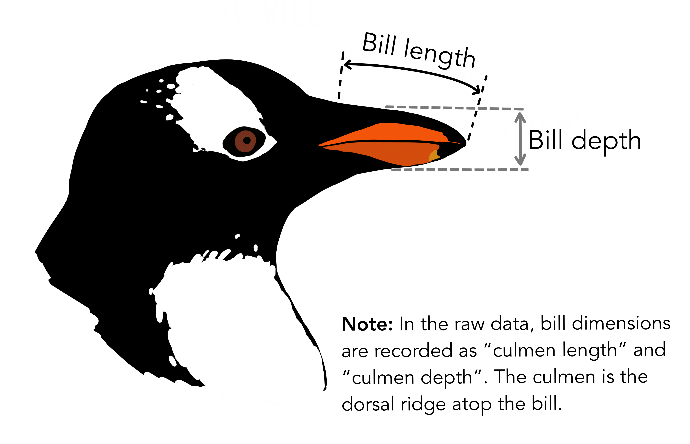

```{r}
#| include: false
#| warning: false
#| message: false

knitr::opts_chunk$set(echo = TRUE, warning = FALSE, message = FALSE, 
                      fig.retina = 3, fig.align = 'center')
library(knitr)
library(tidyverse)
```

::::: columns
::: {.column .center width="50%"}
{width="90%"}
:::

::: {.column .center width="50%"}
<br>

[Linear Models IV: Multiple Regression]{.custom-title}

<br> 

[Megan Ayers]{.custom-subtitle}

[Stat 141 \| Fall 2026 <br> Wednesday, Week 5]{.custom-subtitle}
:::
:::::

------------------------------------------------------------------------

## Announcements

::: {.fragment .nonincremental fragment-index="1"}

- Career panel at Math/Stats colloquium tomorrow!

:::

::: {.fragment .nonincremental fragment-index="2"}

- Math/Stats/CS picnic-hike on 10/10!

:::

<br><br>


------------------------------------------------------------------------

## Goals for Today

-   Handling categorical and quantitative explanatory variables at the same time.
-   Compare parallel slopes and interaction models for multiple regression
-   Transformations


------------------------------------------------------------------------

### Multiple Linear Regression

Form of the Model:

$$ 
\begin{align}
y &= \beta_0 + \beta_1 x_1 + \beta_2 x_2 + \cdots + \beta_p x_p + \epsilon
\end{align}
$$

How does extending to more predictors change our process?

-   What **doesn't** change:
    -   Still use **Method of Least Squares** to estimate coefficients
    -   Still use `lm()` to fit the model and `predict()` for prediction
-   What **does** change:
    -   Meaning of the coefficients are more complicated and depend on other variables in the model
    -   Need to decide which variables to include and how (linear term, squared term...)

------------------------------------------------------------------------

### Multiple Linear Regression

-   We are going to see a few more examples of multiple linear regression this week.

-   We will need to return to modeling later in the course once we have learned about statistical inference (i.e., confidence intervals and p-values).

------------------------------------------------------------------------

## Example

:::: {.columns}

::: {.column width=50% style="font-size:0.9em;"}

Meadowfoam is a plant that grows in the Pacific Northwest and is harvested for its seed oil. 

In a randomized experiment, researchers at OSU looked at how two light-related factors influenced the **number of flowers per meadowfoam plant** (a plant productivity measure). 

The two light measures were **light intensity** (in mmol/ $m^2$ /sec) and the **timing of onset of the light** (early or late in the day).

:::

::: {.column width=50%}

{fig-align='center'}

:::

::::


:::{.fragment}

**Response variable?**

:::

:::{.fragment}


**Explanatory variables?**

:::

:::{.fragment}

**Model Form?**

:::

------------------------------------------------------------------------

### Data Loading and Wrangling

```{r}
library(tidyverse)
library(Sleuth3)
data(case0901)

# Check out the timing variable
count(case0901, Time)
```

<br>

::: fragment

```{r}
# Recode the timing variable
case0901 <- case0901 %>%
  mutate(TimeCat = case_when(Time == 1 ~ "Late",
                             Time == 2 ~ "Early")) 
count(case0901, TimeCat)
```

:::

------------------------------------------------------------------------

### Visualizing the Data

```{r}
#| output-location: column

# theme(...) just makes axis text bigger
ggplot(case0901,
       aes(x = Intensity,
           y = Flowers,
           color = TimeCat)) + 
  geom_point(size = 4) +
  theme(axis.text = element_text(size = 14),
        axis.title = element_text(size = 16))


```

- **Q**: How does this plot help us intuit what $\widehat{\beta}_0$, $\widehat{\beta}_1$, and $\widehat{\beta}_2$ might be?

- **Side Q**: Why don't I have to include `data = ` and `mapping = ` in my `ggplot()` layer?

------------------------------------------------------------------------

### Building and Interpetring the Linear Regression Model

Full model form:

```{r}
modFlowers <- lm(Flowers ~ Intensity + TimeCat, data = case0901)

library(moderndive)
get_regression_table(modFlowers)
```

::: nonincremental
-   Estimated regression line for **TimeCat = "Late"**

<br> 

-   Estimated regression line for **TimeCat = "Early"**:

<br>

-   Interpreting coefficients?

:::

------------------------------------------------------------------------

### Building and Interpetring the Linear Regression Model

Full model form:

```{r}
modFlowers <- lm(Flowers ~ Intensity + TimeCat, data = case0901)

library(moderndive)
get_regression_table(modFlowers)
```


Interpreting coefficients?

- Expect `Flowers` to be 83.5 on average when `Intensity` = 0 **and `TimeCat` is early**
- Expect `Flowers` to decrease by -0.04 on average when `Intensity` increases by 1, **holding `TimeCat` constant**
- Expect plants with late `TimeCat` to have -12.2 fewer flowers on average **than those with early `TimeCat`**, **holding `Intensity` constant**

------------------------------------------------------------------------

### Appropriateness of Model Form

```{r}
#| output-location: column

ggplot(case0901, 
       aes(x = Intensity,
           y = Flowers,
           color = TimeCat)) + 
  geom_point(size = 4) + 
  geom_smooth(method = "lm", se = FALSE)

```

**Q**: Does the assumption of **equal slopes** reasonable here?

------------------------------------------------------------------------

### Prediction

```{r}
flowersNew <- data.frame(Intensity = c(700, 700), TimeCat = c("Early", "Late"))
flowersNew

predict(modFlowers, newdata = flowersNew)
```

------------------------------------------------------------------------

### Returning to the Palmer Penguins

```{r}
library(palmerpenguins)
```

{fig-align="center"}

------------------------------------------------------------------------

### Last time: One Categorical Variable

We predicted a penguin's bill length based on their species.

::: {.fragment}


```{r}
#| output-location: column

ggplot(penguins, aes(x = species, y = bill_length_mm, fill = species)) +
  geom_boxplot() + 
  scale_fill_manual(values = c("steelblue",
                               "goldenrod", 
                               "plum3")) +
  stat_summary(fun = mean, 
               geom = "point", 
               size = 3,
               color = "deeppink") + 
  guides(fill = "none") +
  theme_bw()
```


:::

-   Pink dots represent the mean value in each group. 
-   For the single categorical variable model, those pink dots are the predicted values for each group. 

------------------------------------------------------------------------

### This time: Add a Quantitative Variable

We'll incorporate bill depth for prediction!

::: {.fragment}


```{r}
#| output-location: column

ggplot(penguins, aes(x = bill_depth_mm,
                     y = bill_length_mm)) +
  geom_point(size = 2) + 
  geom_smooth(method = "lm", se = FALSE,
              color = "red") + 
  theme_bw() +
  theme(axis.text = element_text(size = 14),
        axis.title = element_text(size = 16))
```


:::

-   A moderate negative relationship between bill length and bill depth! 
-   Does this make sense?

------------------------------------------------------------------------

{fig-align='center' width=85%}


------------------------------------------------------------------------

### What if we include both? 

::: {.fragment}


```{r echo=FALSE}
ggplot(penguins, aes(x = bill_depth_mm,
                     y = bill_length_mm,
                     color = species)) +
  geom_point(size = 2) + 
  geom_smooth(inherit.aes = FALSE, 
              mapping = aes(x = bill_depth_mm,
                            y = bill_length_mm),
              method = "lm", se = FALSE,
              color = "red") + 
  geom_parallel_slopes(se = FALSE) + 
  scale_color_manual(values = c("steelblue",
                               "goldenrod", 
                               "plum3")) +
  theme_bw() +
  theme(legend.position = "bottom",
        axis.text = element_text(size = 14),
        axis.title = element_text(size = 16),
        legend.text = element_text(size = 14))
```

:::

::: {style="font-size: 0.9em;"}

-   **Negative** relationships between bill depth and bill length overall.
-   **Positive** relationships between bill depth and bill length when accounting for species! 
-   **What is going on here??**
-   This is a case of **Simpson's Paradox**! 

:::

------------------------------------------------------------------------

<!-- ### Side note: plotting equal vs varying slopes -->

<!-- ```{r} -->
<!-- #| output-location: column -->
<!-- #| code-line-numbers: "5" -->

<!-- ggplot(penguins, aes(x = bill_depth_mm, -->
<!--                      y = bill_length_mm, -->
<!--                      color = species)) + -->
<!--   geom_point(size = 2) +  -->
<!--   geom_parallel_slopes(se = FALSE) +  -->
<!--   scale_color_manual(values = c("steelblue", -->
<!--                                "goldenrod",  -->
<!--                                "plum3")) + -->
<!--   theme_bw() + -->
<!--   theme(legend.position = "bottom") -->
<!-- ``` -->


<!-- ::: {.nonincremental style="font-size: 0.9em;"} -->

<!-- -   `geom_parallel_slopes()`: assumes equal slopes (within `color` groups) -->

<!-- ::: -->

<!-- ------------------------------------------------------------------------ -->

<!-- ### Side note: plotting equal vs varying slopes -->

<!-- ```{r} -->
<!-- #| output-location: column -->
<!-- #| code-line-numbers: "5" -->

<!-- ggplot(penguins, aes(x = bill_depth_mm, -->
<!--                      y = bill_length_mm, -->
<!--                      color = species)) + -->
<!--   geom_point(size = 2) +  -->
<!--   geom_smooth(method = "lm", se = FALSE) +  -->
<!--   scale_color_manual(values = c("steelblue", -->
<!--                                "goldenrod",  -->
<!--                                "plum3")) + -->
<!--   theme_bw() + -->
<!--   theme(legend.position = "bottom") -->
<!-- ``` -->


<!-- ::: {.nonincremental style="font-size: 0.9em;"} -->

<!-- -   `geom_parallel_slopes()`: assumes equal slopes (within `color` groups) -->
<!-- -   `geom_smooth(method = "lm")`: assumes varying slopes (within `color` groups) -->

<!-- ::: -->

<!-- ------------------------------------------------------------------------ -->

<!-- ### Side note: plotting equal vs varying slopes -->

<!-- ```{r} -->
<!-- #| output-location: column -->
<!-- #| code-line-numbers: "5-9" -->

<!-- ggplot(penguins, aes(x = bill_depth_mm, -->
<!--                      y = bill_length_mm, -->
<!--                      color = species)) + -->
<!--   geom_point(size = 2) +  -->
<!--   geom_smooth(inherit.aes = FALSE,  -->
<!--               mapping = aes(x = bill_depth_mm, -->
<!--                             y = bill_length_mm), -->
<!--               method = "lm", se = FALSE, -->
<!--               color = "red") +  -->
<!--   geom_parallel_slopes(se = FALSE) +  -->
<!--   scale_color_manual(values = c("steelblue", -->
<!--                                "goldenrod",  -->
<!--                                "plum3")) + -->
<!--   theme_bw() + -->
<!--   theme(legend.position = "bottom") -->
<!-- ``` -->


<!-- ::: {.nonincremental style="font-size: 0.9em;"} -->

<!-- -   `geom_parallel_slopes()`: assumes equal slopes (within `color` groups) -->
<!-- -   `geom_smooth(method = "lm")`: assumes varying slopes (within `color` groups) -->
<!-- -   We can overwrite `aes()` within `geom_smooth()` to get the overall regression line (ignoring color groups) -->

<!-- ::: -->

<!-- ------------------------------------------------------------------------ -->

### Three candidate models

:::: {.columns}

::: {.column width=50%}

Explanatory variable: **species** 
```{r}
species_mod <- lm(bill_length_mm ~ species, penguins)
get_regression_table(species_mod) %>%
  select(term, estimate)
```

<br>

::: {.fragment}

Explanatory variable: **bill_depth_mm** 
```{r}
depth_mod <- lm(bill_length_mm ~ bill_depth_mm, penguins)
get_regression_table(depth_mod) %>%
  select(term, estimate)
```

:::

:::

::: {.column width=50%}

<br>

::: {.fragment}

Explanatory variables: **species** and **bill_depth_mm** (equal slope)
```{r}
both_mod <- lm(bill_length_mm ~ bill_depth_mm + species, penguins)
get_regression_table(both_mod) %>%
  select(term, estimate)
```

:::

<br>

-   **Coefficient interpretations**?

```{r}
#| echo: false
countdown::countdown(3)
```

:::

::::

------------------------------------------------------------------------

### Interpreting the Multiple Regression Equation

```{r}
get_regression_table(both_mod)
```
:::{.fragment}

$$
\widehat{y}= 13.2 + 1.39 \cdot x_{\textrm{Bill Depth}} + 9.94 \cdot  x_{\textrm{Species:Chinstrap}} + 13.4 \cdot x_{\textrm{Species:Gentoo}}
$$

:::

::: {style="font-size: 0.8em;"}

-   **Slope Coefficient on Quantitative Variable:** The *expected/predicted* change in response variable, *on average*, per 1 unit increase in the explanatory variable, *holding all other variables constant*.
    -   Example: We expect a 1.39mm increase in bill length for every 1mm increase in bill depth, on average, after **holding species constant**.

-   Interpretation on factors from **Categorical Variables** still applies: the *expect/predicted* change in response variable, *on average*, when going from the reference level to the factor's level, *holding all other variables constant*.
    - Example: We expect bill length to be 9.94mm larger on average for Chinstrap penguins compared to Adelie penguins, **holding bill depth constant**.

:::

------------------------------------------------------------------------

### Interpreting the Multiple Regression Equation

```{r}
get_regression_table(both_mod)
```


$$
\widehat{y}= 13.2 + 1.39 \cdot x_{\textrm{Bill Depth}} + 9.94 \cdot  x_{\textrm{Species:Chinstrap}} + 13.4 \cdot x_{\textrm{Species:Gentoo}}
$$


    
-   **Intercept Coefficient:** The *expected/predicted* value of the response, *on average*, when all explanatory variables are *set to 0*.
    -   What does setting species to 0 mean in this context?


------------------------------------------------------------------------

## Returning to our MLR model - equal slopes


```{r}
#| output-location: column
#| code-line-numbers: "3"

ggplot(penguins, aes(x = bill_depth_mm, y = bill_length_mm, color = species)) +
  geom_point(size = 2) + 
  geom_parallel_slopes(se = FALSE) + 
  scale_color_manual(values = c("steelblue",
                               "goldenrod", 
                               "plum3")) +
  theme_bw() 
```

**Are equal slopes a reasonable assumption here?**

------------------------------------------------------------------------

## Different Slopes Model (ggplot example)


```{r}
#| output-location: column
#| code-line-numbers: "3"

ggplot(penguins, aes(x = bill_depth_mm, y = bill_length_mm, color = species)) +
  geom_point(size = 2) + 
  geom_smooth(method = "lm", se = FALSE) + 
  scale_color_manual(values = c("steelblue",
                               "goldenrod", 
                               "plum3")) +
  theme_bw() 
```

-   **Equal slopes** models force the relationship between quantitative predictors and the response variable to be the same for each group in the model.

-   In contrast, **different slopes** models allow for **different relationships** between quantitative predictors and the response variable for each group in the model. 

-   How can we allow our model to have different slopes? 


------------------------------------------------------------------------

### Recap

- We've now looked at linear models that combine quantitative and categorical explanatory variables
- They can be complicated to interpret - review the examples here as you practice!
- We've looked at **fixed slope models**, and seen how to compare it to a **varying slope model** in `ggplot2` (`geom_parallel_slopes()` vs regular `geom_smooth()`)

### Next time

-   More on varying slope models
-   Linear regression with many variables
-   Transformations
-   Multicollinearity
-   Model selection

