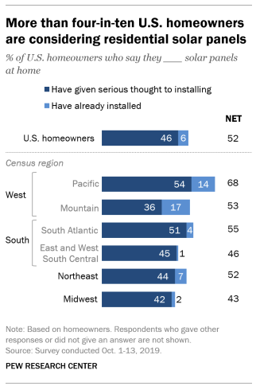
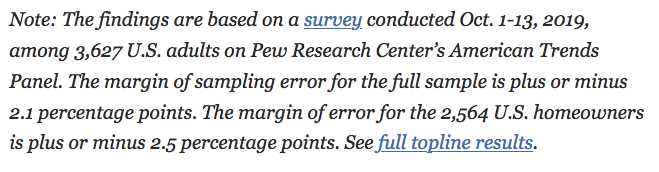
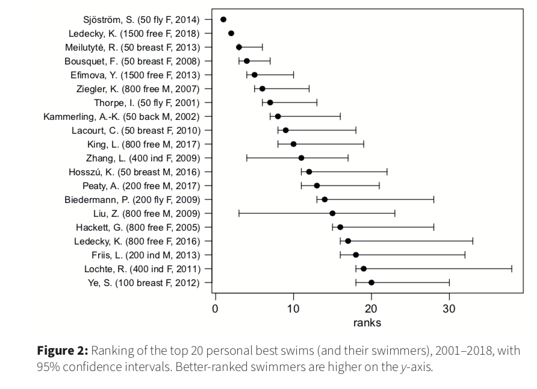

```{r}
#| include: false
#| warning: false
#| message: false

knitr::opts_chunk$set(echo = TRUE, warning = FALSE, message = FALSE, 
                      fig.retina = 3, fig.align = 'center')
library(knitr)
library(tidyverse)
```

::::: columns
::: {.column .center width="50%"}
{width="90%"}
:::

::: {.column .center width="50%"}
<br>

[Sampling Distributions I]{.custom-title}

<br> <br> 

[Megan Ayers]{.custom-subtitle}

[Stat 141 \| Fall 2026 <br> Friday, Week 5]{.custom-subtitle}
:::
:::::

------------------------------------------------------------------------

```{r include=FALSE}
knitr::opts_chunk$set(echo = F, message = FALSE, warning = FALSE, fig.align = "center", fig.height = 4, fig.width = 6,  out.width = "75%")
library(knitr)
library(tidyverse)
library(ggthemes)
library(moderndive)
library(gapminder)
library(infer)
library(tufte)
```

### Announcements/Reminders

- New member of the course assistant team
- Updated office hours
- HW 4 due today
- Extra time for HW 5: due **Monday** March 9
- Final exam slots finalized
- Reminder to pick up your learning assessment for feedback


------------------------------------------------------------------------

### Goals for Today

::::: columns
::: {.column width=50%}
- Start learning the foundations of inference

- Perform a group sampling activity

- Discuss random sampling: the heart of statistics!
:::
::: {.column width=50%}
{width="90%"}
:::
:::::

------------------------------------------------------------------------

#### Distinguishing between the **population** and the **sample**

::::: columns
::: {.column width=45%}
$$ 
y = \beta_0 + \beta_1 x_1 + \beta_2x_2 + \ldots + \beta_p x_p + \epsilon
$$

-   Parameters:
    -   Based on the **population**
    -   Unknown then if don't have data on the whole population
    -   EX: $\beta_0$, $\beta_1$, $\ldots$, $\beta_p$
:::

::: {.column width=10%}

:::

::: {.column width=45%}
$$
\widehat{y} = \widehat{ \beta}_0 + \widehat{\beta}_1 x_1 + \widehat{\beta}_2 x_2 + \ldots + \widehat{\beta}_p x_p
$$

-   Statistics:
    -   Based on the **sample** data
    -   Known
    -   Usually estimate a population parameter
    -   EX: $\widehat{\beta}_0$, $\widehat{\beta}_1$, $\ldots$, $\widehat{\beta}_p$
:::
:::::

------------------------------------------------------------------------

### General Definitions: Parameters and Statistics {.smaller}

- **Parameter:** Numerical characteristic of a population (e.g., average of a variable in a population)

- **Statistic:** Estimate of the population parameter using the sample (e.g., average of the same variable *in the sample*)

- Researchers often wish to investigate the value of a **parameter** in a population.
    - The [proportion]{.underline} of [U.S. voters]{.underline} who plan to vote for a particular presidential candidate.
    - The [mean]{.underline} life-time earnings for [Reed college graduates]{.underline}

\vspace{0.5cm}

- But it is often not feasible to collect complete information on the population.

- Instead, researchers collect a sample and measure a **statistic**, which *estimates* the population parameter
    - The [proportion]{.underline} of [voters in a sample of size 500]{.underline} who plan to vote for the candidate.
    - The [mean]{.underline} life-time earnings for [100 randomly chosen Reed graduates]{.underline}.


# Sampling Activity

------------------------------------------------------------------------

## Decks of cards

::::: columns

::: {.column width=30% .nonincremental}

If we count:

  - **Aces** as 1
  - **Jacks** as 11
  - **Queens** as 12
  - **Kings** as 13
  
The distribution of numbers in a deck of cards looks like:

:::

::: {.column width=70%}

::: fragment
```{r, echo=F, out.width="90%"}
temp <- c(1:13)
cards <- rep(temp, 4)
data <- data.frame(cards)

ggplot(data=data, aes(x = cards)) + 
  geom_histogram(binwidth = 1, color="white") + 
  scale_x_continuous(
    limits=c(0.5, 13.5), 
    breaks=c(1:13),
    labels = c("1\n(Ace)", "2", "3", "4", "5", "6", "7", "8", "9", "10", "11\n(Jck)", "12\n(Qn)", "13\n(Kng)")
  ) + 
  scale_y_continuous(limits=c(0, 5)) + 
  labs(x = "Card Value", title = "A Deck of Cards")+theme_bw()
```

:::

:::

:::::

------------------------------------------------------------------------

## Drawing cards: Population, Sample, Parameter, and Statistic


::::: columns

::: {.column width=40%}

- Today, we're going to be:
    - Randomly drawing 10 cards from a deck of cards
    - Calculating the average value of our 10 cards

<br>

- **Q:** What is the **sample**? What is the **population**?
- **Q:** What is the **statistic**? What is the **parameter**?

:::

::: {.column width=60%}

```{r, echo=F}
#| fig-height: 6

ggplot(data=data, aes(x = cards)) + 
  geom_histogram(binwidth = 1, color="white") + 
  scale_x_continuous(
    limits=c(0.5, 13.5), 
    breaks=c(1:13),
    labels = c("1\n(Ace)", "2", "3", "4", "5", "6", "7", "8", "9", "10", "11\n(Jck)", "12\n(Qn)", "13\n(Kng)")
  ) + 
  scale_y_continuous(limits=c(0, 5)) + 
  labs(x = "Card Value", title = "A Deck of Cards")+theme_bw()
```

:::

:::::


------------------------------------------------------------------------

::: {.callout-note icon=false .nonincremental}
### Activity Instructions

1. Thoroughly shuffle your group's deck of cards.
2. Draw 10 cards from the deck \textbf{without replacement} to form a sample.
3. Compute the average/mean value of your 10 cards
4. Write the value of the average/mean on a sticky note and add to chalkboard.
5. Repeat steps 1 - 4 an additional four times.

\smallskip

Each group should have calculated 5 averages from 5 different samples of 10 cards!
:::


::: {.callout-note icon=false .nonincremental}
### Small Group Discussion

Once you're done, discuss the following questions with your group:

  1) What is the true average card value in a deck of cards?
  2) How does the distribution of [sample means]{.underline} compare to the distribution of card values in a deck of cards?
  3) What is the relationship between the centers of the two distributions?
  4) Which distribution appears to have more variability?
  5) How do the shapes of the two distributions compare? Why do they differ?
:::

```{r}
#| echo: false
countdown::countdown(15)
```

------------------------------------------------------------------------

## Discussion

::::: columns

::: {.column width=55% .nonincremental}

  1) What is the true average card value in a deck of cards?
  2) How does the distribution of [sample means]{.underline} compare to the distribution of card values in a deck of cards?
  3) What is the relationship between the centers of the two distributions?
  4) Which distribution appears to have more variability?
  5) How do the shapes of the two distributions compare? Why do they differ?

:::

::: {.column width=45%}

```{r, echo=F}
#| fig-height: 7
ggplot(data=data, aes(x = cards)) + 
  geom_histogram(binwidth = 1, color="white") + 
  scale_x_continuous(
    limits=c(0.5, 13.5), 
    breaks=c(1:13),
    labels = c("1\n(Ace)", "2", "3", "4", "5", "6", "7", "8", "9", "10", "11\n(Jck)", "12\n(Qn)", "13\n(Kng)")
  ) + theme_bw()+
  scale_y_continuous(limits=c(0, 5)) + 
  labs(x = "Card Value", title = "A Deck of Cards")
```

:::

:::::


# Sampling Overview

------------------------------------------------------------------------

## Sampling Overview

- The distribution of a data set allows us to quantify the shape, center, and spread of the data.
- While a single observation in a data set may appear arbitrary... [repeated trials often show that outcomes follow certain patterns.]{style="color:white;"}


```{r, fig.align = "center", fig.height=2.5, fig.width = 5, out.width="70%"}
set.seed(8)
ggplot(  data.frame(x = rnorm(100, 6, 2)), aes(x = x) ) +
  geom_histogram(bins = 10, color = "white", fill = "white") +
  geom_histogram(data.frame(y = rnorm(1,0,1)), mapping = aes(x = y), bins = 10, color = "white", fill="steelblue" ) +
  theme_classic()+
  labs(title = "A Single Observation is Arbitrary")
```

------------------------------------------------------------------------

## Sampling Overview

::: nonincremental
- The distribution of a data set allows us to quantify the shape, center, and spread of the data.
- While a single observation in a data set may appear arbitrary... repeated trials often show that outcomes follow certain patterns.
:::

 
```{r, fig.height=2.5, fig.width = 5, out.width="70%"}
set.seed(8)
ggplot(  data.frame(x = rnorm(100, 6, 2)), aes( x = x) ) +
  geom_histogram(bins = 10, color = "white", fill = "darkgrey") +
  geom_histogram(data.frame(y = rnorm(1,0,1)), mapping = aes(x = y), bins = 10, color = "white", fill="steelblue" ) +
  theme_classic()+
  labs(title = "But Trends Across Many Observations are Predictable")
```

------------------------------------------------------------------------

## Sampling Overview {.smaller}

::: {.fragment .nonincremental}
- We know that a variable from a population has a distribution
    - e.g., the distribution of card values in a deck of cards


```{r, echo=F, fig.height=2.5, fig.width = 5, out.width="35%"}
ggplot(data=data, aes(x = cards)) + 
  geom_histogram(binwidth = 1, color="white") + 
  scale_x_continuous(
    limits=c(0.5, 13.5), 
    breaks=c(1:13),
    labels = c("1\n(Ace)", "2", "3", "4", "5", "6", "7", "8", "9", "10", "11\n(Jck)", "12\n(Qn)", "13\n(Kng)")
  ) + 
  scale_y_continuous(limits=c(0, 5)) + 
  labs(x = "Card Value", title = "A Deck of Cards")
```
:::

- **Moral of Today:** Statistics (e.g., mean of variable in a sample) have distributions too!!
  - How? We only have ONE statistic -- the statistic from the ONE sample we drew
  - Distribution is **over all the possible samples we could have drawn** (we just see 1)
- **Implication:** Statistics themselves have a *mean*, *standard deviation*, *5-number summary*
    - The mean tells us the statistic's typical value in a randomly chosen sample.
    - The standard deviation tells us how the statistic fluctuates from sample to sample.
- **Very Powerful:** e.g., Can use this distribution to give **plausible** ranges for the parameter and a sense of **uncertainty** in a given statistic.

------------------------------------------------------------------------

### Bigger Picture - Quantifying Our Uncertainty

`R` has been giving us uncertainty estimates (ex. `geom_smooth` when we don't set `se = FALSE`):

```{r}
library(pdxTrees)
kenilworth <- get_pdxTrees_parks() %>%
  filter(Park %in% c("Kenilworth Park")) %>% 
  drop_na(Functional_Type, Native)

ggplot(kenilworth, aes(x = Tree_Height,
                       y = DBH, color = Native)) +
  geom_point() +
  geom_smooth(method = "lm", se = TRUE) +
  scale_color_manual(values = c("plum3", "goldenrod")) + 
  theme(legend.position = "bottom") 
```

------------------------------------------------------------------------

### Bigger Picture - Quantifying Our Uncertainty

`R` has been giving us uncertainty estimates (ex. `std_error` in summaries from `lm()`):

```{r}
modTrees <- lm(Tree_Height ~ DBH*Native, data = kenilworth)
library(moderndive)
get_regression_table(modTrees)
```

------------------------------------------------------------------------

### Bigger Picture - Quantifying Our Uncertainty in Statistics

Uncertainty estimates are constantly reported in [news and journal articles](https://www.pewresearch.org/fact-tank/2019/12/17/more-u-s-homeowners-say-they-are-considering-home-solar-panels/):

::::: columns
::: column
```{r  out.width = "55%", echo=FALSE, fig.align='center'}
 
```
:::

::: column
```{r  out.width = "85%", echo=FALSE, fig.align='center'}
 
```
:::
:::::

------------------------------------------------------------------------

### Bigger Picture - Quantifying Our Uncertainty in Statistics


Uncertainty estimates are constantly reported in [news and journal articles](https://rss.onlinelibrary.wiley.com/doi/abs/10.1111/1740-9713.01501):


```{r  out.width = "65%", echo=FALSE, fig.align='center'}
 
```

------------------------------------------------------------------------

## Statistical Inference

- **Goal**: Draw conclusions about the population based on the sample.
    - We've seen how to calculate a statistic from our sample
    - But different samples give different statistics: how do we know whether to trust the one we have?
    - Sampling distributions show how widely our statistic can range across samples
    - This helps us understand how much to trust any single statistic

------------------------------------------------------------------------
