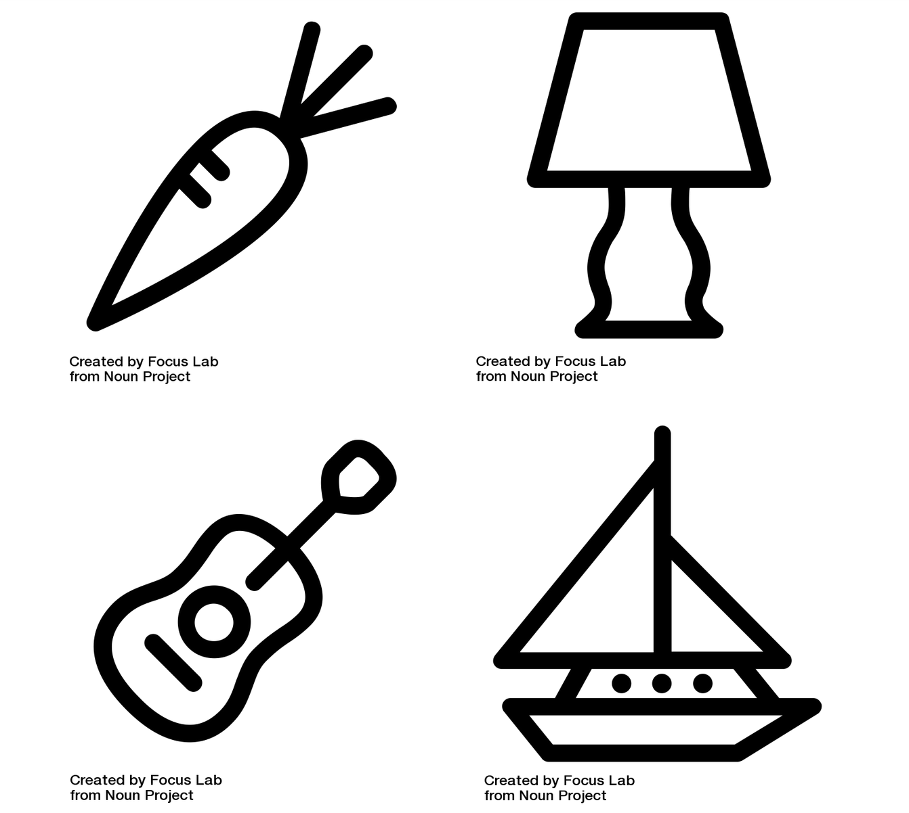

```{r}
#| include: false
#| warning: false
#| message: false
#| echo:    false

knitr::opts_chunk$set(echo = TRUE, warning = FALSE, message = FALSE, 
                      fig.align = 'center')
library(knitr)
library(tidyverse)
library(ggthemes)
library(moderndive)
library(gapminder)
library(infer)
library(tufte)
```

::::: columns
::: {.column .center width="50%"}
{width="90%"}
:::

::: {.column .center width="50%"}
<br>

[Hypothesis Testing II]{.custom-title}

<br> <br> 

[Megan Ayers]{.custom-subtitle}

[Stat 141 \| Fall 2026 <br> Monday, Week 8]{.custom-subtitle}
:::
:::::


------------------------------------------------------------------------

## Goals for today

- Midterm revisions

- Practice framing research questions in terms of hypotheses

- Practice defining null distributions

- 1 vs 2 sided tests


------------------------------------------------------------------------

## Midterm revisions {.smaller}

**If you scored less than 80%** on the midterm you have the opportunity to get some points back. Parameters:

-   You can get up to 50% of your missed points back (up to an 80% total score on the midterm).
    - **Example:** If you got a 70% on the midterm, you can get up to an 80% with revisions, but if you got a 50% on the midterm you can get up to a 75% with revisions. 
-   For each question part you can get half the points you missed.
    - **Example:** If you got a 1 / 3 on Question 1 part (a), an entirely correct solution submitted to me on the midterm makeups will increase your score to 2 / 3 on Question 1 part (a).
-   Changes to rules now apply:
    (1) You must give a brief explanation of where you went wrong for each revised problem and why your revision fixes this.
    (2) You may consult your notes for the course and any of our internal course material. **But outside resources, including friends, peers, the internet, or AI tools, are still prohibited.**
    (3) You have no time pressure.
    (4) You can come to my (Megans's) office hours to discuss questions you are stuck on, but no other office hours or individual tutoring.
-   **Revision instructions are on the course website.**
-   **Submit paper copies of your midterm revisions to me by Wednesday 4/1 at 5:00pm. No late submissions!**

------------------------------------------------------------------------

## Recap: Framework for Hypothesis Testing

1. Present research question and identify hypotheses
    - Null hypothesis (**$H_0$**): status quo, random chance, no effect...
    - Alternative hypothesis (**$H_a$**): the researchers' conjecture

2. Describe **Null** distribution

3. Obtain data, calculate relevant **Test Statistic**

4. Calculate the **P-value**
    - P-value = likelihood of observing the Test Statistic or something more extreme assuming the Null Hypothesis

5. Use the P-value to make a conclusion on the research question


# Let's Practice

------------------------------------------------------------------------

## Example: Does Extrasensory Perception (ESP) exist?

:::::: columns
::: {.column width=40%}

```{r, echo = FALSE, out.width='65%'}

```

```{r, echo = FALSE, out.width='50%'}
knitr::include_graphics("img/galaxy_brain.jgp")
```
:::

::: {.column width=60%}

::: fragment
Psychologists Bem and Honorton conducted extrasensory perception studies:
:::

::: {.fragment .nonincremental}
-   A "sender" randomly chooses an object out of 4 possible objects and sends that information to a "receiver".
-   The "receiver" is then given a set of 4 possible objects and they must decide which one most resembles the object sent to them.
:::

::: fragment
Out of **329 reported trials**, the "receivers" correctly identified the object **106 times**.
:::

:::
::::::

------------------------------------------------------------------------

## Hypothesis Testing Steps: ESP

::::: columns

::: {.column width=47% .nonincremental}

Psychologists Bem and Honorton conducted extrasensory perception studies:

-   A "sender" randomly chooses an object out of 4 possible objects and sends that information to a "receiver".
-   The "receiver" is then given a set of 4 possible objects and they must decide which one most resembles the object sent to them.

Out of **329 reported trials**, the "receivers" correctly identified the object **106 times**.

:::

::: {.column width=6%}

:::

::: {.column width=47% .nonincremental}

**Discuss with neighbor(s)**:

**1.** What is the relevant null hypothesis (**$H_0$**) and alternative hypothesis (**$H_a$**)?

**2.** Describe **Null distribution**. How might we simulate it? (*Hint: Recall the card guessing example*)

**3.** What is our relevant **Test Statistic**?

**4**. What does the **P-value** represent here? How might we calculate it, given step 2?

**5.** How would we use the P-value to make a conclusion on the research question?

```{r}
#| echo: false
countdown::countdown(5)
```

:::

:::::

------------------------------------------------------------------------

## Hypothesis Testing Steps: ESP

1. What is the relevant null hypothesis ($H_0$) and alternative hypothesis ($H_a$)?
    - $H_0$: Participants were guessing randomly ($p = 0.25$)
    - $H_A$: Participants were guessing better than random ($p > 0.25$)
    
------------------------------------------------------------------------

## Hypothesis Testing Steps: ESP

2. Describe "Null" distribution. How might we simulate it?
    - The distribution of $\widehat{p}$ (the proportion of correct guesses) we would see if participants guess at random each time.

::::: columns

::: {.column width=50% .fragment .nonincremental}

**Steps to simulate this:**

1. Sample with replacement from a vector of **0**'s and **1**'s, where we have a 25% chance of sampling **1** each time
2. Compute proportion of **1**'s sampled
3. Repeat 1 and 2 many times.
    
:::

::: {.column width=50%}

::: fragment
```{r fig.height=4}
#| code-line-numbers: "1"
set.seed(123)
guesses <- c(0, 0, 0, 1) # Like a 4-sided dice with sides 0, 0, 0, 1
null_stats <- data.frame(correct = guesses) %>% 
  rep_sample_n(size = 329, replace = TRUE,
               reps = 10000) %>%
  group_by(replicate) %>%
  summarize(p_hat = mean(correct))
ggplot(null_stats, aes(x = p_hat)) + geom_histogram(color = "white")
```
:::

:::

:::::

------------------------------------------------------------------------

## Hypothesis Testing Steps: ESP

::: nonincremental

2. Describe "Null" distribution. How might we simulate it?
    - The distribution of $\widehat{p}$ (the proportion of correct guesses) we would see if participants guess at random each time.
    
:::

::::: columns

::: {.column width=50% .nonincremental}

**Steps to simulate this:**

1. Sample with replacement from a vector of **0**'s and **1**'s, where we have a 25% chance of sampling **1** each time
2. Compute proportion of **1**'s sampled
3. Repeat 1 and 2 many times.
    
:::

::: {.column width=50%}

```{r fig.height=4}
#| code-line-numbers: "2"
set.seed(123)
guesses <- c(0, 0, 0, 1) # Like a 4-sided dice with sides 0, 0, 0, 1
null_stats <- data.frame(correct = guesses) %>% 
  rep_sample_n(size = 329, replace = TRUE,
               reps = 10000) %>%
  group_by(replicate) %>%
  summarize(p_hat = mean(correct))
ggplot(null_stats, aes(x = p_hat)) + geom_histogram(color = "white")
```

:::

:::::

------------------------------------------------------------------------

## Hypothesis Testing Steps: ESP

::: nonincremental

2. Describe "Null" distribution. How might we simulate it?
    - The distribution of $\widehat{p}$ (the proportion of correct guesses) we would see if participants guess at random each time.
    
:::

::::: columns

::: {.column width=50% .nonincremental}

**Steps to simulate this:**

1. Sample with replacement from a vector of **0**'s and **1**'s, where we have a 25% chance of sampling **1** each time
2. Compute proportion of **1**'s sampled
3. Repeat 1 and 2 many times.
    
:::

::: {.column width=50%}

```{r fig.height=4}
#| code-line-numbers: "3-5"
set.seed(123)
guesses <- c(0, 0, 0, 1) # Like a 4-sided dice with sides 0, 0, 0, 1
null_stats <- data.frame(correct = guesses) %>% 
  rep_sample_n(size = 329, replace = TRUE,
               reps = 10000) %>%
  group_by(replicate) %>%
  summarize(p_hat = mean(correct))
ggplot(null_stats, aes(x = p_hat)) + geom_histogram(color = "white")
```

:::

:::::

------------------------------------------------------------------------

## Hypothesis Testing Steps: ESP

::: nonincremental

2. Describe "Null" distribution. How might we simulate it?
    - The distribution of $\widehat{p}$ (the proportion of correct guesses) we would see if participants guess at random each time.
    
:::

::::: columns

::: {.column width=50% .nonincremental}

**Steps to simulate this:**

1. Sample with replacement from a vector of **0**'s and **1**'s, where we have a 25% chance of sampling **1** each time
2. Compute proportion of **1**'s sampled
3. Repeat 1 and 2 many times.
    
:::

::: {.column width=50%}

```{r fig.height=4}
#| code-line-numbers: "6-7"
set.seed(123)
guesses <- c(0, 0, 0, 1) # Like a 4-sided dice with sides 0, 0, 0, 1
null_stats <- data.frame(correct = guesses) %>% 
  rep_sample_n(size = 329, replace = TRUE,
               reps = 10000) %>%
  group_by(replicate) %>%
  summarize(p_hat = mean(correct))
ggplot(null_stats, aes(x = p_hat)) + geom_histogram(color = "white")
```

:::

:::::

------------------------------------------------------------------------

## Hypothesis Testing Steps: ESP

3. What is our relevant "Test Statistic"?
    - $\widehat{p}$ = 106 / 329 = `r round(106/329, 2)` 
    
::: fragment
```{r fig.height=2.5, echo = FALSE}
ggplot(null_stats, aes(x = p_hat)) + geom_histogram(color = "white") +
  geom_vline(aes(xintercept = 106/329), color = "dodgerblue", lwd = 1) 
```
:::

::::: columns

::: {.column width=50%}

4. How can we calculate the "P-value"?
    - Can use probability theory to find $P(\text{Correct guesses} \geq 106) = \ldots ?$
    - Or our simulated null distribution

::: fragment

```{r}
mean(null_stats$p_hat >= 106/329) 
```

:::

:::

::: {.column width=50%}

5. How would we use the P-value to make a conclusion on the research question?
    - If the p-value is "small enough", we reject the null hypothesis of random guessing.
    
:::

:::::


------------------------------------------------------------------------

## Hypothesis Testing: ESP

::: nonincremental

- We got a pretty small p-value ($0.0013$). Hooray! It is reasonable to reject the null hypothesis.

- But really, do we believe that ESP is real? 

:::

- Next lecture, we'll talk more about hypothesis testing errors.


```{r, echo = FALSE, out.width='30%'}
knitr::include_graphics("img/galaxy_brain.jgp")
```

------------------------------------------------------------------------

### Side Note: Reproducibility and Replicatability

::: nonincremental
-   Two important words in data analysis:

    -   Reproducibility
    -   Replicability
    
:::

-   **Reproducibility**: If I give you the raw data and my write-up, you will get to the exact same final numbers that I did.

    -   By using `Quarto` Documents, we are learning a **reproducible** workflow.

-   **Replicability**: If you follow my study design but collect new data (i.e. repeat my study on new subjects), you will come to the same conclusions that I did.

    - Sadly, **replication** studies of Bem and Honorton's ESP trials largely failed to find evidence of ESP.

<!-- ------------------------------------------------------------------------ -->

<!-- ### Replication Crisis -->

<!-- -   Science is going through a **replication crisis** right now. -->

<!--     -   [In cancer science, many "discoveries" don't hold up](https://www.reuters.com/article/us-science-cancer-idUSBRE82R12P20120328) -->
<!--     -   [Estimating the reproducibility of psychological science](https://science.sciencemag.org/content/349/6251/aac4716) -->
<!--     -   [Psychology Is Starting To Deal With Its Replication Problem](https://fivethirtyeight.com/features/psychology-is-starting-to-deal-with-its-replication-problem/) -->

<!-- -   And, sadly, **replication** studies of Bem and Honorton's ESP trials typically failed to find evidence of ESP. -->

<!-- -   On Friday, we'll discuss expectations vs reality of p-values for generating strong scientific evidence -->

------------------------------------------------------------------------

## Switching gears: 1 vs 2 sided tests

- Say we're **flipping a coin 20 times**, and (for some reason) we are worried that it's not a "fair" coin
    - i.e., The probability of heads is not 0.5
- Let **$p=$ probability of getting a heads with this coin**

- **Q**: What is the null hypothesis? 

- Possible alternative hypotheses:
    - **$H_a: p \leq 0.5$**
    - **$H_a: p \geq 0.5$**
    - **$H_a: p \neq 0.5$**

- We've been thinking about the first two cases (1 sided tests). Let's see what changes if $H_a: p \neq 0.5$ (2 sided test).

------------------------------------------------------------------------

## Recall the hypothesis testing steps again: 

1. Present research question and identify hypotheses ($H_0$ and $H_a$)
    - **$H_a: p \leq 0.5$, or $p \geq 0.5$, or $p \neq 0.5$?**
    - $H_0: p = 0.5$

2. Describe "Null" distribution
    - **This is the same regardless of which $H_a$ we use, depends only on $H_0$**

3. Obtain data, calculate relevant "Test Statistic"

4. **Calculate the "P-value"**
    - P-value = likelihood of observing the Test Statistic **or something more extreme** assuming the Null Hypothesis

5. Use the P-value to make a conclusion on the research question

------------------------------------------------------------------------

## 1 vs 2 sided tests: what does "more extreme" mean? {.smaller}

- Suppose our test statistic from 20 coin flips is $\widehat{p}= 0.85$.

::: {.fragment .nonincremental}

- If we have **$H_a: p > 0.5$** (**right**-tailed test)
     - We'd want $\mathrm{P}(\widehat{p} \geq 0.85)$ under the null hypothesis as our P-value

::::: columns

::: {.column width=65%}

```{r echo = FALSE, fig.height=2.5}
set.seed(10)
x <- rnorm(10000, 0, 1)
x_bar <- 2.35
sim_data <- data.frame(x)

coin <- data.frame(face = c("Heads", "Tails"))

null_stats <- coin %>% 
  rep_sample_n(size = 8, replace = T, reps = 10000) %>% 
  summarize(n_heads = sum(face == "Heads")) %>% 
  mutate(p_hat = n_heads/8)

sim_data %>% ggplot(aes(x = x))+geom_histogram(bins = 20, color = "white")+
  labs(title = "Null Distribution, right-tailed test", x = "Simulated Statistics", y = "count")+
  scale_x_continuous(labels = NULL)+scale_y_continuous(labels = NULL)+
  geom_vline(xintercept = x_bar, color = "red", size = 1.25)+
  annotate("text", x = x_bar + .65, y = 500, color = "red", label = "test statistic")+
  annotate("rect", xmin = x_bar, xmax = Inf, ymin = 0, ymax = Inf, fill = "red", alpha = .3)
```

:::

::: {.column width=35%}

```{r}
mean(null_stats$p_hat >= 0.85)
```

:::

:::::

:::

::: {.fragment .nonincremental}

- If instead we have **$H_a: p < 0.5$** (**left**-tailed test)
     - We'd want $\mathrm{P}(\widehat{p} \leq 0.85)$ under the null hypothesis as our P-value
     
::::: columns

::: {.column width=65%}
     
```{r echo = FALSE, fig.height=2.5}
sim_data %>% ggplot(aes(x = x))+geom_histogram(bins = 20, color = "white")+
  labs(title = "Null Distribution, left-tailed test", x = "Simulated Statistics", y = "count")+
  scale_x_continuous(labels = NULL)+scale_y_continuous(labels = NULL)+
  geom_vline(xintercept = x_bar, color = "red", size = 1.25)+
  annotate("text", x = x_bar + .65, y = 500, color = "red", label = "test statistic")+
  annotate("rect", xmin = -Inf, xmax = x_bar, ymin = 0, ymax = Inf, fill = "red", alpha = .3)
```

:::

::: {.column width=35%}

```{r echo = T}
mean(null_stats$p_hat <= 0.85)
```

:::

:::::

:::

------------------------------------------------------------------------

## 1 vs 2 sided tests: what does "more extreme" mean?

::: nonincremental
- Suppose our test statistic from 20 coin flips is $\widehat{p}= 0.85$.
:::

- Suppose we have **$H_a: p \neq 0.5$**
    - $\widehat{p}= 0.85$ is 0.35 *more* than $p = 0.5$, so we want to include $\mathrm{P}(\widehat{p} \geq 0.85)$
    - $\widehat{p}= 0.15$ is 0.35 *less* than $p = 0.5$, so we'd [also]{.underline} want $\mathrm{P}(\widehat{p} \leq 0.15)$ (this would be more extreme in the other direction)

- So our P-value would be the sum of those two things (both tails)!

::: fragment

```{r echo = T}
mean(null_stats$p_hat >= 0.85) + mean(null_stats$p_hat <= 0.15)
```

:::

::: fragment
```{r echo = FALSE, fig.height=2.5}
sim_data %>% ggplot(aes(x = x))+geom_histogram(bins = 20, color = "white")+
  labs(title = "Null Distribution, two-tailed test", x = "Simulated Statistics", y = "count")+
  scale_x_continuous(labels = NULL)+scale_y_continuous(labels = NULL)+
  geom_vline(xintercept = x_bar, color = "red", size = 1.25)+
  annotate("text", x = x_bar + .75, y = 500, color = "red", label = "test statistic")+
  annotate("rect", xmin = x_bar, xmax = Inf, ymin = 0, ymax = Inf, fill = "red", alpha = .3)+
  geom_vline(xintercept = -x_bar, color = "blue", size = 1.25)+
  annotate("text", x = -x_bar - 1, y = 500, color = "blue", label = "equally extreme \n simulated statistics")+
  annotate("rect", xmin = -Inf, xmax = -x_bar, ymin = 0, ymax = Inf, fill = "blue", alpha = .3)

```

:::

------------------------------------------------------------------------

## 1 vs 2 sided tests: what does "more extreme" mean?

Note the effect that our choice of $H_a$ had on our p-values! 

::: nonincremental
  - Our test statistic was $\widehat{p}= 0.85$
  - **$H_a: p \leq 0.5$**: P-value = 0.9649
  - **$H_a: p \geq 0.5$**: P-value = 0.0351
  - **$H_a: p \neq 0.5$**: P-value = 0.0732
  
:::

------------------------------------------------------------------------

### Another Example

Can you tell if a mouse is in pain by looking at its facial expression? A recent study created a "mouse grimace scale" and tested to see if there was a positive correlation between scores on that scale and the degree of pain (based on injections of a weak and mildly painful solution). The study's authors believe that if the scale applies to other mammals as well, it could help veterinarians test how well painkillers and other medications work in animals.

<br>

::: nonincremental
- **Q**: Write out $H_0$ and $H_a$ qualitatively (in words).

- **Q**: Write out $H_0$ and $H_a$ in terms of population parameters. (*Hint: recall that we use $r$ for correlation*)

- **Q**: Describe how we'd expect the data to behave under $H_0$.
:::


```{r}
#| echo: false
countdown::countdown(3)
```


------------------------------------------------------------------------

### Another Example!

Can a simple smile have an effect on punishment assigned following an infraction? In a 1995 study, Hecht and LeFrance examined the effect of a smile on the leniency of disciplinary action for wrongdoers. Participants in the experiment took on the role of members of a college disciplinary panel judging students accused of cheating. For each suspect, along with a description of the offense, a picture was provided with either a smile or neutral facial expression. A leniency score was calculated based on the disciplinary decisions made by the participants.

<br>

::: nonincremental
- **Q**: Write out $H_0$ and $H_a$ qualitatively (in words).

- **Q**: Write out $H_0$ and $H_a$ in terms of population parameters (*Hint, we can write the population mean leniency score for smilers as $\mu_S$*).

- **Q**: Describe how we'd expect the data to behave under $H_0$.
:::


```{r}
#| echo: false
countdown::countdown(3)
```

-----------------------------------------------------------------------

## Null distributions: how to generate them for these other examples?

::::: columns

::: {.column width=50% .fragment .nonincremental}

- **Rat Pain and grimacing :( **
    - $H_0$: The correlation between grimacing and the level of pain is 0
    - Under the null, grimacing and level of pain are totally unrelated
    - To approximate the null distribution, we could:
        1. Randomly shuffle the `grimace` column of our data
        2. Calculate the correlation between `grimace` and `pain` in the shuffled data
        3. Repeat 1-2 many times.
    
:::    

::: {.column width=50% .fragment}

```{r, fig.height = 3.5}
set.seed(111)
df <- data.frame(pain = runif(100, 0, 10),
                 grimace = rnorm(100, 10, 2))
null_stats <- df %>% select(grimace) %>%
  rep_sample_n(size = 100, replace = FALSE,
               reps = 5000) %>%
  add_column(pain = rep(df$pain, times = 5000)) %>%
  group_by(replicate) %>%
  summarize(stat = cor(grimace, pain))
                
ggplot(null_stats, aes(x = stat)) + 
  geom_histogram(color = "white", fill = "gray60") +
  geom_vline(aes(xintercept = 0), lty = 2,
             col = "black", lwd = 1) +
  theme_classic()
```

:::

:::::

------------------------------------------------------------------------

## Null distributions: how to generate them for these other examples?

::::: columns

::: {.column width=50% .fragment .nonincremental}

- **Discipline for Smilers vs Non-Smilers**
    - $H_0$: We expect the difference in average leniency scores between the smiling and non-smiling groups to be zero - no relationship between the leniency score and the treatment group.
    - To approximate the null distribution, we could:
        1. Randomly shuffle the `treatment` column of our data
        2. Calculate the difference in means between the leniency scores in each group
        3. Repeat 1-2 many times.
    
:::    

::: {.column width=50% .fragment}

```{r, fig.height = 4}
set.seed(111)
df <- data.frame(treatment = rep(c("smile", "neutral"), times = 30),
                 score = round(runif(60, 0, 10)))
null_stats <- df %>% select(treatment) %>%
  rep_sample_n(size = 60, replace = FALSE, reps = 5000) %>%
  add_column(score = rep(df$score, times = 5000)) %>%
  group_by(replicate, treatment) %>%
  summarize(ybar = mean(score)) %>% 
  pivot_wider(names_from = treatment, values_from = ybar) %>%
  mutate(stat = smile - neutral)
ggplot(null_stats, aes(x = stat)) + 
  geom_histogram(color = "white", fill = "gray60") +
  geom_vline(aes(xintercept = 0), lty = 2, col = "black", lwd = 1) +
  theme_classic()
```

:::

:::::

-----------------------------------------------------------------------

### Next time

- Decisions in hypothesis testing

<br>

- Types of hypothesis testing errors

<br>

::: {.fragment .nonincremental}
- Power

{width=20%}
:::

------------------------------------------------------------------------
