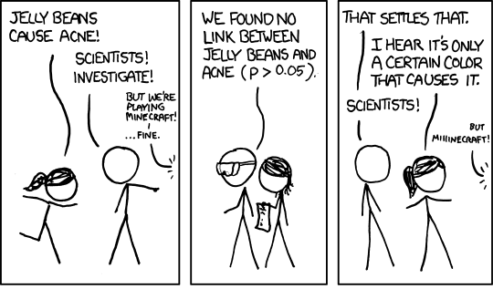
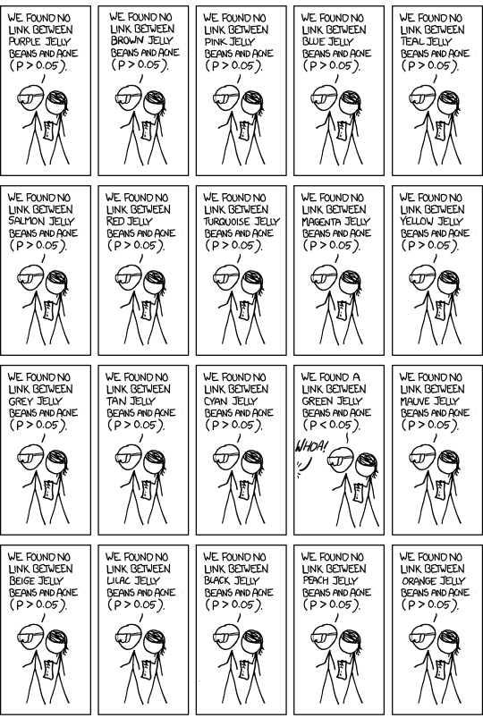
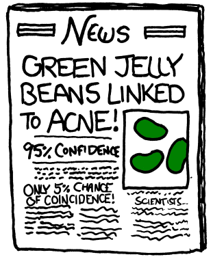
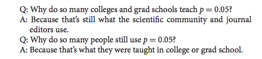
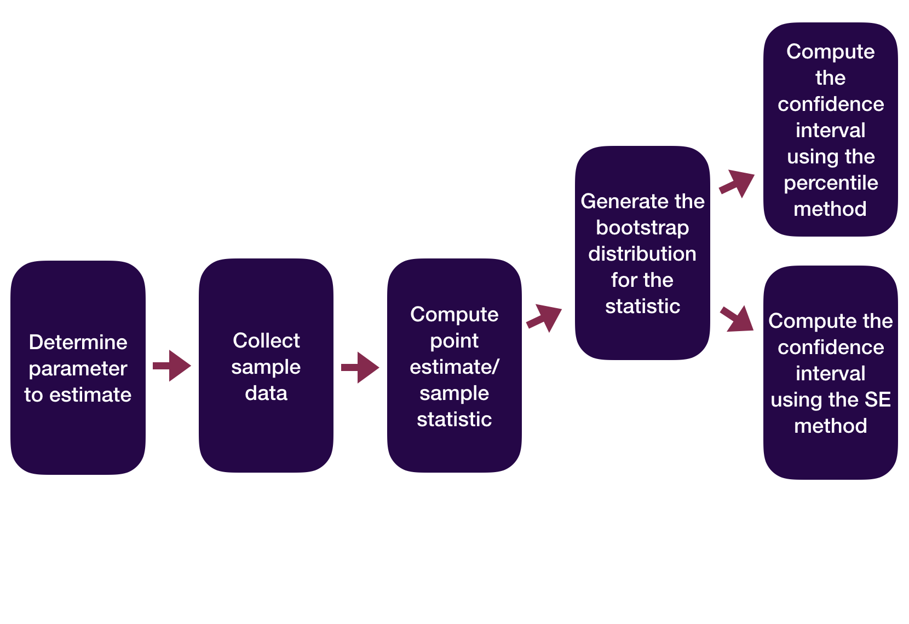
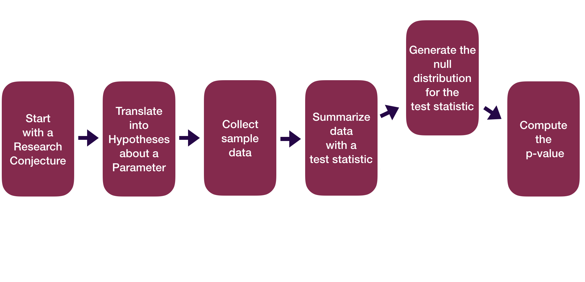
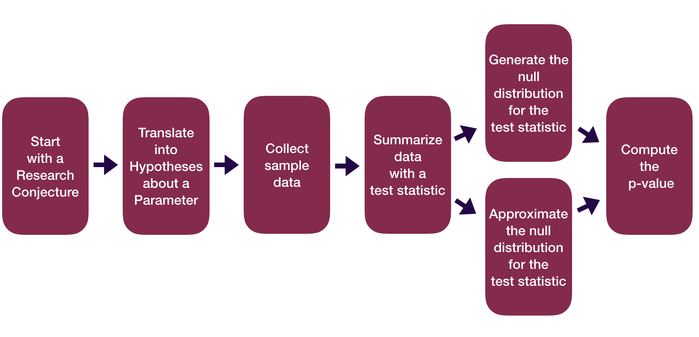

```{r}
#| include: false
#| warning: false
#| message: false
#| echo:    false

knitr::opts_chunk$set(echo = TRUE, warning = FALSE, message = FALSE, 
                      fig.align = 'center')
library(knitr)
library(tidyverse)
library(ggthemes)
library(moderndive)
library(gapminder)
library(infer)
library(tufte)
```

::::: columns
::: {.column .center width="50%"}
{width="90%"}
:::

::: {.column .center width="50%"}
<br>

[P-Value Pitfalls]{.custom-title}

<br> <br> 

[Megan Ayers]{.custom-subtitle}

[Stat 141 \| Fall 2026 <br> Friday, Week 8]{.custom-subtitle}
:::
:::::


------------------------------------------------------------------------

## Reminders
- Assignment deadlines will resume per usual after the break
    - Lab from yesterday: Due Tuesday March 31st
    - Midterm revisions: Due Wednesday April 1st
    - HW 7: Due Friday April 3rd
    
------------------------------------------------------------------------


## Goals for today

- A hearty p-values discussion

- Zoom out on statistical inference so far

- Motivate theory-based inference

------------------------------------------------------------------------


### Let's Talk About P-values

-   The original intention of the p-value was as an **informal** measure to judge whether or not a researcher should take a second look.

-   But to create simple statistical manuals for practitioners, this informal measure quickly became a rule: **"p-value \< 0.05" = "statistically significant"**.

::: fragment
**What were/are the consequences of the "p-value \< 0.05" = "statistically significant" rule?**
:::

------------------------------------------------------------------------

### Let's Talk About P-values

::: nonincremental
-   **A consequence**: The p-value is often misinterpreted to be the probability the null hypothesis is true.
    -   A p-value of 0.003 does not mean there's a 0.3% chance that ESP doesn't exist!
    -   By giving people a simple rule, they never learned what the p-value actually measures.
:::

------------------------------------------------------------------------

### Let's Talk About P-values

::: columns
::: column
::: nonincremental
-   **A consequence**: Researchers often put too much weight on the p-value and not enough weight on their domain knowledge/the plausibility of their conjecture.

-  **Read and discuss this [xkcd comic](https://xkcd.com/1132/) with your neighbors**
:::
:::

::: column
```{r  out.width = "65%", echo=FALSE, fig.align='center'}
include_graphics("img/frequentists_vs_bayesians_2x.png") 
```
:::
:::

```{r}
#| echo: false
countdown::countdown(3)
```

------------------------------------------------------------------------

### Let's Talk About P-values

::: columns
::: column
::: nonincremental
-   **A consequence**: [P-hacking](https://stats.andrewheiss.com/hack-your-way/): Cherry-picking promising findings that are beyond this arbitrary threshold.

-   [xkcd comic](https://www.explainxkcd.com/wiki/index.php/882:_Significant)
:::
:::

::: column
```{r echo=FALSE, fig.align='center'}
 
```
:::
:::

------------------------------------------------------------------------

### Let's Talk About P-values

::: columns
::: column
::: nonincremental
-   **A consequence**: [P-hacking](https://stats.andrewheiss.com/hack-your-way/): Cherry-picking promising findings that are beyond this arbitrary threshold.

-   [xkcd comic](https://www.explainxkcd.com/wiki/index.php/882:_Significant)
:::
:::

::: column
```{r  out.width = "70%", echo=FALSE, fig.align='center'}
 
```
:::
:::

------------------------------------------------------------------------

### Let's Talk About P-values

::: columns
::: column
::: nonincremental
-   **A consequence**: [P-hacking](https://stats.andrewheiss.com/hack-your-way/): Cherry-picking promising findings that are beyond this arbitrary threshold.

-   [xkcd comic](https://www.explainxkcd.com/wiki/index.php/882:_Significant)
:::
:::

::: column
```{r  out.width = "55%", echo=FALSE, fig.align='center'}
 
```
:::
:::

- **Q**: If we run 100 hypothesis tests where all null hypotheses are true, how many do we expect to have a P-value less than 0.05 due to chance? 
    - This is also known as the **multiple comparisons** problem

------------------------------------------------------------------------

## Where does p-hacking come from?
- Can be an unintentional consequence of data analysis's "[garden of forking paths](https://sites.stat.columbia.edu/gelman/research/unpublished/p_hacking.pdf)" 
- Also partly a byproduct of publication bias/incentives in academia

------------------------------------------------------------------------

## Moving forward from p-hacking
- Distinguish the purpose of your analysis: **confirmatory vs exploratory**
    - **Confirmatory** analyses: Pre-register your hypotheses and planned analysis before conducting your study
    - **Exploratory** analyses: Less pressure on "statistical significance", more focus on preliminary evidence that requires a confirmatory follow-up

- **Always present statistical context behind your conclusions**: confidence intervals, p-values, analysis decisions, and assumptions

- **Multiple testing corrections**
   - Informally, these inflate your p-values to account for performing many tests
   - Ex. If I perform $n$ hypothesis tests, I change my rejection threshold to $\alpha / n$ (Bonferroni correction)

------------------------------------------------------------------------

### Let's Talk About P-values

-   **Another consequence of p-values**: People conflate *statistical significance* with *practical significance*.

::: fragment
**Example**: A *Nature* study of 19,000+ recently married people found that those who meet their spouses online...
:::

-   Are less likely to divorce (p-value \< 0.002)

-   Are more likely to have high marital satisfaction (p-value \< 0.001)

-   BUT the estimated **effect sizes** were tiny.

    -   Divorce rate of 5.96% for those who met online versus 7.67% for those who met in-person.
    -   On a 7 point scale, happiness value of 5.64 for those who met online versus 5.48 for those who met in-person.

::: fragment
**Q**: Do these results provide compelling evidence that one should change their dating behavior?
:::


------------------------------------------------------------------------

### Let's Talk About P-values

The American Statistical Association created a set of principles to address misconceptions and misuse of p-values:

::: incremental
1.  P-values can indicate how incompatible the data are with a specified statistical model.

2.  P-values do not measure the probability that the studied hypothesis is true.

3.  Scientific conclusions and business or policy decisions should not be based only on whether or not a p-value passes a specific threshold (i.e. 0.05).

4.  Proper inference requires full reporting and transparency.

5.  A p-value, or statistical significance, does not measure the size of an effect or the importance of a result.

6.  By itself, a p-value does not provide a good measure of evidence regarding a model or hypothesis.
:::

------------------------------------------------------------------------

### Let's Talk About P-values

-   Despite its issues, p-values are still quite popular and can still be a useful tool **when used properly**.

-   In 2014, George Cobb a professor from Mount Holyoke College posed the following questions (and answers):

::: fragment
```{r  out.width = "55%", echo=FALSE, fig.align='center'}
 
```
:::

-  We can break the cycle!

------------------------------------------------------------------------

### Math 141 & P-Values

-   Understanding p-values and being able to **interpret a p-value in context** is a learning objective of Math 141.

    -   Ex: If ESP doesn't exist, the probability of guessing correctly on at least 106 out of 329 trials is 0.003.

-   Understanding that a small p-value means we have **some evidence for $H_a$** is important.

    -   Ex: Because the p-value is small, we have evidence for ESP.

-   Understanding that a small p-value alone does not imply practical significance.

    -   Create a confidence interval to contextualize the effect size!

-   Understanding that what you mean by **small** should depend on your field and whether a Type I Error or Type II Error is worse for **your particular research question**.

-   Your ability to tell if a \# is less than 0.05 is not a learning objective for Math 141.


# Inference: The big picture

------------------------------------------------------------------------

## Inference: The Big Picture

- **Statistical inference** is the process of drawing conclusions about a population based on sample data.

- **Q**: How do point estimates and confidence intervals help us make inferences?

- **Q**: How does the hypothesis testing framework help us make inferences?

```{r}
#| echo: false
countdown::countdown(3)
```

------------------------------------------------------------------------

## Inference: The Big Picture

- Working with samples provides a window into the population, but we can't see it all

- **Overarching goal**: distinguish between results that arise due to chance vs results that reflect a real, systematic pattern in the population
    - This led us to focus on **sampling distributions**, which we approximate using **bootstrap distributions** and **resampling methods**

    - We used these to accomplish two tasks:
        - **Generate point + interval estimates**: Our best guess + range of plausible values for a parameter
        - **Perform hypothesis tests**: A scientific method for maintaining or rejecting a null hypothesis in favor of an alternative hypothesis
  
------------------------------------------------------------------------

## Inference: The Big Picture

- **Point + interval estimates**: Our best guess + range of plausible values for a parameter

- **Hypothesis testing**: A scientific method for maintaining or rejecting a null hypothesis in favor of an alternative hypothesis

- These two approaches are two sides of the same coin! 

------------------------------------------------------------------------

## Inference: The Big Picture

::: nonincremental
- These two approaches are two sides of the same coin! 

- Suppose we have $H_0: \mu = 0$, and observe a test statistic 

- Performing **2-sided** hypothesis test with $\alpha = 0.05$ is equivalent to computing a 95% confidence interval (CI) from our data and seeing if 0 falls inside it.

::: 

::: {.fragment .nonincremental}

::::: columns 

::: {.column width=35%}

- For any value $x_{in}$ in CI, we **would not **reject a null hypothesis $H_0: \mu = x_{in}$ given our data. 
- For any value $x_{out}$ outside of CI, we **would** reject a null hypothesis $H_0: \mu = x_{out}$.
    
:::

::: {.column width=65%}
  

```{r echo = FALSE}
set.seed(10)
x <- rnorm(10000, 0, 1)
x_bar <- 2.35
se <- sd(x)
sim_data <- data.frame(x)

sim_data %>% ggplot(aes(x = x))+
  geom_histogram(bins = 20, color = "white", fill = "gray60")+
  labs(title = "Null Distribution, two-tailed test", x = "Simulated Statistics", y = "count")+
  scale_y_continuous(labels = NULL)+
  geom_vline(xintercept = x_bar, color = "dodgerblue", size = 1.25)+
  annotate("text", x = x_bar + .75, y = 500, color = "dodgerblue", label = "Test statistic")+
  annotate("rect", xmin = x_bar, xmax = Inf, ymin = 0, ymax = Inf, fill = "dodgerblue", alpha = .3)+
  geom_vline(xintercept = -x_bar, color = "dodgerblue", size = 1.25)+
  geom_vline(xintercept = 0, lty = 2, size = 1.25) +
  annotate("text", x = -x_bar - 1, y = 500, color = "dodgerblue", label = "Equally extreme \n simulated statistics") +
  annotate("rect", xmin = -Inf, xmax = -x_bar, ymin = 0, ymax = Inf, fill = "dodgerblue", alpha = .3) +
  theme_classic()
```

:::

:::::

:::

------------------------------------------------------------------------

## Inference: The Big Picture

::: nonincremental
- These two approaches are two sides of the same coin! 

- Suppose we have $H_0: \mu = 0$, and observe a test statistic 

- Performing **2-sided** hypothesis test with $\alpha = 0.05$ is equivalent to computing a 95% confidence interval (CI) from our data and seeing if 0 falls inside it.

::: 

::: {.nonincremental}

::::: columns 

::: {.column width=35%}

- For any value $x_{in}$ in CI, we **would not **reject a null hypothesis $H_0: \mu = x_{in}$ given our data. 
- For any value $x_{out}$ outside of CI, we **would** reject a null hypothesis $H_0: \mu = x_{out}$.
    
:::

::: {.column width=65%}
  
```{r echo = FALSE}
set.seed(10)
x <- rnorm(10000, 0, 1)
x_bar <- 2.35
se <- sd(x)
sim_data <- data.frame(x)

sim_data %>% ggplot(aes(x = x))+
  geom_histogram(bins = 20, color = "white", fill = "gray60")+
  labs(title = "Null Distribution, two-tailed test", x = "Simulated Statistics", y = "count")+
  scale_y_continuous(labels = NULL)+
  geom_vline(xintercept = quantile(x, 0.975), color = "goldenrod", size = 1.25)+
  geom_vline(xintercept = quantile(x, 0.025), color = "goldenrod", size = 1.25)+
  annotate("text", x = quantile(x, 0.025) + 0.75, y = 1550, color = "goldenrod",
           label = "2.5 and 97.5\npercentiles") +
  geom_vline(xintercept = x_bar, color = "dodgerblue", size = 1.25)+
  annotate("text", x = x_bar + .75, y = 500, color = "dodgerblue", label = "Test statistic")+
  annotate("rect", xmin = x_bar, xmax = Inf, ymin = 0, ymax = Inf, fill = "dodgerblue", alpha = .3)+
  geom_vline(xintercept = -x_bar, color = "dodgerblue", size = 1.25)+
  geom_vline(xintercept = 0, lty = 2, size = 1.25) +
  annotate("text", x = -x_bar - 1, y = 500, color = "dodgerblue", label = "Equally extreme \n simulated statistics") +
  annotate("rect", xmin = -Inf, xmax = -x_bar, ymin = 0, ymax = Inf, fill = "dodgerblue", alpha = .3) +
  theme_classic()
```

:::

:::::

:::

------------------------------------------------------------------------

## Inference: The Big Picture

::: nonincremental
- These two approaches are two sides of the same coin! 

- Suppose we have $H_0: \mu = 0$, and observe a test statistic 

- Performing **2-sided** hypothesis test with $\alpha = 0.05$ is equivalent to computing a 95% confidence interval (CI) from our data and seeing if 0 falls inside it.

::: 

::: {.nonincremental}

::::: columns 

::: {.column width=35%}

- For any value $x_{in}$ in CI, we **would not **reject a null hypothesis $H_0: \mu = x_{in}$ given our data. 
- For any value $x_{out}$ outside of CI, we **would** reject a null hypothesis $H_0: \mu = x_{out}$.
    
:::

::: {.column width=65%}
  
```{r echo = FALSE}
set.seed(10)
x <- rnorm(10000, 0, 1)
x_bar <- 2.35
se <- sd(x)
sim_data <- data.frame(x)

sim_data %>% ggplot(aes(x = x))+
  geom_histogram(bins = 20, color = "white", fill = "gray60")+
  labs(title = "Null Distribution, two-tailed test", x = "Simulated Statistics", y = "count")+
  scale_y_continuous(labels = NULL)+
  geom_vline(xintercept = quantile(x, 0.975), color = "goldenrod", size = 1.25)+
  geom_vline(xintercept = quantile(x, 0.025), color = "goldenrod", size = 1.25)+
  annotate("text", x = quantile(x, 0.025) + 0.75, y = 1550, color = "goldenrod",
           label = "2.5 and 97.5\npercentiles") +
  geom_vline(xintercept = x_bar, color = "dodgerblue", size = 1.25)+
  annotate("text", x = x_bar + .75, y = 500, color = "dodgerblue", label = "Test statistic")+
  annotate("rect", xmin = x_bar, xmax = Inf, ymin = 0, ymax = Inf, fill = "dodgerblue", alpha = .3)+
  geom_vline(xintercept = -x_bar, color = "dodgerblue", size = 1.25)+
  geom_vline(xintercept = 0, lty = 2, size = 1.25) +
  annotate("text", x = -x_bar - 1, y = 500, color = "dodgerblue", label = "Equally extreme \n simulated statistics") +
  annotate("rect", xmin = -Inf, xmax = -x_bar, ymin = 0, ymax = Inf, fill = "dodgerblue", alpha = .3) +
  geom_segment(aes(x = x_bar + 2*se, y = 1500, xend = x_bar, yend = 1500), arrow = arrow(length = unit(0.3, "cm"), ends = "first", type = "closed"), color = "magenta2", lwd = 1)+
  geom_segment(aes(x = x_bar - 2*se, y = 1500, xend = x_bar, yend = 1500), arrow = arrow(length = unit(0.3, "cm"), ends = "first", type = "closed"), color = "magenta2", lwd = 1)+
  annotate(geom = "point", x = x_bar, y = 1500, color = "magenta2", size = 3) +
  annotate("text", x = x_bar + 1, y = 1625, color = "magenta2", label = "Confidence interval\nfor our test statistic") +
  theme_classic()
```

:::

:::::

:::


------------------------------------------------------------------------

## Inference: The Big Picture

::: nonincremental
- These two approaches are two sides of the same coin! 

- Suppose we have $H_0: \mu = 0$, and observe a test statistic 

- Performing **2-sided** hypothesis test with $\alpha = 0.05$ is equivalent to computing a 95% confidence interval (CI) from our data and seeing if 0 falls inside it.

::: 

::: {.nonincremental}

::::: columns 

::: {.column width=35%}

- For any value $x_{in}$ in CI, we **would not **reject a null hypothesis $H_0: \mu = x_{in}$ given our data. 
- For any value $x_{out}$ outside of CI, we **would** reject a null hypothesis $H_0: \mu = x_{out}$.
    
:::

::: {.column width=65%}
  
```{r echo = FALSE}
set.seed(10)
x <- rnorm(10000, 0, 1)
x_bar <- 2.35
se <- sd(x)
sim_data <- data.frame(x)

sim_data %>% ggplot(aes(x = x))+
  geom_histogram(bins = 20, color = "white", fill = "gray60")+
  labs(title = "Null Distribution, two-tailed test", x = "Simulated Statistics", y = "count")+
  scale_y_continuous(labels = NULL)+
  geom_vline(xintercept = quantile(x, 0.975), color = "goldenrod", size = 1.25)+
  geom_vline(xintercept = quantile(x, 0.025), color = "goldenrod", size = 1.25)+
  annotate("text", x = quantile(x, 0.025) + 0.75, y = 1550, color = "goldenrod",
           label = "2.5 and 97.5\npercentiles") +
  geom_vline(xintercept = x_bar, color = "dodgerblue", size = 1.25)+
  annotate("text", x = x_bar + .75, y = 500, color = "dodgerblue", label = "Test statistic")+
  annotate("rect", xmin = x_bar, xmax = Inf, ymin = 0, ymax = Inf, fill = "dodgerblue", alpha = .3)+
  geom_vline(xintercept = -x_bar, color = "dodgerblue", size = 1.25)+
  geom_vline(xintercept = 0, lty = 2, size = 1.25) +
  annotate("text", x = -x_bar - 1, y = 500, color = "dodgerblue", label = "Equally extreme \n simulated statistics") +
  annotate("rect", xmin = -Inf, xmax = -x_bar, ymin = 0, ymax = Inf, fill = "dodgerblue", alpha = .3) +
  geom_segment(aes(x = x_bar + 2*se, y = 1500, xend = x_bar, yend = 1500), arrow = arrow(length = unit(0.3, "cm"), ends = "first", type = "closed"), color = "magenta2", lwd = 1)+
  geom_segment(aes(x = x_bar - 2*se, y = 1500, xend = x_bar, yend = 1500), arrow = arrow(length = unit(0.3, "cm"), ends = "first", type = "closed"), color = "magenta2", lwd = 1)+
  annotate(geom = "point", x = x_bar, y = 1500, color = "magenta2", size = 3) +
  annotate("text", x = x_bar + 1, y = 1625, color = "magenta2", label = "Confidence interval\nfor our test statistic") +
  geom_segment(aes(x = quantile(x, 0.975) - 0.5 + 2*se, y = 900, xend = quantile(x, 0.975) - 0.5, yend = 900), arrow = arrow(length = unit(0.3, "cm"), ends = "first", type = "closed"), color = "green3", lwd = 1)+
  geom_segment(aes(x = quantile(x, 0.975) - 0.5 - 2*se, y = 900, xend = quantile(x, 0.975) - 0.5, yend = 900), arrow = arrow(length = unit(0.3, "cm"), ends = "first", type = "closed"), color = "green3", lwd = 1)+
  annotate(geom = "point", x = quantile(x, 0.975) - 0.5, y = 900, color = "green3", size = 3) +
  annotate("text", x = quantile(x, 0.975) + 1.6, y = 1175, color = "green4", label = "Confidence interval\nfor different test statistic\n between 2.5 and\n97.5 percentiles") +
  theme_classic()
```

:::

:::::

:::


------------------------------------------------------------------------

### Statistical Inference Zoom Out -- Estimation

{width="60%" fig-align="center"}

::: fragment
**Question**: How did folks do inference before computers?
:::

------------------------------------------------------------------------

### Statistical Inference Zoom Out -- Estimation

{width="60%" fig-align="center"}

**Question**: How did folks do inference before computers?

------------------------------------------------------------------------

### Statistical Inference Zoom Out -- Testing

{width="70%" fig-align="center"}

::: fragment
**Question**: How did folks do inference before computers?
:::

------------------------------------------------------------------------

### Statistical Inference Zoom Out -- Testing

{width="70%" fig-align="center"}

**Question**: How did folks do inference before computers?

# This means we need to learn about probability models!

------------------------------------------------------------------------

### Probability Models

- We have computers now! Why do we need to know how to do inference without them?
    - It's important to build literacy for existing and future work that relies on probability models and theory
    - Default settings for many programmed statistical analyses make assumptions based on probability theory
    - Closed-form results build intuition and formalize ideas in ways that simulation methods alone do not

------------------------------------------------------------------------

### Probability Models

::: columns
::: column
**Motivating question**: How can we use theoretical probability models to approximate our (sampling) distributions?

```{r, echo=FALSE, fig.width = 6}
set.seed(123)
library(tidyverse)
library(palmerpenguins)
library(infer)
penguins %>%
  drop_na(sex) %>%
  specify(flipper_length_mm ~ sex) %>%
  hypothesize(null = "independence") %>%
  generate(reps = 1000, type = "permute") %>%
  calculate(stat ="diff in means", order = c("female", "male")) %>%
  visualize()
```
:::

::: column
::: fragment
Before we can answer that question and apply the models, we need to learn about the theoretical probability models themselves. We'll turn to this **after spring break**! 
:::
:::
:::


# Enjoy your spring break!! 


------------------------------------------------------------------------


