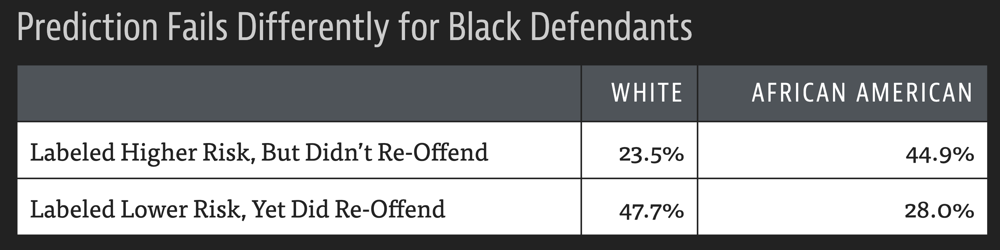

```{r include=FALSE}
knitr::opts_chunk$set(echo = F, message = FALSE, warning = FALSE, fig.align = "center", fig.height = 4, fig.width = 6,  out.width = "75%")
options(digits = 3)
library(knitr)
library(tidyverse)
library(dplyr)
library(ggthemes)
library(moderndive)
library(gapminder)
library(infer)
library(tufte)
library(gridExtra)
library(kableExtra)

theme_set(theme_bw())
theses<-read_csv("Data/theses.csv") %>% 
  filter(division %in% c("ART","HSS","LL","MNS","PRPL")) %>% 
  drop_na(n_pages, year)

library(palmerpenguins)
penguins <- penguins %>% drop_na()
set.seed(4)
penguins <- penguins[sample(1:333,100),]
penguins$species <- factor(penguins$species,levels=c("Chinstrap","Gentoo","Adelie"))
```

::::: columns
::: {.column .center width="50%"}
{width="90%"}
:::

::: {.column .center width="50%"}
<br>

[Modeling Categorical Outcomes]{.custom-title}

<br> <br> 

[Megan Ayers]{.custom-subtitle}

[Math 141 \| Spring 2026 <br> Monday, Week 14]{.custom-subtitle}
:::
:::::


------------------------------------------------------------------------

## Announcements

- Last day of individual and general Math/Stats drop-in tutoring will be Friday, May 1st
- Reading week office hours with me and course assistants will be posted soon
- Midterm revisions ready for pickup in my office

------------------------------------------------------------------------

## Goals for today

- Logistics and advice for the final exam

- Discuss a method for modeling categorical outcomes

- Discuss algorithmic fairness in context of predictive models


# Final Exam

------------------------------------------------------------------------

## Exam logistics

- You'll have a 3 hour time slot to complete your exam. **Arrive on time, and quietly!** If you arrive late, you'll still need to finish on time.
    - **10am lecture section**: Monday, May 11 from 6-9pm
    - **12pm lecture section**: Thursday, May 14 from 6-9pm

- You can bring 2 notecards, handwritten, both sides

- I'll provide the theory-based inference summary tables with the exam

- Exam will be cumulative, all handwritten

- No live coding, but you may be asked to evaluate code shown to you or write "pseudo code" (more examples in lab)

------------------------------------------------------------------------

## Exam review

- New review sheet is posted next to today's slides on course website
    - It covers material since the midterm - look at your midterm review sheet too
    
<br>

- On **Thursday in lab** we'll mainly practice code-based questions + some conceptual questions

<br>

- On **Friday** we'll practice conceptual / mathematical questions

------------------------------------------------------------------------

## Exam review

**Studying advice**:

- Start early and divide up your review 
- Use the review sheets to identify challenging areas
- Focus on generalizable concepts first
    - Ex. First, answer: What are the steps for building confidence intervals + what's the purpose of each step?
    - Second, practice specific exercises without notes
    
------------------------------------------------------------------------

## Remaining assignments

- Lab 10: **due Thursday 4/30 at 11:59pm** (submission with 4 extension days would be 5/4)
- Any late work: **due Friday 5/8 at 11:59pm** via email to me. 
    - You'll get partial credit for any late assignments you submit beyond extension days
    - You will not get feedback, but can talk to any of us in office hours about assignments

<br>

- **Questions?**

# Logistic Regression

*Note: this will not be on the final exam!*

## Logistic Regression

Logistic regression can be used when:

-   **Response variable**: binary, categorical variable
-   **Explanatory variables**: Can be a mix of categorical and quantitative variables

------------------------------------------------------------------------

### Logistic Regression

**Response variable**: A **categorical** variable with **two** categories

```{=tex}
\begin{align*}
Y_i =   \left\{
\begin{array}{ll}
      1 & \mbox{success} \\
      0 & \mbox{failure} \\
\end{array} 
\right.  
\end{align*}
```
::: fragment
$Y_i \sim$ Bernoulli $(p_i)$ where $p_i = P(Y_i = 1) = P(\mbox{success})$.
:::

::: fragment
**Explanatory variables**: Can be a mix of categorical and quantitative
:::

<br>

::: fragment
**Goal**: Build a model explaining $P(Y_i = 1)$.
:::

::: fragment
**Examples**:
:::

- Predicting survival on the Titanic
- Predicting a medical diagnosis
- Predicing college admission

------------------------------------------------------------------------

### Why can't we use linear regression?

::: columns
::: column
-   Regression line = estimated **probability** of success

-   For valid values of $x$, we are predicting the probability is less than 0 or greater than 1.

-   Estimated probabilities *should be* bounded between 0 and 1.
:::

::: column
```{r, echo=FALSE}
set.seed(40)
x <- c(runif(20, 0, .6), runif(20, 0.4, 1))
y <- c(rep(0, 20), rep(1, 20))
dat <- data.frame(x, y)
ggplot(dat, aes(x, y)) +
  geom_point(alpha = 0.5, size = 3) +
  geom_smooth(method = lm, se = FALSE) + 
  labs(y = "P(Y = 1)")#  +
  # geom_smooth(method = 'glm', method.args = list(family = "binomial"), se = FALSE, color = "tomato")
```
:::
:::

<!-- ::: fragment -->
<!-- What does the **logistic regression model** look like? -->
<!-- ::: -->

------------------------------------------------------------------------

### Why can't we use linear regression?

::: columns
::: {.column .nonincremental}
-   Regression line = estimated **probability** of success

-   For valid values of $x$, we are predicting the probability is less than 0 or greater than 1.

-   The estimated probabilities based on the **logistic regression model** are bounded between 0 and 1.
:::

::: column
```{r, echo=FALSE}
set.seed(40)
x <- c(runif(20, 0, .6), runif(20, 0.4, 1))
y <- c(rep(0, 20), rep(1, 20))
dat <- data.frame(x, y)
ggplot(dat, aes(x, y)) +
  geom_point(alpha = 0.5, size = 3) +
  geom_smooth(method = lm, se = FALSE) + 
  labs(y = "P(Y = 1)") +
  geom_smooth(method = 'glm', method.args = list(family = "binomial"), se = FALSE, color = "tomato")
```
:::
:::

::: fragment
What does the **logistic regression model** look like?
:::

------------------------------------------------------------------------

### Logistic Regression Model

```{=tex}
\begin{align*}
\log\left(\frac{P(Y = 1)}{1  - P(Y = 1)}  \right) &= \beta_o + \beta_1 x_1 + \beta_2 x_2 + \cdots + \beta_p x_p 
\end{align*}
```

::: fragment
**Why this model?**
:::

- It's convenient that we're still modeling *something involving $P(Y=1)$* as linear
- The **logit transformation** maps $P(Y=1)$ in $[0, 1]$ to $(-\infty, \infty)$


------------------------------------------------------------------------

### Logistic Regression Model

```{=tex}
\begin{align*}
\log\left(\frac{P(Y = 1)}{1  - P(Y = 1)}  \right) &= \beta_o + \beta_1 x_1 + \beta_2 x_2 + \cdots + \beta_p x_p 
\end{align*}
```
::: fragment
Interpreting the left hand side:

```{=tex}
\begin{align*}
\mbox{LHS} &= \log\left(\frac{P(Y = 1)}{1  - P(Y = 1)}  \right)\\ 
&= \log \left( \mbox{odds (of success)}  \right)\\
&= \mbox{logit}(P(Y = 1))
\end{align*}
```
Note:

$$ 
\mbox{odds} = \frac{\mbox{prob of success}}{\mbox{prob of failure}}
$$
:::

------------------------------------------------------------------------

### Example

Let's look at the [`gotv`](https://isps.yale.edu/research/data/d001) data set, which is the product of a randomized experiment studying how social pressure affects voter turnout in the state of Michigan. The outcome of interest is whether or not an individual voted in the 2006 primary election, and explanatory variables include a variety of mailer treatments (baseline + varying levels of social pressure), voting turnout history, age, and gender. 

<br>

::: fragment

**Our question**: Can we build a model to predict whether or not an individual from Michigan voted in the 2006 primary, given their treatment and some useful predictors? 


<br>


```{r echo = TRUE}
#| output-location: column
gotv <- read.csv("data/gotv.csv")
head(gotv)
```

:::

<!-- Note: I couldn't get the ISPS website to load properly and let me download the full data set. This is a version from Jas which I think only has individuals in the control or civic duty groups. -->


------------------------------------------------------------------------

### Example

::: columns
::: column
This is what a helpful explanatory variable (ex. `age`) would look like:

```{r, echo=FALSE}

temp <- data.frame(x = c(rnorm(500, 35, 7.5), rnorm(500, 60, 7.5)),
                   y = rep(c(0, 1), each = 500)) %>%
  filter(x > 18)

temp %>%
  ggplot(mapping = aes(x = x,
                     y = y)) +
  geom_jitter(size = 3, alpha = 0.25,
              width = 0, height = 0.05) +
  labs(y = "P(Y = 1)") +
  geom_smooth(method = 'glm',
              method.args =
                list(family = "binomial"))
```
:::

::: {.column .fragment}
This is what an unhelpful explanatory variable would look like.

```{r, echo = FALSE}
temp <- data.frame(x = c(rnorm(500, 40, 15), rnorm(500, 40, 15)),
                   y = rep(c(0, 1), each = 500)) %>%
  filter(x > 18)

temp %>%
  ggplot(mapping = aes(x = x,
                     y = y)) +
  geom_jitter(size = 3, alpha = 0.25,
              width = 0, height = 0.05) +
  labs(y = "P(Y = 1)") +
  geom_smooth(method = 'glm',
              method.args =
                list(family = "binomial"))
```
:::
:::

- **Question**: How do we fit the model (the blue curve) in R?


------------------------------------------------------------------------

### Logistic Regression Table

```{r echo = TRUE}
library(broom)                                              # Package for tidying statistical objects in R
mod <- glm(voted ~ age, data = gotv, family = "binomial")   # Builds LR model
tidy(mod)                                                   # Prints tidy model results
```

<br>

-   (Side note: take STAT 243 in the fall to learn more about GLM!)

-   But what do the coefficient estimates $\hat{\beta}_0 = -1.84$ and $\hat{\beta}_1 = 0.0195$ represent?

------------------------------------------------------------------------

### Interpretation of Coefficients

#### Recall the (2) following definitions:

**(1) Odds:**

$$\text{odds} = \frac{\text{prob of success}}{\text{prob of failure}} = \frac{P(Y = 1)}{1 - P(Y = 1)}$$

and **(2) the logistic regression model**:

$$\log\left(\frac{P(Y = 1)}{1 - P(Y = 1)}\right) = \beta_0 + \beta_1 x_1$$

::: {.fragment}

So then

$$\text{odds} = \exp\left(\beta_0 + \beta_1 x_1\right)$$

:::

------------------------------------------------------------------------

### Interpretation of Coefficients

#### New concept:

**Odds ratio**: Comparison of odds between two groups

$$\text{odds ratio} = \frac{\text{odds of group 1}}{\text{odds of group 2}}$$

**Interpretation of odds ratio:** The odds of success in group 1 are *insert #* times the odds of success in group 2.

<br>

::: {.fragment}

**Note:** Also useful property:

$$\exp(a + b) = \exp(a) \exp(b)$$

:::

------------------------------------------------------------------------

### Interpretation of Coefficients

(estimated) odds for $x_1 = t$ years old:

$$\exp\left(\hat{\beta}_0 + \hat{\beta}_1 t\right)$$

::: {.fragment}

(estimated) odds for $x_1 = (t + 1)$ years old:

$$\exp\left(\hat{\beta}_0 + \hat{\beta}_1 (t + 1)\right)$$

:::

::: {.fragment}

odds ratio:

$$\frac{\exp\left(\hat{\beta}_0 + \hat{\beta}_1 (t + 1)\right)}{\exp\left(\hat{\beta}_0 + \hat{\beta}_1 t\right)} = \frac{\exp(\hat{\beta}_0)\exp(\hat{\beta}_1 (t + 1))}{\exp(\hat{\beta}_0)\exp(\hat{\beta}_1 t)} = \exp(\hat{\beta}_1)$$

:::

------------------------------------------------------------------------

### Interpretation of Coefficients

How do we interpret $\hat{\beta}_1 = 0.0195$?

$$\exp(\hat{\beta}_1) = \frac{\text{odds of voting for age } (t + 1) }{\text{odds of voting for age } t}$$

<br>

::: {.fragment}

```{r echo = TRUE}
exp(0.0195)
```


For every 1 year increase in age, the odds of an individual voting **increase by 2%.**

:::

------------------------------------------------------------------------

### Logistic Regression with Multiple Predictors

```{r echo = TRUE}
mod <- glm(voted ~ g2000 + g2002 + p2000 + p2002 + p2004 + age + treatment + sex,
           data = gotv, family = "binomial")
library(broom)
tidy(mod)
```


------------------------------------------------------------------------

### Prediction

How can I use this model to predict, for a given individual, whether they voted in the 2006 primary or not?

We can use the **predicted probability** for an individual to help us predict the **binary outcome**.

::: {.fragment}

$$\widehat{P(Y = 1)} \geq 0.5 \rightarrow \hat{y} = 1$$
$$\widehat{P(Y = 1)} < 0.5 \rightarrow \hat{y} = 0$$

:::

------------------------------------------------------------------------

### Prediction Accuracy


```{r echo = TRUE}
preds <- predict(mod, newdata = gotv, type = "response")
head(preds, 10)
```

::: fragment

```{r}
hist(preds)
```

:::


------------------------------------------------------------------------

### Prediction Accuracy

```{r echo = TRUE}
gotv2 <- gotv %>%
  bind_cols(preds = preds) %>% # quickly add as a column
  mutate(pred_voted = case_when(
    preds >= 0.5 ~ 1,
    preds < 0.5 ~ 0
  ))

gotv2 %>%
  count(voted, pred_voted)
```

<br>

-   Overall, our model is correct $\dfrac{154082 + 9291}{229461} \cdot 100 \approx 71\%$  of the time

------------------------------------------------------------------------

## Tangentially related topic: algorithmic fairness

- With increases in the amount of data we have and in our ability to do computations with it, models for binary outcomes and decisions have proliferated in public and private domains.

- Some applications involve particularly life-altering outcomes. Examples:
    - Loan approvals
    - Hiring decisions
    - Granting parole
    - Child welfare risk assessment


------------------------------------------------------------------------

## Are models really objective? 

- Organizations may claim that using models or algorithms to make these decisions results in more "objective" decision making. 
- But models are developed using data from the real world! This can encode preexisting biases.
- And, most models just try to minimize the total # of mistakes. They don't "know" what it means to be fair.

- Ex: [The COMPAS tool for predicting recidivism](https://www.propublica.org/article/machine-bias-risk-assessments-in-criminal-sentencing)

::: fragment

{width=60%}
:::

------------------------------------------------------------------------

## Are models really objective? 

{width=60%}

- Many takeaways from this, but one is that overall accuracy is not the only important metric for a model
    - Assess the kinds of errors a model makes and consider the consequences
    - Investigate potential **differential impacts**

------------------------------------------------------------------------

## Next time

- Review the big picture of our trajectory from exploring data to inference

- QOD analysis


------------------------------------------------------------------------
