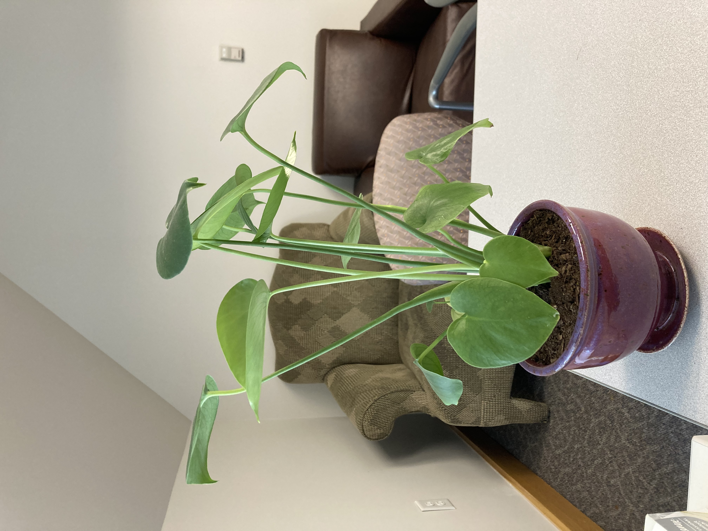
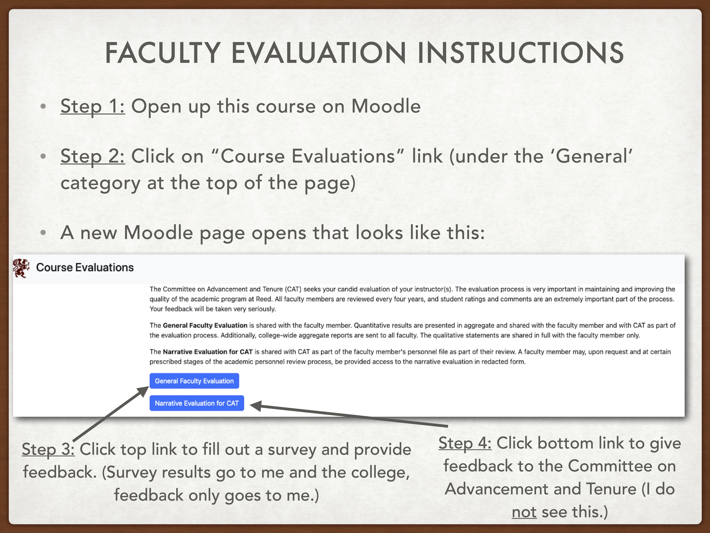

```{r include=FALSE}
knitr::opts_chunk$set(echo = F, message = FALSE, warning = FALSE, fig.align = "center", fig.height = 4, fig.width = 6,  out.width = "75%")
options(digits = 3)
library(knitr)
library(tidyverse)
library(dplyr)
library(ggthemes)
library(moderndive)
library(gapminder)
library(infer)
library(tufte)
library(gridExtra)
library(kableExtra)

theme_set(theme_bw())
theses<-read_csv("Data/theses.csv") %>% 
  filter(division %in% c("ART","HSS","LL","MNS","PRPL")) %>% 
  drop_na(n_pages, year)

library(palmerpenguins)
penguins <- penguins %>% drop_na()
set.seed(4)
penguins <- penguins[sample(1:333,100),]
penguins$species <- factor(penguins$species,levels=c("Chinstrap","Gentoo","Adelie"))
```

::::: columns
::: {.column .center width="50%"}
{width="90%"}
:::

::: {.column .center width="50%"}
<br>

[The Big Picture]{.custom-title}

<br> <br> 

[Megan Ayers]{.custom-subtitle}

[Stat 141 \| Fall 2026 <br> Wednesday, Week 14]{.custom-subtitle}
:::
:::::


------------------------------------------------------------------------

## Announcements

- Reading week office hours are set

------------------------------------------------------------------------

## Goals for today

- Reflect on the big picture of learning from data using probability, statistics, and `R`

- Highlights from questions of the day 

- Vote for topics to review in class

- Course evaluations

------------------------------------------------------------------------

## Learning Outcomes

:::: {.columns}

::: {.column width="55%"}


:::


::: {.column width="45%"}

<br><br><br>

- Think back to your week 1 self

- Since then, we've learned skills to work with data, draw conclusions from data, and critically engage in the entire data analysis process!

:::

::::

------------------------------------------------------------------------

## Learning Outcomes

:::: {.columns}

::: {.column width="55%"}


:::


::: {.column width="45%"}

**Exploration & Visualization**

Over the semester we've learned how to...

::: {.fragment .nonincremental}

- Recognize common data structures in R
- Create beautiful and effective graphs with `ggplot`!
- Use visualizations to gain insights from data
- Critically interpret visualizations

:::

:::

::::

------------------------------------------------------------------------

## Learning Outcomes

:::: {.columns}

::: {.column width="55%"}


:::


::: {.column width="45%"}

**Data Wrangling**

Over the semester we've learned how to...

::: {.fragment .nonincremental}

- Perform data wrangling operations in `R`
- Calculate statistics from data
- Resample data to create bootstrap, null, sampling distributions

:::

:::

::::


------------------------------------------------------------------------

## Learning Outcomes

:::: {.columns}

::: {.column width="55%"}


:::


::: {.column width="45%"}

**Data Acquisition**

Over the semester we've learned how to...

::: {.fragment .nonincremental}

- Determine the data and study conditions necessary to conduct different analyses
- Critically consider where our data comes from
- Consider sampling strategies and study design when interpreting results

:::

:::

::::


------------------------------------------------------------------------

## Learning Outcomes

:::: {.columns}

::: {.column width="55%"}


:::


::: {.column width="45%"}

**Modeling & Inference**

Over the semester we've learned how to...

::: {.fragment .nonincremental}

- Build linear regression models and determine when they are appropriate
- Perform simulation-based inference with hypothesis testing and confidence intervals
- Use probability theory to perform theory-based inference tasks

:::

:::

::::


------------------------------------------------------------------------

## Learning Outcomes

:::: {.columns}

::: {.column width="55%"}


:::


::: {.column width="45%"}

**Question Formulation**

Over the semester we've learned how to...

::: {.fragment .nonincremental}

- Translate research questions into testable hypotheses involving parameters and statistics
- Use exploratory data analysis to generate new research questions
- Identify the questions our data and analyses can, and cannot, answer

:::

:::

::::


------------------------------------------------------------------------

## Learning Outcomes

:::: {.columns}

::: {.column width="55%"}


:::


::: {.column width="45%"}

**Communicating Findings**

Over the semester we've learned how to...

::: {.fragment .nonincremental}

- Work with Quarto documents (`.qmd` files) to develop a reproducible workflow
- Interpret and communicate the results of statistical analyses effectively
- Use graphs to communicate findings visually 

:::

:::

::::

------------------------------------------------------------------------

## Statistical Thinking

::: {.nonincremental}

- Software like `R` makes it incredibly easy to perform statistical analyses and tests and abstract away the details.

```{r eval = F, echo = T}
t.test(response ~ group, data = df)  # Inference for difference-in-means
```

:::

<br>

- There is deep theory, and, strong assumptions about the underlying data behind one-liners like this. In this course we've discussed:
    - Tools to understand the underlying **probability theory** being employed
    - The **conditions** required for tests and analyses to be valid, and **how we can check them** using data wrangling, visualization, and context on the data collection process
    - **Simulation-based methods as alternatives** when some conditions aren't met
    - How to **responsibly interpret p-values** and what kinds of conclusions are reasonable given the data context


# Question of the day findings

------------------------------------------------------------------------

## Special shoutouts...

`case_when()` and I would like to thank all 26 of you who always used the same spelling/format of your name for every "Question of the Day"!

<br>

```{r echo = TRUE, eval = FALSE}
attendance <- attendance %>%
  mutate(name = case_when(name %in% c("MEGAN", "Megan", "MEGAN A", "Megan Ayers") ~ "Megan A",
                          name %in% c("Michael P", "Mikey P", "MP", "Michaeeeel") ~ "Michael P",
                          name %in% c("G Dog", "Grayson W", "Grayson White") ~ "Grayson W",
                          ...))
```

------------------------------------------------------------------------

## Special shoutouts...

- Question of the day suggestions you gave me that are unasked but still in my heart...
    - "Would you rather: salami underwear, wasabi for toothpaste?"
    - "Rate Reed College's reefer madness culture out of 10"
    - "See who will give you the last 4 digits of their ssn"

<br>    

- Thank you for brightening my day with your creative QOD responses:
    - **Q**: How do you feel about the Reed geese?
        - "I love them, they're like if giraffes were birds "
    - **Q**: Describe your ideal spring break in one word.
        - "Unshackled" 
    - **Q**: Best road trip snack?
        - "Hydroxyzine"
        

------------------------------------------------------------------------

## Tag Yourself! 

::: columns
::: {.column width=33%}
Data Visualizer

<iframe src="https://giphy.com/embed/d31vTpVi1LAcDvdm" width="480" height="362" frameBorder="0" class="giphy-embed" allowFullScreen>

</iframe>

:::

::: {.column width=33%}

Data Wrangler

<iframe src="https://giphy.com/embed/DbaUtl1DcLyrdwhzGJ" width="480" height="362" frameBorder="0" class="giphy-embed" allowFullScreen>

</iframe>
:::

::: {.column width=33%}
Model Builder

<br>

<iframe src="https://giphy.com/embed/xZsLh7B3KMMyUptD9D" width="480" height="270" frameBorder="0" class="giphy-embed" allowFullScreen>

</iframe>
:::

:::

::: fragment

```{r fig.height = 1.5}
x <- read.csv("data/viz_wrangle_model.csv")
names(x) <- "answer"
ggplot(x, aes(x = answer, fill = answer)) +
  geom_bar() +
  xlab("")
```


:::


------------------------------------------------------------------------

## Feelings about geese and sense of cat self

::: columns

::: {.column width=60%}

```{r, fig.width = 5.5, fig.height = 5.5}
qod <- read.csv("data/geese-cats.csv")
qod <- na.omit(qod)
qod$geese <- trimws(tolower(qod$geese))
qod$cat <- trimws(tolower(qod$cat))

qod$geese <- ifelse(qod$geese == "a", "love",
                    ifelse(qod$geese == "b", "fear",
                           ifelse(qod$geese == "c", "both", "neither")))
qod$geese <- factor(qod$geese, levels = c("love", "fear", "both", "neither"))

ggplot(qod, aes(x = geese, fill = cat)) +
  geom_bar(position = "fill")

```

:::

::: {.column width=40%}

```{r}
addmargins(table(qod$cat, qod$geese))
```

<br>

::: fragment

```{r}
chisq.test(qod$cat, qod$geese)
```

:::

::: fragment

```{r}
fisher.test(qod$cat, qod$geese)
```


:::

:::

:::


------------------------------------------------------------------------

## Plant name reveal...

::: {.fragment .center}

Welcome to the world, **Mike Wazowski Confidence Ayers**! 

{width=5in}

:::


<!-- ------------------------------------------------------------------------ -->

<!-- ## Midterm Feelings {.smaller} -->


<!-- ```{r fig.height = 1.8, fig.width = 5} -->
<!-- midterm <- read.csv("data/midterm_feelings.csv") -->
<!-- midterm$grade <- midterm$grade*100 -->
<!-- midterm %>% -->
<!--   ggplot(aes(x = pre_feeling, y = post_feeling)) + -->
<!--   geom_point() + -->
<!--   geom_abline(aes(intercept = 0, slope = 1), lty = 2, color = "gray") + -->
<!--   geom_smooth(method = "lm", se = FALSE) + -->
<!--   annotate("text", x = 5, y = 60, color = "blue", -->
<!--            label = paste0("r = ", round(cor(midterm$pre_feeling, midterm$post_feeling), 2))) -->
<!-- ``` -->

<!-- ::: fragment -->

<!-- ::: columns -->

<!-- ::: column -->

<!-- ```{r echo=T} -->
<!-- mod <- lm(grade ~ pre_feeling, midterm) -->
<!-- get_regression_table(mod) -->
<!-- ``` -->

<!-- ::: -->

<!-- ::: column -->

<!-- ```{r echo=T} -->
<!-- mod <- lm(grade ~ post_feeling, midterm) -->
<!-- get_regression_table(mod) -->
<!-- ``` -->

<!-- ::: -->

<!-- ::: -->

<!-- ::: -->

<!-- ::: {.fragment .center} -->

<!-- ```{r echo=T} -->
<!-- mod <- lm(grade ~ pre_feeling + post_feeling, midterm) -->
<!-- get_regression_table(mod) -->
<!-- ``` -->

<!-- ::: -->


------------------------------------------------------------------------

## Most Recommended TV / Movies / Games (Summer Break considerations)

::: columns

::: {.column width=25% .nonincremental }

**TV**

- Avatar the Last Airbender
- The Good Place
- Star Trek
- Breaking Bad
- The Pitt
- New Girl

:::

::: {.column width=50% .nonincremental .fragment}

**Movies**

- The Princess Bride
- Eternal Sunshine of the Spotless Mind
- Ponyo (Miyazaki movies in general)
- Shawshank Redemption
- The Big Lebowski
- Ratatouille


:::

::: {.column width=25% .nonincremental .fragment}

**Board Games**

- Settlers of Catan
- Clue
- Monopoly
- Ticket to Ride
- I hate board games

:::

::: 

::: fragment

::: columns

::: {.column width=20% .nonincremental}

**Video Games**

- Stardew Valley
- Minecraft


:::

::: {.column  width=20% .nonincremental}

<br>

- Mario Kart
- Disco Elysium
- The Sims

:::

::: {.column width=60%}

:::

:::

:::


# Final exam in-class review requests

------------------------------------------------------------------------

## Final exam in-class review requests

- Spend a few minutes looking through the review sheet

- Slack message Megan with 2 topics you would most like covered during in-class review sessions

```{r}
#| echo: false
countdown::countdown(4)
```


# Course Evaluations

------------------------------------------------------------------------

{width=75% fig-align="center"}

<!-- # ```{r} -->
<!-- # #| echo: false -->
<!-- # countdown::countdown(20) -->
<!-- # ``` -->


------------------------------------------------------------------------


