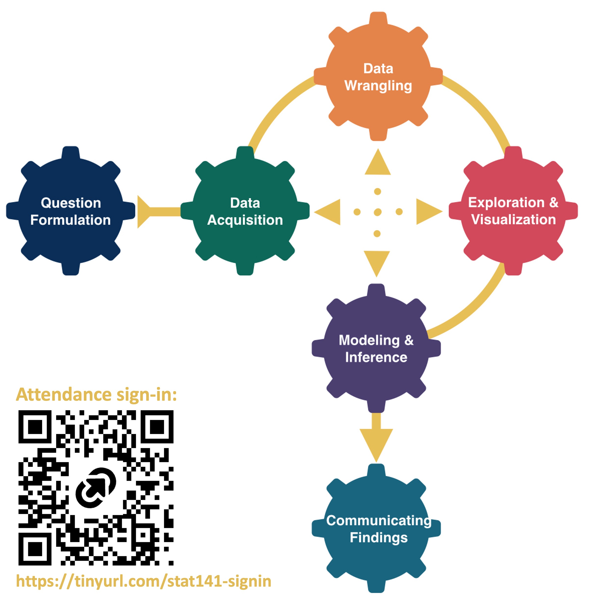

```{r include=FALSE}
knitr::opts_chunk$set(echo = F, message = FALSE, warning = FALSE, fig.align = "center", fig.height = 4, fig.width = 6,  out.width = "75%")
options(digits = 3)
library(knitr)
library(tidyverse)
library(dplyr)
library(ggthemes)
library(moderndive)
library(gapminder)
library(infer)
library(tufte)
library(gridExtra)
library(kableExtra)

```

::::: columns
::: {.column .center width="50%"}
{width="90%"}
:::

::: {.column .center width="50%"}
<br>

[Exam Review]{.custom-title}

<br> <br> 

[Megan Ayers]{.custom-subtitle}

[Stat 141 \| Fall 2026 <br> Friday, Week 14]{.custom-subtitle}
:::
:::::


------------------------------------------------------------------------

## Goals for today

- Reminder: no calculators needed for the exam - can leave algebra unsimplified
- Practice problems and exam review

# Quick Review 

------------------------------------------------------------------------

## When to use which versions of inference? 

- Variable types determine what parameter/statistics

<br>

- Data conditions (and maybe preference) determine if we use theory-based or simulation-based


------------------------------------------------------------------------

## Confidence Intervals (theory and simulation)

- **General idea**: given [some approximated sampling distribution]{.underline}, to find a $C\%$ confidence interval...
    - **SE method**: $(\text{statistic}) \pm (\text{crit. value})_C\cdot(SE \text{ of sampling distribution})$. Only works if sampling distribution is bell-shaped! 
    - **Percentile method**: Find the $\dfrac{100-C}{2}$ and $100 - \dfrac{100-C}{2}$ percentiles of the sampling distribution, these are your confidence interval bounds

- **Individual steps:**
    1. Specify parameter and population
    2. Specify sample and statistic
    3. Approximate your sampling distribution, either via bootstrapping (simulation) or probability model (theory-based)
    4. Use one of the two methods above depending on the shape of your distribution
    
    
------------------------------------------------------------------------

## Hypothesis Testing (theory and simulation)

- **General idea**: Figure out the probability of observing our data if the null hypothesis is true. Use this probability to inform whether we reject or maintain the null.

- **Individual steps:**
    1. Specify parameter and population
    2. State your hypotheses and specify $\alpha$
        - $H_0: p = p_0$, $H_a:$ either $p \neq p_0$, $p > p_0$, or $p < p_0$ 
    3. Specify sample and **test statistic** (may be a standardized version of another statistic)
    4. Approximate the **null sampling distribution**, either via resampling from a simulated null population, or via probability model (theory-based)
    5. Use proportion/area of the null distribution to calculate $\text{P-value}=P[\text{observe our test statistic } \textit{or something more extreme} | H_0]$
    6. Compare $\text{P-value}$ to $\alpha$ to make a conclusion about $H_0$ vs $H_a$. 


# Practice Problems

------------------------------------------------------------------------

## Question 1: Theory-Based Inference - Hypothesis Tests {.smaller}

- Suppose I'm interested in comparing effectiveness of two techniques of studying for a final exam: complete practice problems vs. no studying at all.
    - I randomly sample 100 intro stat students at a large university
    - I randomly divide them into two groups: Treatment (complete practice problems) and Control (no studying allowed)
    - 40/50 students get an "A" in the Treatment group, 25/50 students get an "A" in the Control group
  
<br>

::: {.fragment .nonincremental}

**Questions**

1. What kind of inference are we interested in conducting? (single mean or proportion, difference in means or proportions)

2. State the conditions for theory-based inference and if we've met them

3. Determine the mean and SE of the theory-based **null distribution**

4. Sketch the null distribution and shade the area corresponding to the p-value for a two-sided test

5. Suppose the p-value is 0.02. Can we say doing practice problems causes better exam scores?

6. State an ethical problem with the study.

7. If we wanted to do simulation-based inference instead, what would change about our process?

:::

```{r}
#| echo: false
countdown::countdown(10)
```

------------------------------------------------------------------------

<!-- ## SOLUTION: Question 1 -->

<!-- ::: nonincremental -->

<!-- > [Suppose I'm interested in comparing effectiveness of two techniques of studying for a final exam: complete practice problems vs. no studying at all. I randomly sample 100 intro stat students at a large university. I randomly divide them into two groups: Treatment (complete practice problems) and Control (no studying allowed). 40/50 students get an "A" in the Treatment group, 25/50 students get an "A" in the Control group]{style="color:darkred;"}. -->

<!-- ::: -->

<!-- 1. What kind of inference? -->
<!--     - Difference in proportions -->

<!-- 2. Conditions? -->
<!--     - Two independent samples, 10 "successes" and "failures" in each. All conditions have been met. -->

<!-- 3. Mean and SE of the **null distribution**? -->
<!--     - Mean: 0; SE = $\sqrt{\frac{.65(1-.65)}{50} + \frac{.65(1-.65)}{50}}$. (0.65 is the "pooled proportion") -->


<!-- ------------------------------------------------------------------------ -->

<!-- ## SOLUTION: Question 1 -->

<!-- ::: nonincremental -->

<!-- > [Suppose I'm interested in comparing effectiveness of two techniques of studying for a final exam: complete practice problems vs. no studying at all. I randomly sample 100 intro stat students at a large university. I randomly divide them into two groups: Treatment (complete practice problems) and Control (no studying allowed). 40/50 students get an "A" in the Treatment group, 25/50 students get an "A" in the Control group]{style="color:darkred;"}. -->

<!-- ::: -->

<!-- 4. Sketch the null distribution and shade the area corresponding to the p-value. -->
<!--     - Null distribution is a bell-curve centered at 0. Shade the area above $\frac{15}{50}$ and below $-\frac{15}{50}$ -->

<!-- 5. Suppose the p-value is 0.02. Can we say doing practice problems causes better exam scores? -->
<!--     - Probably yes, depending on $\alpha$. We have a low p-value to reject the null *and* we have a **random experiment** which allows for causal conclusions. -->

<!-- 6. Ethical problems? -->
<!--     - Our study "forces" some students to **not** study! This isn't fair to those students! -->


<!-- ------------------------------------------------------------------------ -->

<!-- ## SOLUTION: Question 1 -->

<!-- ::: nonincremental -->

<!-- > [Suppose I'm interested in comparing effectiveness of two techniques of studying for a final exam: complete practice problems vs. no studying at all. I randomly sample 100 intro stat students at a large university. I randomly divide them into two groups: Treatment (complete practice problems) and Control (no studying allowed). 40/50 students get an "A" in the Treatment group, 25/50 students get an "A" in the Control group]{style="color:darkred;"}. -->

<!-- ::: -->

<!-- 7. Changes for simulation based inference? -->
<!--     - Above we assume that under the null, $\widehat{p}_1 - \widehat{p}_0 \sim Normal(0, \widehat{SE})$. Instead, we would simulate a population under the null (ex. 1000 students where 65% get A's).  -->
<!--     - Then, sample 2 independent samples of size 50, and calculate the difference in proportions. Repeat ~1000 times to obtain an approximate null distribution.  -->
<!--     - Our p-value would then be the proportion of null statistics that were more extreme than our observed statistic. -->


<!-- ------------------------------------------------------------------------ -->

## Question 2: Theory-Based Inference - Confidence Intervals {.smaller}

::: nonincremental

- Suppose I'm interested in comparing effectiveness of two techniques of studying for a final exam: complete practice problems vs. no studying at all.
    - I randomly sample 100 intro stat students at a large university
    - I randomly divide them into two groups: Treatment (complete practice problems) and Control (no studying allowed)
    - 40/50 students get an "A" in the Treatment group, 25/50 students get an "A" in the Control group
    
:::
  
<br>

::: {.fragment .nonincremental}

**Questions**

1. What theoretical sampling distribution would we consider for constructing confidence intervals?

2. Given that the relevant critical value is 1.64, write the formula to find the theory-based 90% confidence interval for this scenario. Where does the critical value come from?

3. Suppose the confidence interval is approximately [0.15, 0.5]. Can we say doing practice problems causes better exam scores?

4. What would we change to get simulation-based confidence intervals using the percentile method instead? 

:::

```{r}
#| echo: false
countdown::countdown(5)
```

------------------------------------------------------------------------

<!-- ## SOLUTION: Question 2 -->

<!-- ::: nonincremental -->

<!-- > [Suppose I'm interested in comparing effectiveness of two techniques of studying for a final exam: complete practice problems vs. no studying at all. I randomly sample 100 intro stat students at a large university. I randomly divide them into two groups: Treatment (complete practice problems) and Control (no studying allowed). 40/50 students get an "A" in the Treatment group, 25/50 students get an "A" in the Control group]{style="color:darkred;"}. -->

<!-- ::: -->

<!-- 1. Theoretical sampling distribution? -->
<!--     - $\widehat{p}_1 - \widehat{p}_0 \sim Normal(\frac{40}{50} - \frac{25}{50}, \widehat{SE}) \text{, where } \widehat{SE} = \sqrt{\frac{0.8\cdot0.2}{50} + \frac{0.5\cdot0.5}{50}}$ -->

<!-- 2. Formula for 90% confidence interval: -->
<!--     - $(\widehat{p}_1 - \widehat{p}_0) \pm 1.64\cdot \widehat{SE} = \frac{15}{50} \pm 1.64\cdot 0.09 = [0.152 , 0.448]$.  -->
<!--     - The critical value $z^* = 1.64$ comes from the 0.95 quantile of $Normal(0, 1)$. -->
<!--     - When we multiply $z^*$ by $\widehat{SE}$ and add/subtract $\widehat{p}_1 - \widehat{p}_0$, this gives us the 0.95 and 0.05 quantiles of the distribution from part 1 of this question.  -->


<!-- ------------------------------------------------------------------------ -->

<!-- ## SOLUTION: Question 2 -->

<!-- ::: nonincremental -->

<!-- > [Suppose I'm interested in comparing effectiveness of two techniques of studying for a final exam: complete practice problems vs. no studying at all. I randomly sample 100 intro stat students at a large university. I randomly divide them into two groups: Treatment (complete practice problems) and Control (no studying allowed). 40/50 students get an "A" in the Treatment group, 25/50 students get an "A" in the Control group]{style="color:darkred;"}. -->

<!-- ::: -->

<!-- 3. Based on the confidence interval, can we say doing practice problems causes better exam scores? -->
<!--     - Yes it seems likely - the 90% confidence interval does not include 0, and this was a randomized experiment. -->

<!-- 4. What would we change to get simulation-based confidence intervals using the percentile method instead?  -->
<!--     - We would approximate our sampling distribution using bootstrapping -->
<!--     - Then we'd take the 0.05 and 0.95 quantiles of the bootstrap distribution to use as our confidence interval -->


<!-- ------------------------------------------------------------------------ -->

## Question 3: Linear Regression

Consider the following regression model:

$$\widehat{y}_\text{Movie Duration} = -980 + 0.56(x_\text{Year}) + 20(x_\text{Drama}) + 0.01(x_\text{Year})(x_\text{Drama})$$

::: {.fragment .nonincremental}

**Questions**

1. Using the regression equation, predict the duration of a Drama movie released in 1950.

2. Carefully interpret the intercept coefficient, in context.

3. Carefully interpret the slope coefficient for Year, in context.

4. Carefully interpret the slope coefficient for Drama, in context.

5. Which slope coefficients have *practical* significance? Explain your reasoning.

6. If we fit this model in R, where would we look to do theory-based inference for these coefficients?

7. What general steps would we follow to do simulation-based inference for $\beta_{year}$?

:::


```{r}
#| echo: false
countdown::countdown(10)
```

------------------------------------------------------------------------

<!-- ## SOLUTION: Question 3 {.smaller} -->

<!-- $$\widehat{y}_\text{Movie Duration} = -980 + 0.56(x_\text{Year}) + 20(x_\text{Drama}) + 0.01(x_\text{Year})(x_\text{Drama})$$ -->

<!-- 1. Predict the duration of a Drama movie released in 1950. -->
<!--     - -980 + .56(1950) + 20(1) + 0.01(1950)(1) = 151.5 minutes -->

<!-- 2. Carefully interpret the intercept coefficient, in context.  -->
<!--     - We predict a non-Drama movie released in the year 0 to be -980 minutes long, on average. -->

<!-- 3. Carefully interpret the slope coefficient for Year, in context. -->
<!--     - For every additional year a *non-Drama* movie is released, we predict the movie's duration to increase by 0.56 minutes, on average. -->

<!-- 4. Carefully interpret the slope coefficient for Drama, in context. -->
<!--     - We expect a drama movie to be 20 minutes longer than a non-drama movie, on average, **in the year 0**. -->

<!-- 5. Which slope coefficients have *practical* significance? Explain your reasoning. -->
<!--     - ALL coefficients have practical significance! (The interaction coefficient may seem small, but trying plugging in 1900 for year!) -->

<!-- 6. If we fit this model in R, where would we look to do theory-based inference for these coefficients? -->
<!--     - The output of the regression table (from `get_regression_table`) has both theory-based confidence intervals and hypothesis testing results. -->

<!-- ------------------------------------------------------------------------ -->

<!-- ## SOLUTION: Question 3 {.smaller} -->

<!-- $$\widehat{y}_\text{Movie Duration} = -980 + 0.56(x_\text{Year}) + 20(x_\text{Drama}) + 0.01(x_\text{Year})(x_\text{Drama})$$ -->


<!-- 7. What general steps would we follow to do simulation-based inference for $\beta_{year}$? -->
<!--     - Bootstrapping: in each bootstrap sample, refit our model and grab the estimated coefficient.  -->
<!--         - Calculate quantiles of the bootstrap distribution of coefficients to get confidence intervals. -->
<!--         - Use the standard deviation of the distribution as $\widehat{SE}$ to calculate a z-score and perform hypothesis testing with `pnorm` (assuming $n$ is large enough). -->
